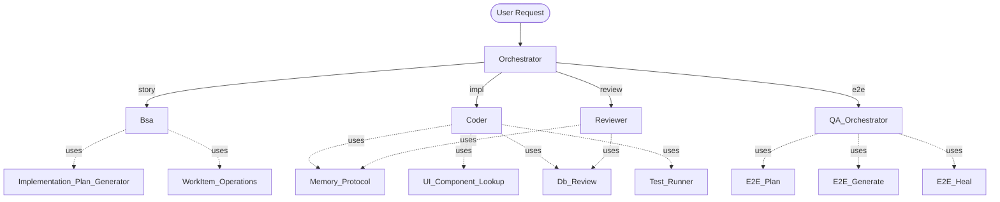

# .dev-agents — Agentic System (Canonical Source)

> **Fuente canónica.** This folder contains the agnostic, tool-independent definitions for all agents, skills, workflows, and memory-bank structure.
> Copilot uses thin stubs in `.github/agents/` that reference these files.
> Claude Code uses thin stubs in `.claude/agents/` that reference these files.
>
> Global rules: [`../AGENTS.md`](../AGENTS.md).
> Workflow contract: [`../workflows/README.md`](../workflows/README.md).

## Overview

The project uses **5 agents** + **9 skills** orchestrated through a single
master workflow. Agents are _behavior_ (decide, delegate, coordinate). Skills
are _capability_ (deterministic procedure, no autonomy). All cross-cutting
rules live in [`../AGENTS.md`](../AGENTS.md); each agent/skill `inherits` from it.



## Agents (5)

| Agent             | Purpose                                                   | File                 |
| ----------------- | --------------------------------------------------------- | -------------------- |
| `Orchestrator`    | Workflow coordinator — never writes code, only delegates  | `Orchestrator.md`    |
| `Bsa`             | Business analyst — creates BRDs and User Story markdowns  | `Bsa.md`             |
| `Coder`           | Software engineer — generates production code             | `Coder.md`           |
| `Reviewer`        | Senior reviewer — scores code 1–10, flags critical issues | `Reviewer.md`        |
| `QA_Orchestrator` | E2E QA coordinator — plan / generate / heal E2E tests     | `QA_Orchestrator.md` |

## Skills (9)

| Skill                           | Owner agent(s)  | Purpose                                                   |
| ------------------------------- | --------------- | --------------------------------------------------------- |
| `Memory_Protocol`               | All             | Read/write per-agent memory under `.dev-agents/memory-bank/20-agents/{n}/` |
| `Implementation_Plan_Generator` | Bsa             | Standardized implementation plan templates                |
| `WorkItem_Operations`           | Bsa             | Work-tracking platform work item / wiki / PR operations   |
| `UI_Component_Lookup`           | Coder, Reviewer | Authoritative UI component library docs                   |
| `Db_Review`                     | Coder, Reviewer | Database / migration / query review                       |
| `Test_Runner`                   | Coder, QA       | Run the project's test suites; report metrics             |
| `E2E_Plan`                      | QA_Orchestrator | Build E2E test plan from acceptance criteria              |
| `E2E_Generate`                  | QA_Orchestrator | Generate E2E test spec files                              |
| `E2E_Heal`                      | QA_Orchestrator | Debug and repair failing E2E tests                        |

## Memory bank (`.dev-agents/memory-bank/`)

Tiered, progressively loaded. **Runtime data — not moved by this migration.**

| Tier             | Path                                | Scope                                                |
| ---------------- | ----------------------------------- | ---------------------------------------------------- |
| `00-shared/`     | `.dev-agents/memory-bank/00-shared/`         | Cross-agent: project facts, patterns, anti-patterns  |
| `20-agents/{n}/` | `.dev-agents/memory-bank/20-agents/{n}/`     | Per-agent private memory (one folder per agent name) |
| `30-learnings/`  | `.dev-agents/memory-bank/30-learnings/`      | Recently-captured learnings pending classification   |

Agent names for path resolution: `orchestrator`, `bsa`, `coder`, `reviewer`, `qa`.

## Document templates (`.dev-agents/template-docs/`)

All canonical document templates (BRD, User Story, Implementation Plan, ADR, Bug report, Risk assessment, Migration plan, Test plan, Code review report, PR description, Commit message, Rollback plan) live in [`.dev-agents/template-docs/`](.dev-agents/template-docs/README.md) — **not moved by this migration, shared by both platforms**.

## Workflows

All workflows are declared in [`../workflows/master.yaml`](../workflows/master.yaml):

| Workflow      | Trigger phrase                         | Phases                                               |
| ------------- | -------------------------------------- | ---------------------------------------------------- |
| `full_dev`    | `@Orchestrator full_dev <description>` | preflight → story → impl → review → unit_tests → e2e |
| `qa_only`     | `@QA_Orchestrator qa_only`             | preflight → e2e                                      |
| `review_only` | `@Orchestrator review_only`            | preflight → review                                   |
| `hotfix`      | `@Orchestrator hotfix <description>`   | preflight → impl → review → unit_tests               |

## Invocation

**Copilot:**
```text
@Orchestrator full_dev User Story #1234
@Orchestrator hotfix Add a multi-select filter to a list column
@QA_Orchestrator qa_only
@Reviewer Review pending changes
```

**Claude Code:**
```text
/workflow full_dev User Story #1234
/workflow hotfix Add a multi-select filter to a list column
/qa
/review
```

Optional mode flag: `supervised | semi | unattended` (default: `semi`).
Optional feedback level: `full | limited | minimal` (default: `limited`).

## Where things live

```
.dev-agents/                              ← canonical agnostic source (this folder)
├── AGENTS.md                            ← global rules (single source of truth)
├── agents/
│   ├── README.md                        ← (this file)
│   ├── Orchestrator.md
│   ├── Bsa.md
│   ├── Coder.md
│   ├── Reviewer.md
│   └── QA_Orchestrator.md
├── skills/
│   ├── Memory_Protocol/SKILL.md
│   ├── Implementation_Plan_Generator/SKILL.md
│   ├── WorkItem_Operations/SKILL.md
│   ├── UI_Component_Lookup/SKILL.md
│   ├── Db_Review/SKILL.md
│   ├── Test_Runner/SKILL.md
│   ├── E2E_Plan/SKILL.md
│   ├── E2E_Generate/SKILL.md
│   └── E2E_Heal/SKILL.md
├── workflows/
│   ├── master.yaml                      ← primary entrypoint
│   ├── dev.yaml                         ← preflight..unit_tests sub-workflow
│   └── qa.yaml                          ← e2e sub-workflow
└── memory-bank/
    └── README.md                        ← initialization guide (not runtime data)

.dev-agents/memory-bank/                          ← runtime memory (shared, not moved)
.dev-agents/template-docs/                   ← canonical templates (shared, not moved)
.github/agents/*.md                      ← Copilot thin stubs → .dev-agents/agents/
.claude/agents/*.md                      ← Claude Code thin stubs → .dev-agents/agents/
```

## Key conventions (see `../AGENTS.md` for full list)

1. **Address the user as "My Lord"** in all interactions.
2. **Real timestamps only** — `Get-Date -AsUTC -Format 'yyyy-MM-ddTHH:mm:ssZ'`. Never fabricate.
3. **English everywhere** in code/commits/documentation. Conversation language follows the user.
4. **User validation gates** — every phase pauses for user approval in `supervised` mode.
5. **Orchestrator never writes code** — only coordinates via delegation.
6. **Read `AGENTS.md` first** — it defines pre-flight checks every agent must run.
