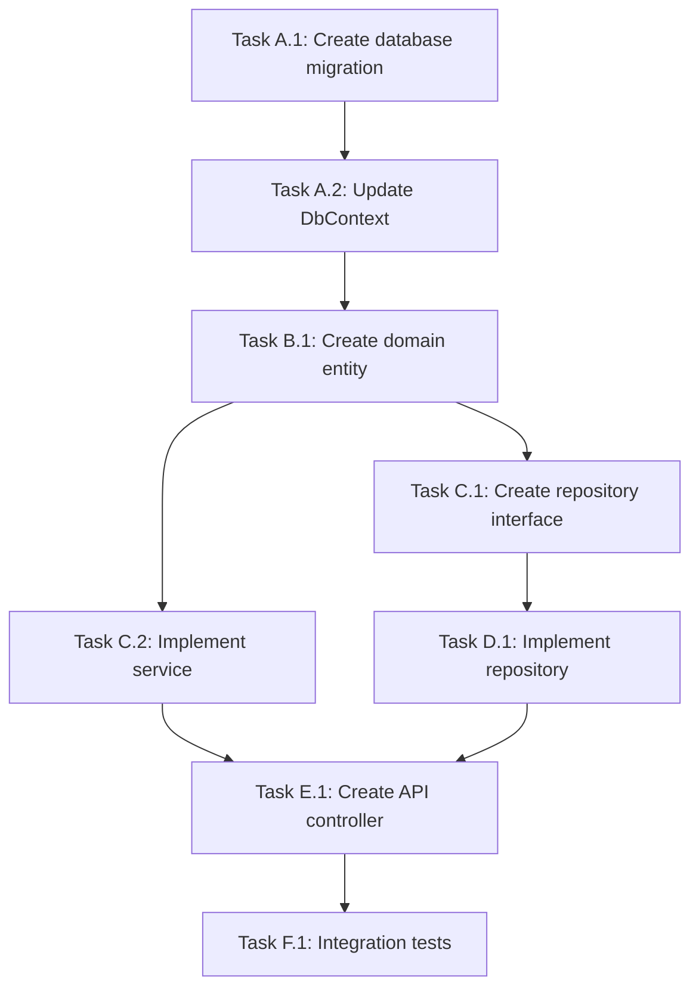

# Business Requirements Document (BRD)

## Document Information

- **Feature Name:** [Feature Name]
- **Document Version:** 1.0
- **Created By:** BSA Agent
- **Created Date:** [YYYY-MM-DD]
- **User Story ID:** [work-tracking platform ID or "Ad-Hoc"]
- **Estimated Complexity:** [Low | Medium | High | Very High]
- **Estimated Implementation Time:** [X days/hours]
- **Priority:** [Critical | High | Medium | Low]

---

## 1. Executive Summary

[Provide a 2-3 paragraph overview that covers:

- What is being built/changed
- Why it's needed (business value)
- Who benefits (target users)
- High-level technical approach
- Expected timeline and key milestones]

**Example:**

> This feature implements JWT-based refresh token authentication to improve user session security and experience. Currently, users must re-authenticate every time their access token expires (15 minutes), causing workflow interruptions. The new system will allow seamless token renewal for up to 7 days while maintaining security through token rotation. The implementation affects the API, Application, Domain, and Infrastructure layers, with an estimated completion time of 3 days.

---

## 2. Business Objectives

### 2.1 Problem Statement

**Current State:**
[Describe the current situation and pain points]

**Desired State:**
[Describe the target state after implementation]

**Gap Analysis:**
[What's missing or broken that this feature addresses]

### 2.2 Target Users

**Primary Users:**

- [User type 1]: [How they'll use this feature]
- [User type 2]: [How they'll use this feature]

**Secondary Users:**

- [User type 3]: [Indirect benefits]

### 2.3 Success Metrics

**Quantitative Metrics:**

- [Metric 1]: [e.g., Reduce login failures by 30%]
- [Metric 2]: [e.g., Improve user session duration by 20%]
- [Metric 3]: [e.g., Decrease support tickets about authentication by 50%]

**Qualitative Metrics:**

- [Metric 1]: [e.g., Improved user satisfaction (measured by survey)]
- [Metric 2]: [e.g., Positive developer feedback on API usability]

**Measurement Timeline:**

- [e.g., Measure 2 weeks post-deployment, then monthly for 3 months]

---

## 3. Functional Requirements

### 3.1 User Stories

**Primary User Story:**

**As a** [user type],  
**I want** [goal],  
**So that** [benefit].

**Example:**

> **As a** API client developer,  
> **I want** to refresh access tokens without re-authenticating,  
> **So that** my application maintains uninterrupted access to protected resources.

**Additional User Stories:**

1. **As a** [user type], **I want** [goal], **So that** [benefit].
2. **As a** [user type], **I want** [goal], **So that** [benefit].

### 3.2 Acceptance Criteria

**Functional Acceptance Criteria:**

- ✅ [Criterion 1] - [e.g., User can refresh access token using valid refresh token]
- ✅ [Criterion 2] - [e.g., Old refresh token is invalidated after successful refresh]
- ✅ [Criterion 3] - [e.g., Expired refresh token returns 401 Unauthorized]
- ✅ [Criterion 4] - [e.g., Invalid refresh token returns 400 Bad Request]
- ✅ [Criterion 5] - [e.g., Rate limiting enforced (10 requests/minute per user)]

**Given-When-Then Format (if applicable):**

**Scenario 1:** [Happy path scenario name]

- **Given** [initial context]
- **When** [action occurs]
- **Then** [expected outcome]

**Scenario 2:** [Error scenario name]

- **Given** [initial context]
- **When** [error condition]
- **Then** [error handling outcome]

### 3.3 Use Cases

#### Use Case 1: [Primary Flow Name]

**Actors:** [Primary user, system components]

**Preconditions:**

- [Condition 1]
- [Condition 2]

**Main Flow:**

1. [User/System action 1]
2. [System response 1]
3. [User/System action 2]
4. [System response 2]
5. [Final outcome]

**Postconditions:**

- [State after successful completion]

**Alternative Flows:**

- [3a]: [If error occurs at step 3, system does X]

#### Use Case 2: [Error Flow Name]

**Actors:** [Primary user, system components]

**Preconditions:**

- [Error condition setup]

**Main Flow:**

1. [User provides invalid input]
2. [System validates and detects error]
3. [System returns error message]
4. [System logs error for audit]

**Postconditions:**

- [System state remains unchanged]

---

## 4. Technical Requirements

### 4.1 Architecture Layer Impacts

| Layer                | Impact Level           | Changes Required         |
| -------------------- | ---------------------- | ------------------------ |
| API                  | [None/Low/Medium/High] | [Description of changes] |
| Application          | [None/Low/Medium/High] | [Description of changes] |
| Domain               | [None/Low/Medium/High] | [Description of changes] |
| Infrastructure       | [None/Low/Medium/High] | [Description of changes] |
| [primary-db].Migrations | [None/Low/Medium/High] | [Description of changes] |
| [staging-db].Migrations | [None/Low/Medium/High] | [Description of changes] |
| IsolatedFunctions    | [None/Low/Medium/High] | [Description of changes] |
| FileProcessing       | [None/Low/Medium/High] | [Description of changes] |

**Detailed Changes by Layer:**

#### API Layer

- **New Files:**
  - [File path 1]
  - [File path 2]
- **Modified Files:**
  - [File path 1]: [Description of modifications]
  - [File path 2]: [Description of modifications]

#### Application Layer

- **New Files:**
  - [File path 1]
  - [File path 2]
- **Modified Files:**
  - [File path 1]: [Description of modifications]

[Repeat for each affected layer]

### 4.2 Database Changes

**Database:** [serviceDb | stagingDb | both]

#### New Tables

**Table Name:** [TableName]

| Column Name  | Data Type    | Nullable | Default | Description   | Constraints          |
| ------------ | ------------ | -------- | ------- | ------------- | -------------------- |
| [ColumnName] | [type(size)] | [Yes/No] | [value] | [Description] | [PK/FK/Unique/Index] |

**Indexes:**

- [Index name]: [Column(s)] - [Clustered/Non-clustered] - [Unique/Non-unique]

**Foreign Keys:**

- [FK name]: [Column] → [Referenced Table].[Referenced Column]

#### Modified Tables

**Table Name:** [ExistingTableName]

**Changes:**

- **Add Column:** [ColumnName] [type] [nullable] - [Description]
- **Modify Column:** [ColumnName] - [Change description]
- **Remove Column:** [ColumnName] - [Justification and impact analysis]

**Backward Compatibility Strategy:**

- [How this change maintains compatibility with existing queries]

#### Migration Strategy

1. **Migration Order:**
   - [Step 1: Create table X]
   - [Step 2: Add column Y to table Z]
   - [Step 3: Create indexes]

2. **Data Migration (if applicable):**
   - [Source data]
   - [Transformation logic]
   - [Target location]

3. **Rollback Strategy:**
   - [Step-by-step rollback procedure]
   - [Data preservation approach]

4. **Testing Strategy:**
   - Test in local environment
   - Test in staging with production-size data
   - Smoke tests post-migration
   - Rollback test before production deployment

### 4.3 External Dependencies

#### Dependency 1: [Cloud Service / Third-Party API]

- **Purpose:** [What this dependency provides]
- **Type:** [cloud service / REST API / package dependency / etc.]
- **Version/API Level:** [Specific version]
- **Authentication:** [Method]
- **Configuration Required:**
  - [Setting 1]: [Value or source]
  - [Setting 2]: [Value or source]
- **Rate Limits/Quotas:** [Limitations]
- **Error Handling:** [Strategy for failures]
- **Monitoring:** [How to monitor health]

[Repeat for each dependency]

### 4.4 Security Requirements

#### Authentication

- [Authentication mechanism]
- [Token type and expiration]
- [Refresh/rotation strategy]

#### Authorization

- [Permission/role requirements]
- [Access control strategy]

#### Data Protection

- **In Transit:**
  - [TLS version]
  - [Certificate requirements]
- **At Rest:**
  - [Encryption algorithm]
  - [Key management (secret store)]

#### Input Validation

- [Validation rules]
- [Sanitization approach]
- [Injection prevention]

#### Secrets Management

- **Secrets Location:** [secret store / config file / etc.]
- **Secret Names:**
  - [Secret 1]: [Purpose]
  - [Secret 2]: [Purpose]
- **Rotation Policy:** [Frequency and procedure]

#### Audit Logging

- **Events to Log:**
  - [Event 1]: [What to capture]
  - [Event 2]: [What to capture]
- **Log Level:** [Information / Warning / Error]
- **Log Destination:** [Application Insights / File / etc.]
- **Retention Policy:** [Duration]

#### Security Testing Requirements

- [ ] SQL injection vulnerability testing
- [ ] XSS vulnerability testing
- [ ] CSRF vulnerability testing
- [ ] Authentication bypass testing
- [ ] Authorization escalation testing
- [ ] Secrets exposure testing
- [ ] [Other security test]

### 4.5 Performance Requirements

| Metric              | Target         | Measurement Method       |
| ------------------- | -------------- | ------------------------ |
| Response Time       | [< 200ms]      | [Application Insights]   |
| Throughput          | [1000 req/sec] | [Load testing]           |
| Concurrent Users    | [500]          | [Load testing]           |
| Database Query Time | [< 50ms]       | [SQL Profiler]           |
| Memory Usage        | [< 500MB]      | [Performance monitoring] |

**Performance Testing Strategy:**

- [Load testing approach]
- [Stress testing scenarios]
- [Benchmark comparisons]

---

## 5. Implementation Plan

### 5.1 Task Breakdown

#### Phase A: [Foundation / Database / etc.]

**Dependencies:** [None | Depends on Phase X]

**Tasks:**

- [ ] **A.1** [Task Name]
  - **Description:** [Detailed description]
  - **Estimated Time:** [X hours/days]
  - **Files Affected:**
    - [File path 1]
    - [File path 2]
  - **Acceptance Criteria:**
    - [Criterion 1]
    - [Criterion 2]
  - **Dependencies:** [None | Task A.2, B.1]

- [ ] **A.2** [Task Name]
  - **Description:** [Detailed description]
  - **Estimated Time:** [X hours/days]
  - **Files Affected:**
    - [File path 1]
  - **Acceptance Criteria:**
    - [Criterion 1]
  - **Dependencies:** [None]

#### Phase B: [Domain Layer / Application Layer / etc.]

**Dependencies:** [Phase A]

**Tasks:**

- [ ] **B.1** [Task Name]
  - [Same structure as above]

[Repeat for all phases]

### 5.2 Implementation Sequence

**Critical Path:** [List the sequence of tasks that determine minimum completion time]

Example: A.1 → A.2 → B.1 → C.2 → D.1 → E.1 → F.2 (Total: 18 hours)

**Parallel Work Opportunities:**

- **While waiting for [X]:**
  - Can work on [Task Y]
  - Can prepare [Task Z]

**Total Estimated Time:**

- **Optimistic (everything goes smoothly):** [X hours/days]
- **Realistic (expected with normal issues):** [Y hours/days]
- **Pessimistic (with unexpected blockers):** [Z hours/days]
- **Recommended Estimate (Realistic + 20% buffer):** [W hours/days]

### 5.3 Dependency Graph

---

## 6. Testing Strategy

### 6.1 Test Coverage Matrix

| Component     | Unit Tests | Integration Tests | Security Tests | Performance Tests |
| ------------- | ---------- | ----------------- | -------------- | ----------------- |
| [Component 1] | ✅ Yes     | ✅ Yes            | ✅ Yes         | ❌ No             |
| [Component 2] | ✅ Yes     | ✅ Yes            | ❌ No          | ✅ Yes            |
| [Component 3] | ✅ Yes     | ❌ No             | ❌ No          | ❌ No             |

**Coverage Targets:**

- **Unit Test Coverage:** ≥80% for critical components
- **Integration Test Coverage:** All critical user journeys
- **Security Test Coverage:** All security-critical components (100%)
- **Performance Test Coverage:** All performance-sensitive endpoints

### 6.2 Test Scenarios

#### Unit Test Scenarios

**Component: [ComponentName]**

1. **Test:** [Test name]
   - **Given:** [Initial state]
   - **When:** [Action]
   - **Then:** [Expected outcome]

2. **Test:** [Test name]
   - [Same format]

[Repeat for each component]

#### Integration Test Scenarios

**Workflow: [WorkflowName]**

1. **Test:** [Happy path test name]
   - **Setup:** [Test data and environment]
   - **Steps:**
     1. [Action 1]
     2. [Action 2]
     3. [Action 3]
   - **Assertions:**
     - [Assertion 1]
     - [Assertion 2]

2. **Test:** [Error path test name]
   - [Same format]

#### Security Test Scenarios

1. **Test:** [SQL Injection Test]
   - **Input:** [Malicious payload]
   - **Expected:** [Rejected with 400 Bad Request, logged]

2. **Test:** [Authentication Bypass Test]
   - **Attempt:** [Bypass method]
   - **Expected:** [401 Unauthorized, audit logged]

[Repeat for all security tests]

#### Performance Test Scenarios

1. **Test:** [Load Test]
   - **Load Profile:** [X concurrent users, Y requests/second]
   - **Duration:** [Z minutes]
   - **Success Criteria:** [Response time < A ms, error rate < B%]

### 6.3 Quality Gates

**Must Pass Before Deployment:**

- [ ] Unit test coverage ≥80% for critical components
- [ ] All integration tests pass
- [ ] Zero high-severity security vulnerabilities
- [ ] Performance targets met (response time, throughput)
- [ ] Code review approval score ≥9/10
- [ ] Static code analysis passes with no critical issues
- [ ] Documentation complete

---

## 7. Risk Assessment

### 7.1 Risk Matrix

| Risk ID | Description        | Probability  | Impact       | Severity | Mitigation Owner |
| ------- | ------------------ | ------------ | ------------ | -------- | ---------------- |
| R-001   | [Risk description] | Low/Med/High | Low/Med/High | [X.X]    | [Role/Agent]     |
| R-002   | [Risk description] | Low/Med/High | Low/Med/High | [X.X]    | [Role/Agent]     |

**Severity Calculation:** (Probability × Impact) / 2 where Low=3, Medium=5, High=10

**Priority:**

- **High Severity (≥7):** Must mitigate before implementation
- **Medium Severity (4-6):** Mitigate during implementation
- **Low Severity (≤3):** Monitor during testing

### 7.2 Detailed Mitigation Plans

#### Risk R-001: [Risk Name]

**Category:** [Technical | Integration | Operational | Timeline]

**Probability:** [Low | Medium | High]  
**Impact:** [Low | Medium | High]  
**Severity:** [Calculated score]

**Description:**
[Detailed description of the risk and potential consequences]

**Prevention Strategy:**

- [Action 1 to prevent risk from occurring]
- [Action 2 to prevent risk from occurring]

**Detection Strategy:**

- [How to detect if risk is materializing]
- [Monitoring/alerting approach]
- [Early warning signs]

**Response Strategy:**

- [Immediate action if risk occurs]
- [Escalation path]
- [Recovery procedure]

**Owner:** [Who is responsible for managing this risk]

**Timeline:** [When mitigation actions should be taken]

**Validation:** [How to confirm mitigation is effective]

[Repeat for each high/medium severity risk]

---

## 8. Non-Functional Requirements

### 8.1 Performance

- **Response Time:** [Target with percentile, e.g., p95 < 200ms]
- **Throughput:** [Requests per second]
- **Scalability:** [Horizontal/vertical, expected growth]
- **Resource Usage:** [Memory, CPU limits]

### 8.2 Security

[Summary from Section 4.4, with additional enterprise requirements]

### 8.3 Reliability

- **Uptime Target:** [e.g., 99.9% SLA]
- **Error Rate:** [e.g., < 0.1%]
- **MTTR (Mean Time To Recovery):** [e.g., < 15 minutes]
- **Disaster Recovery:** [RPO/RTO targets]

### 8.4 Maintainability

- **Code Quality:** [Standards: Clean Code, SOLID principles]
- **Documentation:** [XML comments, README updates, architecture diagrams]
- **Logging:** [Structured logging with ILogger<T>]
- **Monitoring:** [Application Insights, metrics, alerts]

### 8.5 Usability (if applicable)

- **Accessibility:** [WCAG compliance level]
- **User Experience:** [Response feedback, error messages]
- **API Usability:** [RESTful conventions, clear error messages]

### 8.6 Compatibility

- **Browser Compatibility:** [If web frontend]
- **API Versioning:** [Strategy for breaking changes]
- **Backward Compatibility:** [Support for existing clients]

---

## 9. Dependencies & Constraints

### 9.1 Technical Dependencies

**Internal Dependencies:**

- [Project A depends on Project B because...]
- [Component X requires Component Y to...]

**External Dependencies:**

- [cloud service dependency]
- [Third-party API dependency]
- [package version dependency]

### 9.2 Timeline Constraints

- **Target Completion Date:** [YYYY-MM-DD]
- **Sprint/Iteration:** [Sprint number or iteration]
- **Hard Deadlines:** [Any regulatory or business deadlines]
- **Team Dependencies:** [Waiting for other team's deliverable]

### 9.3 Resource Constraints

- **Team Availability:** [Developer capacity, vacations, other projects]
- **Infrastructure Limitations:** [Environment access, cloud quota]
- **Budget Constraints:** [cloud costs, third-party licensing]

### 9.4 Assumptions

- [Assumption 1: e.g., Database will be available during deployment]
- [Assumption 2: e.g., identity-provider configuration can be completed by IT team]
- [Assumption 3: e.g., No major framework version upgrades during implementation]

---

## 10. Out of Scope

**Explicitly NOT included in this feature:**

- [Item 1] - [Rationale: Why it's out of scope]
- [Item 2] - [Rationale: Deferred to future phase]
- [Item 3] - [Rationale: Different team responsibility]

**Future Enhancements (Post-MVP):**

- [Enhancement 1] - [Planned for Phase 2]
- [Enhancement 2] - [Nice-to-have feature]

---

## 11. Open Questions

**Questions that need resolution before/during implementation:**

1. **[Question 1]**
   - **Status:** [Open | Answered]
   - **Assigned To:** [Stakeholder/role]
   - **Answer:** [Response when available]
   - **Impact if not resolved:** [High/Medium/Low]

2. **[Question 2]**
   - [Same format]

---

## 12. Approval & Sign-Off

| Role           | Name      | Status            | Date                   |
| -------------- | --------- | ----------------- | ---------------------- |
| BSA Agent      | BSA Agent | ✅ Approved       | [YYYY-MM-DD]           |
| Technical Lead | [Name]    | ⏳ Pending Review |                        |
| Product Owner  | [Name]    | ⏳ Pending Review |                        |
| Security Team  | [Name]    | ⏳ Pending Review | (if security-critical) |
| DBA            | [Name]    | ⏳ Pending Review | (if database changes)  |

---

## Appendix A: Reference Documentation

**Organizational Standards:**

- [Link to `docs/architecture/layers-and-examples.md`]
- [Link to coding standards]
- [Link to security policies]

**Project Documentation:**

- [Link to README.md]
- [Link to API documentation]
- [Link to domain documentation]

**Related Features:**

- [Link to related BRD or User Story]

---

## Appendix B: Glossary

| Term           | Definition                                                        |
| -------------- | ----------------------------------------------------------------- |
| [Acronym/Term] | [Clear definition in project context]                             |
| JWT            | JSON Web Token - A compact, URL-safe means of representing claims |
| Refresh Token  | Long-lived token used to obtain new access tokens                 |
| [Custom term]  | [Project-specific definition]                                     |

---

## Appendix C: Revision History

| Version | Date         | Author    | Changes                   |
| ------- | ------------ | --------- | ------------------------- |
| 1.0     | [YYYY-MM-DD] | BSA Agent | Initial document creation |

---

**Document Status:** ✅ Ready for Implementation  
**Next Step:** Hand off to Orchestrator agent for workflow execution  
**BRD File Location:** `docs/brds/BRD-[YYYY-MM-DD]-[feature-name].md`
