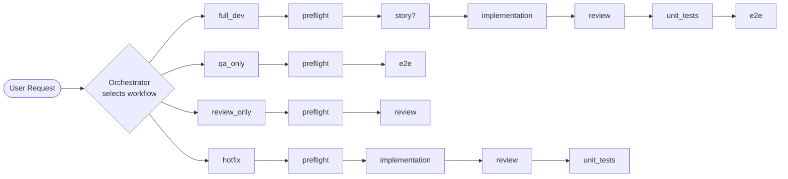

# Agentic Workflows — the project

This folder contains the canonical workflow definitions for all agentic
operations in the project repository. It is the result of the
[ADR-2026-05-13 agentic restructure](../../docs/architecture/ADR-2026-05-13-agentic-restructure.md).

## Files

| File                | Purpose                                                                                                                 |
| ------------------- | ----------------------------------------------------------------------------------------------------------------------- |
| `master.yaml`       | **Primary entrypoint.** Declares workflows, phases, gates, modes; delegates phase execution to the sub-workflows below. |
| `master-diagram.md` | Visual flow for the master workflow selector, gates, and branching paths.                                               |
| `dev.yaml`          | Canonical sub-workflow for development phases (preflight..unit_tests).                                                  |
| `dev-diagram.md`    | Visual flow for the dev sub-workflow.                                                                                   |
| `qa.yaml`           | Canonical sub-workflow for E2E QA (plan/generate/heal).                                                                 |
| `qa-diagram.md`     | Visual flow for the QA sub-workflow.                                                                                    |
| `qa-flowchart.mmd`  | Mermaid source for the QA flowchart.                                                                                    |

## Available Workflows

## How to invoke

| Want to...                            | Say...                                 |
| ------------------------------------- | -------------------------------------- |
| Implement a feature end-to-end        | `@Orchestrator full_dev <description>` |
| Run only E2E QA                       | `@QA_Orchestrator qa_only`             |
| Review pending changes                | `@Orchestrator review_only`            |
| Apply a quick fix (no story / no E2E) | `@Orchestrator hotfix <description>`   |

Add a mode hint after the workflow name when needed:
`@Orchestrator full_dev supervised <description>` (default is `semi`).

## Phase ownership

| Phase            | Owner agent     | Skills invoked                                                             |
| ---------------- | --------------- | -------------------------------------------------------------------------- |
| `preflight`      | Orchestrator    | —                                                                          |
| `story`          | Bsa             | `Implementation_Plan_Generator`, `WorkItem_Operations`                          |
| `implementation` | Coder           | `Memory_Protocol`, `UI_Component_Lookup` (opt), `Db_Review` (opt)              |
| `review`         | Reviewer        | `Memory_Protocol`, `Db_Review` (opt)                                       |
| `unit_tests`     | Coder           | `Test_Runner`                                                              |
| `e2e`            | QA_Orchestrator | `E2E_Plan`, `E2E_Generate`, `E2E_Heal`, `Test_Runner` |

## Gates

All gates declared in `master.yaml` must pass before a phase advances. The
default mode `semi` auto-advances only when the gate is **objective**
(exit codes, metrics, thresholds). **Subjective** gates (e.g. user story
content review) always pause for user confirmation.

## Notes for agents

- The Orchestrator MUST read `master.yaml` first; sub-workflows are entered only after the workflow + mode is resolved there.
- Sub-workflows (`dev.yaml`, `qa.yaml`) are the **canonical, executable** definitions of their phases. They are not legacy artifacts and not slated for inlining.
- Any conflict between `master.yaml` and a sub-workflow is resolved **in favor of `master.yaml`** (which carries the cross-workflow gates and modes).
- Telemetry is declared but disabled until the follow-up iteration.

## Deferred follow-ups

- **Enable telemetry block in `master.yaml`** once the storage target is
  decided.
