# Complete Development Workflow

## 📖 Legend and Conventions

### 🎨 Color Code by Node Type

- **🔵 Blue** - Agent Nodes (`runSubagent → Agent_Name`)
- **🟠 Orange** - Decision Nodes (questions and conditions)
- **🟢 Cyan** - Validation Nodes (checks and verifications)
- **🔴 Red** - Error Nodes (workflow stops)
- **🟢 Green** - Success Nodes (approvals and continuation)
- **🟢 Light Green** - Process Nodes (intermediate operations)
- **⚪ Gray** - Input Nodes (data entry)
- **🟣 Purple** - Final Node (workflow complete)

### 📋 Text Conventions

- **Bold** - Agent names and main actions
- _Italic_ - File paths and technical details
- 🤖 - Indicates agent call (`runSubagent`)
- • - List items within nodes

### 🔗 Connection Types

- **Solid line** → Normal workflow flow
- **Dotted line** ⋯→ Optional or conditional flow
- **Labels**: ✅ Yes | ❌ No | 🔄 Retry | ⏭️ Skip

### 📊 Phase Structure

1. **📋 PHASE 1**: User Story Generation (Steps 1.1 - 1.4 + optional early QA)
2. **💻 PHASE 2**: Implementation (Steps 2.1 - 2.4 + retry logic)
3. **🔍 PHASE 3**: Code Review Loop (Steps 3.1 - 3.3, max 5 iterations)
4. **🧪 PHASE 4**: Dev Testing — Unit Tests (Backend + Frontend, Steps 4.1 - 4.3)
5. **✅ PHASE 5**: QA Validation — E2E (Steps 5.1 - 5.3, QA_Orchestrator sub-workflow)

---

## 🗺️ Workflow Flowchart Diagram

```mermaid
%%{init: {'theme':'base', 'themeVariables': { 'fontSize':'16px', 'fontFamily':'Arial, sans-serif'}}}%%
flowchart TD

%% ============================================
%% PHASE 1 — USER STORY GENERATION
%% ============================================

subgraph PHASE1 ["📋 PHASE 1: USER STORY GENERATION"]
    direction TB

    P1_S1["📝 Step 1.1<br/>Input: Transcript / Requirements"]
    P1_S2["🤖 Step 1.2<br/><b>runSubagent → Bsa</b><br/>Create BRD"]
    P1_S3["🤖 Step 1.3<br/><b>runSubagent → Bsa</b><br/>Generate User Story Markdown<br/><i>docs/user-stories/</i>"]
    P1_S4["🤖 Step 1.4<br/><b>runSubagent → Bsa (WorkItem_Operations)</b><br/>Create User Story in the work-tracking platform"]
    P1_S5{"❓ Step 1.5<br/>Create QA Test Cases Early?"}
    P1_S6["🤖 Step 1.6<br/><b>runSubagent → QaTester</b><br/>Create Test Cases Early"]

    P1_S1 --> P1_S2
    P1_S2 --> P1_S3
    P1_S3 --> P1_S4
    P1_S4 --> P1_S5
    P1_S5 -->|"✅ Yes"| P1_S6
    P1_S5 -->|"⏭️ No / Skip"| PHASE2_START
    P1_S6 --> PHASE2_START

end

%% ============================================
%% PHASE 2 — IMPLEMENTATION
%% ============================================

subgraph PHASE2 ["💻 PHASE 2: IMPLEMENTATION"]
    direction TB

    PHASE2_START["🤖 Step 2.1<br/><b>runSubagent → Bsa (WorkItem_Operations)</b><br/>Read User Story from the work-tracking platform"]
    P2_S2["🤖 Step 2.2<br/><b>runSubagent → Bsa</b><br/>Create Implementation Plan<br/><i>implementation-plans/</i>"]
    P2_S3["🤖 Step 2.3<br/><b>runSubagent → Coder</b><br/>Implement Requirements<br/><i>Follow Implementation Plan</i>"]
    P2_S4["🔍 Step 2.4<br/>Validate Implementation<br/>• Check files_modified<br/>• Run: the project's build command<br/>• Verify output"]
    P2_S4_CHECK{"⚡ Build<br/>Successful?"}
    P2_READ_ERRORS["📄 Read Build Errors<br/>Collect compilation errors<br/>and diagnostics"]
    P2_RETRY_CHECK{"🔄 Retry<br/>Attempts < 2?"}
    P2_S3_RETRY["🤖 Fix Build Errors<br/><b>runSubagent → Coder</b><br/>Apply error feedback"]
    P2_ERROR["❌ Stop Workflow<br/><b>Build Failed</b><br/>After Max Retries"]

    PHASE2_START --> P2_S2
    P2_S2 --> P2_S3
    P2_S3 --> P2_S4
    P2_S4 --> P2_S4_CHECK
    P2_S4_CHECK -->|"✅ Yes"| PHASE3_START
    P2_S4_CHECK -->|"❌ No"| P2_READ_ERRORS
    P2_READ_ERRORS --> P2_RETRY_CHECK
    P2_RETRY_CHECK -->|"🔄 Yes"| P2_S3_RETRY
    P2_S3_RETRY --> P2_S4
    P2_RETRY_CHECK -->|"🛑 No"| P2_ERROR

end

%% ============================================
%% PHASE 3 — CODE REVIEW LOOP
%% ============================================

subgraph PHASE3 ["🔍 PHASE 3: CODE REVIEW LOOP"]
    direction TB

    PHASE3_START["🤖 Step 3.1<br/><b>runSubagent → Reviewer</b><br/>Review Code Quality<br/><i>Changed files only</i>"]
    P3_S2{"📊 Step 3.2<br/>Evaluate Score<br/>Score ≥ 9?"}
    P3_EXIT["✅ Code Review Passed<br/>Proceed to Unit Testing"]
    P3_CHECK_ITER{"🔢 Iteration < 5?"}
    P3_S3["🤖 Step 3.3<br/><b>runSubagent → Coder</b><br/>Apply Review Feedback<br/>🔴 Critical → 🟡 Suggestions → 🔵 Future"]
    P3_INCREMENT["➕ Increment Iteration Counter"]
    P3_MAX_ITER["⚠️ Max Iterations Reached<br/>Proceed to Unit Testing"]

    PHASE3_START --> P3_S2
    P3_S2 -->|"✅ Yes"| P3_EXIT
    P3_S2 -->|"❌ No"| P3_CHECK_ITER
    P3_CHECK_ITER -->|"🔄 Yes"| P3_S3
    P3_S3 --> P3_INCREMENT
    P3_INCREMENT --> PHASE3_START
    P3_CHECK_ITER -->|"⚠️ No"| P3_MAX_ITER
    P3_MAX_ITER --> P3_EXIT

end

%% ============================================
%% PHASE 4 — DEV TESTING (UNIT TESTS)
%% ============================================

subgraph PHASE4 ["🧪 PHASE 4: DEV TESTING — UNIT TESTS"]
    direction TB

    P4_S1["🔍 Step 4.1<br/>Run Backend Unit Tests<br/><i>the project's backend test command</i><br/>• All test projects<br/>• Test report generated"]
    P4_S1_CHECK{"⚡ Backend Tests<br/>Passed?"}
    P4_S1_RETRY["🤖 Fix Backend Tests<br/><b>runSubagent → Coder</b><br/>Analyze failures &amp; fix"]
    P4_S1_ERROR["❌ Stop Workflow<br/><b>Backend Tests Failed</b><br/>After Max Retries"]

    P4_S2["🔍 Step 4.2<br/>Run Frontend Unit Tests<br/><i>the project's frontend test command</i><br/>• UI components<br/>• Hooks &amp; utilities"]
    P4_S2_CHECK{"⚡ Frontend Tests<br/>Passed?"}
    P4_S2_RETRY["🤖 Fix Frontend Tests<br/><b>runSubagent → Coder</b><br/>Analyze failures &amp; fix"]
    P4_S2_ERROR["❌ Stop Workflow<br/><b>Frontend Tests Failed</b><br/>After Max Retries"]

    P4_S3["📊 Step 4.3<br/>Generate Dev Testing Report<br/>• Backend results<br/>• Frontend results"]

    P4_S1 --> P4_S1_CHECK
    P4_S1_CHECK -->|"✅ Yes"| P4_S2
    P4_S1_CHECK -->|"❌ No"| P4_S1_RETRY
    P4_S1_RETRY --> P4_S1_CHECK
    P4_S1_CHECK -->|"🛑 Max Retries"| P4_S1_ERROR

    P4_S2 --> P4_S2_CHECK
    P4_S2_CHECK -->|"✅ Yes"| P4_S3
    P4_S2_CHECK -->|"❌ No"| P4_S2_RETRY
    P4_S2_RETRY --> P4_S2_CHECK
    P4_S2_CHECK -->|"🛑 Max Retries"| P4_S2_ERROR

end

%% ============================================
%% PHASE 5 — QA VALIDATION (PLAYWRIGHT E2E)
%% ============================================

subgraph PHASE5 ["✅ PHASE 5: QA VALIDATION — E2E"]
    direction TB

    P5_S1["🤖 Step 5.1<br/><b>runSubagent → Bsa</b><br/>Prepare QA Context<br/>• Extract scenarios from Coder<br/>• Include Reviewer edge cases<br/>• Map AC to E2E flows"]

    P5_S2["🤖 Step 5.2<br/><b>runSubagent → QA_Orchestrator</b><br/>Execute QA E2E Workflow<br/><i>qa.yaml</i>"]

    subgraph QA_SUBWORKFLOW ["🔄 QA Sub-Workflow (qa.yaml)"]
        direction TB
        QA_P1["🤖 E2E_Plan<br/>Plan E2E Tests<br/><i>the test plans directory</i>"]
        QA_P2["🤖 E2E_Generate<br/>Generate E2E Tests<br/><i>the E2E tests directory</i>"]
        QA_P3["▶️ Execute Tests<br/>Run E2E specs"]
        QA_P3_CHECK{"⚡ Tests Pass?"}
        QA_P4["🤖 E2E_Heal<br/>Fix Failing Tests<br/>Max 3 iterations"]
        QA_P3_FINAL["📊 Final E2E Results"]

        QA_P1 --> QA_P2
        QA_P2 --> QA_P3
        QA_P3 --> QA_P3_CHECK
        QA_P3_CHECK -->|"✅ Pass"| QA_P3_FINAL
        QA_P3_CHECK -->|"❌ Fail"| QA_P4
        QA_P4 --> QA_P3
    end

    P5_S3["📝 Step 5.3<br/>Final QA Sign-Off<br/>&amp; Workflow Summary<br/>🎉 END WORKFLOW"]

    P5_S1 --> P5_S2
    P5_S2 --> QA_P1
    QA_P3_FINAL --> P5_S3

end

%% ============================================
%% CONNECTIONS BETWEEN PHASES
%% ============================================

P3_EXIT --> P4_S1
P4_S3 --> P5_S1

%% Optional early test cases connection
P1_S6 -.->|"📋 Early Test Cases Available"| P5_S1

%% ============================================
%% END
%% ============================================

P5_S3 --> END_WORKFLOW(["🎉 WORKFLOW COMPLETE"])

%% ============================================
%% STYLING
%% ============================================

classDef agentNode fill:#4A90E2,stroke:#2E5C8A,stroke-width:3px,color:#fff,font-size:16px
classDef decisionNode fill:#F5A623,stroke:#D68910,stroke-width:3px,color:#000,font-size:16px
classDef validationNode fill:#50E3C2,stroke:#2BA88D,stroke-width:3px,color:#000,font-size:16px
classDef errorNode fill:#E25454,stroke:#B83E3E,stroke-width:3px,color:#fff,font-size:16px
classDef successNode fill:#7ED321,stroke:#5FA319,stroke-width:3px,color:#000,font-size:16px
classDef processNode fill:#B8E986,stroke:#8FBE5E,stroke-width:2px,color:#000,font-size:16px
classDef inputNode fill:#D0D0D0,stroke:#9B9B9B,stroke-width:2px,color:#000,font-size:16px
classDef endNode fill:#BD10E0,stroke:#8B0AA8,stroke-width:4px,color:#fff,font-size:18px
classDef qaSubNode fill:#9B59B6,stroke:#6C3483,stroke-width:2px,color:#fff,font-size:15px

%% Apply styles
class P1_S2,P1_S3,P1_S4,P1_S6,PHASE2_START,P2_S2,P2_S3,P2_S3_RETRY,PHASE3_START,P3_S3,P4_S1_RETRY,P4_S2_RETRY,P5_S1,P5_S2 agentNode
class P1_S5,P2_S4_CHECK,P2_RETRY_CHECK,P3_S2,P3_CHECK_ITER,P4_S1_CHECK,P4_S2_CHECK,QA_P3_CHECK decisionNode
class P2_S4,P4_S1,P4_S2 validationNode
class P2_ERROR,P4_S1_ERROR,P4_S2_ERROR errorNode
class P3_EXIT,P3_MAX_ITER successNode
class P2_READ_ERRORS,P3_INCREMENT,P4_S3,P5_S3 processNode
class P1_S1 inputNode
class END_WORKFLOW endNode
class QA_P1,QA_P2,QA_P4 qaSubNode
class QA_P3,QA_P3_FINAL processNode
```

---

## 📝 Additional Notes

### 🔄 Retry Mechanisms

- **Build Failures (Phase 2)**: Maximum 2 retries before stopping workflow
- **Code Review Loop (Phase 3)**: Maximum 5 improvement iterations
- **Backend Unit Test Failures (Phase 4.1)**: Maximum 1 retry via Coder
- **Frontend Unit Test Failures (Phase 4.2)**: Maximum 1 retry via Coder
- **E2E Test Failures (Phase 5)**: Maximum 3 fix iterations via E2E_Heal
- **Agent Failures**: 1 automatic retry by default

### ⚠️ User Validation Points

The workflow requires user approval at critical steps:

- ✅ After each implementation (Step 2.3)
- ✅ After each build validation (Step 2.4)
- ✅ After each code review (Step 3.1)
- ✅ After applying corrections (Step 3.3)
- ✅ After backend unit tests complete (Step 4.1)
- ✅ After frontend unit tests complete (Step 4.2)
- ✅ After E2E tests complete (Step 5.2)

### 📁 Generated Artifacts

The following artifacts are created during the workflow:

- **BRD** → Business Requirements Document
- **User Story Markdown** → `docs/user-stories/US-{date}-{feature}.md`
- **Implementation Plan** → `docs/implementation-plans/`
- **Work-Tracking Platform Work Items** → User Stories and Tasks
- **Backend Test Results** → `test-results/test-results.trx`
- **Frontend Test Coverage** → `[frontend-coverage-dir]/`
- **QA Context Document** → `docs/user-stories/{feature}-qa-context.md`
- **E2E Test Plan** → `docs/test-suites/{feature}_Test_Plan.md`
- **E2E Test Spec** → `[e2e-tests-dir]/{feature}.[test-ext]`
- **Final Workflow Summary** → Generated at Step 5.3

---

**Workflow Version**: 2.0
**Last Updated**: February 26, 2026
