# Master Agentic Workflow - Visual Diagram

**Version 2.0** | Primary workflow selector and phase orchestrator

---

## 📖 Legend and Conventions

### 🎨 Color Code by Node Type

- **🔵 Blue** - Orchestrator and agent-owned phase nodes
- **🟠 Orange** - Decision nodes and gate evaluations
- **🟢 Green** - Successful advance or workflow completion
- **🟣 Purple** - Workflow-mode and sub-workflow reference nodes
- **🔴 Red** - Hard-stop and failure nodes
- **⚪ Gray** - Inputs and invocation nodes
- **🟢 Cyan** - Validation and diagnostic checks

### 📋 Text Conventions

- **Bold** - Workflow names, agents, and primary actions
- _Italic_ - Files, commands, and implementation details
- 🤖 - Indicates agent ownership or agent execution
- • - Lists important gates or outputs inside nodes

### 🔗 Connection Types

- **Solid line** → Normal workflow progression
- **Dotted line** ⋯→ Optional path, skip path, or delegated sub-workflow
- **Labels**: ✅ Pass | ❌ Fail | ⏭️ Skip | 🔄 Retry | 📄 Existing story

### 🧭 Scope of This Diagram

1. **Workflow selection** from `master.yaml`
2. **Preflight gating** before executable workflows
3. **Branch-specific phase chains** for `full_dev`, `qa_only`, `review_only`, `hotfix`, and `selftest`
4. **Loop and retry rules** owned by the master workflow
5. **Delegation points** into `dev.yaml` and `qa.yaml`

---

## 🗺️ Workflow Flowchart Diagram

```mermaid
%%{init: {'theme':'base', 'themeVariables': { 'fontSize':'16px', 'fontFamily':'Arial, sans-serif'}}}%%
flowchart TD

START(["🚀 START<br/>User invokes workflow"])
INPUT["📝 Input<br/>• workflow name<br/>• mode: supervised / semi / unattended<br/>• feature description or User Story ID"]
SELECT{"🧭 Select Workflow<br/>Declared in <i>master.yaml</i>?"}
INVALID["❌ Stop Workflow<br/><b>Unknown workflow</b>"]
MODE["🟣 Resolve Execution Mode<br/>• supervised = user confirms every phase<br/>• semi = auto-advance on objective gates<br/>• unattended = gate-driven auto-advance"]

START --> INPUT
INPUT --> SELECT
SELECT -->|"✅ Yes"| MODE
SELECT -->|"❌ No"| INVALID

MODE --> WF_DECISION{"📦 Which workflow?"}

%% ============================================
%% SELFTEST BRANCH
%% ============================================

WF_DECISION -->|"selftest"| SELFTEST
SELFTEST["🟢 Selftest Workflow<br/>🤖 <b>Orchestrator</b><br/>Validate agentic system wiring<br/><i>Read-only diagnostic</i>"]
SELFTEST_CHECK["🔍 Selftest Checks<br/>• AGENTS.md present<br/>• YAML parses<br/>• agents and skills present<br/>• memory paths and indexes readable<br/>• workflow aliases resolve"]
SELFTEST_MCP["🧪 Work-Tracking MCP Probe<br/>Tool callable within 30s<br/><i>no write operations</i>"]
SELFTEST_REPORT["📝 Selftest Report<br/><i>markdown output from template</i>"]
SELFTEST_FAIL["❌ Report And Stop<br/><b>Selftest failed</b>"]
SELFTEST_END(["🏁 SELFTEST COMPLETE"])

SELFTEST --> SELFTEST_CHECK
SELFTEST_CHECK --> SELFTEST_MCP
SELFTEST_MCP -->|"✅ Pass"| SELFTEST_REPORT
SELFTEST_MCP -->|"❌ Fail"| SELFTEST_FAIL
SELFTEST_REPORT --> SELFTEST_END

%% ============================================
%% PREFLIGHT ENTRY FOR EXECUTABLE WORKFLOWS
%% ============================================

WF_DECISION -->|"full_dev / qa_only / review_only / hotfix"| PREFLIGHT
PREFLIGHT["🤖 Preflight Phase<br/><b>Orchestrator</b><br/>Validate environment before execution"]
PREFLIGHT_G1{"🟠 Gate<br/>work_tracking_mcp_available?"}
PREFLIGHT_G2{"🟠 Gate<br/>on_feature_branch?"}
PREFLIGHT_FAIL["❌ Hard Block<br/><b>Preflight failed</b>"]
ROUTE["🟣 Route To Workflow Chain<br/>Sub-workflow delegation starts here"]

PREFLIGHT --> PREFLIGHT_G1
PREFLIGHT_G1 -->|"✅ Pass"| PREFLIGHT_G2
PREFLIGHT_G1 -->|"❌ Fail"| PREFLIGHT_FAIL
PREFLIGHT_G2 -->|"✅ Pass"| ROUTE
PREFLIGHT_G2 -->|"❌ Fail"| PREFLIGHT_FAIL

ROUTE --> BRANCH{"🔀 Branch by workflow"}
BRANCH -->|"full_dev"| FULL_STORY_CHECK
BRANCH -->|"qa_only"| QA_ONLY
BRANCH -->|"review_only"| REVIEW_ONLY
BRANCH -->|"hotfix"| HOTFIX_IMPL

%% ============================================
%% FULL DEV
%% ============================================

FULL_STORY_CHECK{"📄 User Story ID provided?"}
FULL_STORY["🤖 Story Phase<br/><b>Bsa</b><br/>• Create BRD + User Story markdown<br/>• Push work item to the work-tracking platform"]
FULL_IMPL["🤖 Implementation Phase<br/><b>Coder</b><br/>Delegates to <i>dev.yaml</i><br/>Outputs: changed_files, build_status"]
FULL_IMPL_GATE1{"🟠 Gate<br/>build_ok?"}
FULL_IMPL_GATE2{"🟠 Gate<br/>lint_ok?"}
FULL_IMPL_RETRY{"🔄 Retry<br/>attempts < 2?"}
FULL_IMPL_FAIL["❌ Stop Workflow<br/><b>Implementation gates failed</b>"]
FULL_REVIEW["🤖 Review Phase<br/><b>Reviewer</b><br/>Score code quality 1..10"]
FULL_REVIEW_GATE{"🟠 Gate<br/>review_score ≥ 9?"}
FULL_REVIEW_LOOP{"🔄 Iterations < 5?"}
FULL_TESTS["🤖 Unit Tests Phase<br/><b>Coder</b><br/>• backend_pass_rate ≥ 0.98<br/>• frontend_pass_rate ≥ 0.98<br/>• coverage_pct ≥ 0.80"]
FULL_TESTS_GATE{"🟠 Gates passed?"}
FULL_TESTS_RETRY{"🔄 Retry<br/>attempts < 2?"}
FULL_TESTS_FAIL["❌ Stop Workflow<br/><b>Unit tests gates failed</b>"]
FULL_E2E["🤖 E2E Phase<br/><b>QA_Orchestrator</b><br/>Delegates to <i>qa.yaml</i><br/>Gate: e2e_pass_rate ≥ 0.95"]
FULL_END(["🎉 FULL_DEV COMPLETE"])

FULL_STORY_CHECK -->|"❌ No"| FULL_STORY
FULL_STORY_CHECK -->|"📄 Existing story"| FULL_IMPL
FULL_STORY --> FULL_IMPL
FULL_IMPL --> FULL_IMPL_GATE1
FULL_IMPL_GATE1 -->|"✅ Pass"| FULL_IMPL_GATE2
FULL_IMPL_GATE1 -->|"❌ Fail"| FULL_IMPL_RETRY
FULL_IMPL_GATE2 -->|"✅ Pass"| FULL_REVIEW
FULL_IMPL_GATE2 -->|"❌ Fail"| FULL_IMPL_RETRY
FULL_IMPL_RETRY -->|"🔄 Yes"| FULL_IMPL
FULL_IMPL_RETRY -->|"🛑 No"| FULL_IMPL_FAIL
FULL_REVIEW --> FULL_REVIEW_GATE
FULL_REVIEW_GATE -->|"✅ Pass"| FULL_TESTS
FULL_REVIEW_GATE -->|"❌ Fail"| FULL_REVIEW_LOOP
FULL_REVIEW_LOOP -->|"🔄 Yes"| FULL_IMPL
FULL_REVIEW_LOOP -->|"⚠️ No"| FULL_TESTS
FULL_TESTS --> FULL_TESTS_GATE
FULL_TESTS_GATE -->|"✅ Pass"| FULL_E2E
FULL_TESTS_GATE -->|"❌ Fail"| FULL_TESTS_RETRY
FULL_TESTS_RETRY -->|"🔄 Yes"| FULL_TESTS
FULL_TESTS_RETRY -->|"🛑 No"| FULL_TESTS_FAIL
FULL_E2E --> FULL_END

%% ============================================
%% QA ONLY
%% ============================================

QA_ONLY["🤖 QA Only Workflow<br/><b>QA_Orchestrator</b><br/>Run only E2E validation via <i>qa.yaml</i>"]
QA_ONLY_END(["✅ QA_ONLY COMPLETE"])
QA_ONLY --> QA_ONLY_END

%% ============================================
%% REVIEW ONLY
%% ============================================

REVIEW_ONLY["🤖 Review Only Workflow<br/><b>Reviewer</b><br/>Review current changes only"]
REVIEW_ONLY_GATE{"🟠 Gate<br/>review_score ≥ 9?"}
REVIEW_ONLY_END(["✅ REVIEW_ONLY COMPLETE"])
REVIEW_ONLY_WARN["🟢 Review Summary<br/>Critical items and suggestions reported"]

REVIEW_ONLY --> REVIEW_ONLY_GATE
REVIEW_ONLY_GATE -->|"✅ Pass"| REVIEW_ONLY_END
REVIEW_ONLY_GATE -->|"❌ Below threshold"| REVIEW_ONLY_WARN
REVIEW_ONLY_WARN --> REVIEW_ONLY_END

%% ============================================
%% HOTFIX
%% ============================================

HOTFIX_IMPL["🤖 Hotfix Implementation<br/><b>Coder</b><br/>Fast path via <i>dev.yaml</i>"]
HOTFIX_REVIEW["🤖 Hotfix Review<br/><b>Reviewer</b>"]
HOTFIX_TESTS["🤖 Hotfix Unit Tests<br/><b>Coder</b>"]
HOTFIX_END(["✅ HOTFIX COMPLETE"])

HOTFIX_IMPL --> HOTFIX_REVIEW
HOTFIX_REVIEW --> HOTFIX_TESTS
HOTFIX_TESTS --> HOTFIX_END

%% ============================================
%% SUB-WORKFLOW REFERENCES
%% ============================================

DEV_REF["🟣 Sub-workflow: <i>dev.yaml</i><br/>Covers: preflight, story, implementation, review, unit_tests"]
QA_REF["🟣 Sub-workflow: <i>qa.yaml</i><br/>Covers: e2e"]

FULL_IMPL -.-> DEV_REF
FULL_REVIEW -.-> DEV_REF
FULL_TESTS -.-> DEV_REF
HOTFIX_IMPL -.-> DEV_REF
HOTFIX_REVIEW -.-> DEV_REF
HOTFIX_TESTS -.-> DEV_REF
FULL_E2E -.-> QA_REF
QA_ONLY -.-> QA_REF

%% ============================================
%% STYLING
%% ============================================

classDef inputNode fill:#D0D0D0,stroke:#9B9B9B,stroke-width:2px,color:#000,font-size:16px
classDef agentNode fill:#4A90E2,stroke:#2E5C8A,stroke-width:3px,color:#fff,font-size:16px
classDef decisionNode fill:#F5A623,stroke:#D68910,stroke-width:3px,color:#000,font-size:16px
classDef successNode fill:#7ED321,stroke:#5FA319,stroke-width:3px,color:#000,font-size:16px
classDef processNode fill:#50E3C2,stroke:#2BA88D,stroke-width:3px,color:#000,font-size:16px
classDef subflowNode fill:#9B59B6,stroke:#6C3483,stroke-width:2px,color:#fff,font-size:15px
classDef errorNode fill:#E25454,stroke:#B83E3E,stroke-width:3px,color:#fff,font-size:16px

class START,INPUT inputNode
class PREFLIGHT,SELFTEST,FULL_STORY,FULL_IMPL,FULL_REVIEW,FULL_TESTS,FULL_E2E,QA_ONLY,REVIEW_ONLY,HOTFIX_IMPL,HOTFIX_REVIEW,HOTFIX_TESTS agentNode
class SELECT,WF_DECISION,PREFLIGHT_G1,PREFLIGHT_G2,BRANCH,FULL_STORY_CHECK,FULL_IMPL_GATE1,FULL_IMPL_GATE2,FULL_IMPL_RETRY,FULL_REVIEW_GATE,FULL_REVIEW_LOOP,FULL_TESTS_GATE,FULL_TESTS_RETRY,REVIEW_ONLY_GATE decisionNode
class MODE,ROUTE,SELFTEST_CHECK,SELFTEST_MCP,SELFTEST_REPORT,REVIEW_ONLY_WARN processNode
class DEV_REF,QA_REF subflowNode
class SELFTEST_END,FULL_END,QA_ONLY_END,REVIEW_ONLY_END,HOTFIX_END successNode
class INVALID,PREFLIGHT_FAIL,SELFTEST_FAIL,FULL_IMPL_FAIL,FULL_TESTS_FAIL errorNode
```

---

## 🔑 Diagram Notes

### Workflow Routing Rules

- `full_dev` is the only path that can include all canonical phases from story creation through E2E sign-off.
- `story` runs only when no User Story ID is provided.
- `qa_only`, `review_only`, and `hotfix` all pass through `preflight` before their specialized branch begins.
- `selftest` is isolated and read-only; it does not execute implementation or QA work.

### Gate Ownership

- `preflight` enforces `work_tracking_mcp_available` and `on_feature_branch` before execution can continue.
- `implementation` enforces `build_ok` and `lint_ok`, with up to 2 attempts.
- `review` loops back to `implementation` until `review_score >= 9` or `max_iterations = 5`.
- `unit_tests` enforces backend pass rate, frontend pass rate, and coverage threshold, with up to 2 attempts.
- `e2e` enforces `e2e_pass_rate >= 0.95` through the QA sub-workflow.

### Delegation Model

- `master.yaml` is the authoritative router and gate contract.
- `dev.yaml` executes the development-side phases: `preflight`, `story`, `implementation`, `review`, and `unit_tests`.
- `qa.yaml` executes the `e2e` phase and its planning, generation, and healing loop.
- If `master.yaml` and a sub-workflow differ, the master definition wins.

---

**Source:** `master.yaml` v2.0  
**Last Updated:** 2026-06-04
