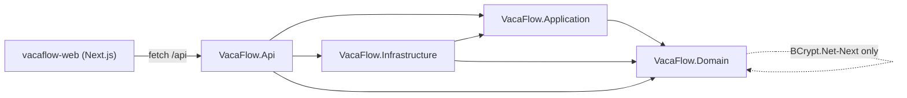

# Implementation Plan — US-001 User Registration

## 1. Metadata

| Field | Value |
|---|---|
| **Plan ID** | IP-2026-07-22-us-001-user-registration |
| **Date** | 2026-07-22 |
| **Source analysis** | [backlog.md §US-001](../../documentation/05-planning/backlog.md) |
| **Author** | Bsa (AI Assisted) |
| **Status** | Draft |
| **Version** | 1.0 |
| **Impacted stacks** | Backend (.NET 8 / EF Core 8 / SQLite), Frontend (Next.js 14 / React 18 / TS 5), Database (SQLite — initial schema) |
| **Linked ticket** | US-001 |

> **GREENFIELD NOTICE.** The repository currently contains documentation only — there is **no source code**. This plan therefore bootstraps the entire solution (`VacaFlow.sln`, the five projects, the EF Core `DbContext`, cookie-auth host, seeders, and the Next.js web app) **before** delivering the registration feature. US-001 is the first buildable slice; every later US (US-002 … US-013) assumes this scaffolding exists.
>
> **INCREMENTAL EXTENSION.** `InfrastructureServiceExtensions.AddInfrastructure()` and `VacaFlow.Api/Program.cs` are created here with only the bindings US-001 needs. They are **extended incrementally by later US** (e.g. `ICurrentUserContext`/`HttpContextCurrentUserContext` and `ITransactionService` land with US-002/US-004; request/approval repositories land with US-004+). Do not attempt to register services for entities that do not yet exist.

---

## 2. Executive Summary

- **Change:** Stand up the VacaFlow solution end-to-end and deliver public employee self-registration: `POST /api/auth/register` plus a Next.js registration page.
- **Motivation:** US-001 is the entry point of the product and the foundational slice that unblocks US-002 … US-013.
- **Backend impact:** New 5-project Reduced-Onion solution, `Employee`/`AbsenceType` domain entities with a BCrypt password factory, EF Core `VacaFlowDbContext` over SQLite, startup DB provisioning + idempotent seeders, cookie-auth host with a single `ExceptionHandlingMiddleware`, and the `AuthService.RegisterAsync` use case.
- **Frontend impact:** New `vacaflow-web` Next.js 14 App-Router app, a credentials-aware `lib/api.ts` client, and a `/register` page with an accessible, fully state-managed form (idle / submitting / error / success).
- **Global risk:** **Medium** — risk is concentrated in greenfield scaffolding correctness (project reference direction, Application-layer purity) and startup DB provisioning, not in the registration logic itself.
- **Total effort:** **53 hours** (Backend 36h · Frontend 13h · Database 4h).

---

## 3. Scope

### In scope — Backend
- `VacaFlow.sln` and the five projects with strictly inward project references, `.editorconfig`, `.gitignore` (`*.db`, `*.db-journal`, `.env.local`).
- `Employee` entity (private ctor + `RegisterEmployee` / `CreateManager` BCrypt factories), `AbsenceType` entity, `UserRole` enum, `DomainException` base + `InvalidEmployeeException`.
- Application layer: `IAuthService` / `AuthService.RegisterAsync`, `IUserRepository`, `RegisterRequest` / `RegisterResponse` DTOs, `ValidationException` (carries a stable error code).
- Infrastructure: `VacaFlowDbContext` + `Employees`/`AbsenceTypes` mappings, `InitialCreate` migration applied at startup, `AbsenceTypeSeeder` (Vacation / Personal Leave / Sick Leave), `ManagerAccountSeeder` (BR-AUTH-003), `EfCoreUserRepository`, `InfrastructureServiceExtensions.AddInfrastructure()` + `InitializeDatabaseAsync()`.
- Api host: `Program.cs` cookie-auth scheme (HttpOnly, `SameSite=Strict`, 120-min sliding), CORS (explicit `http://localhost:3000`, `AllowCredentials`), `ExceptionHandlingMiddleware`, `/health`, `POST /api/auth/register` (`AuthEndpoints`).
- Backend test project (`VacaFlow.Tests`) with hand-written fakes, Domain + Application unit tests, and a `WebApplicationFactory` integration test.

### In scope — Frontend
- `vacaflow-web` Next.js 14 App-Router scaffold (TS strict, no `any`), `src/lib/api.ts` (`credentials:'include'`), `src/types/index.ts`.
- `/register` route (`app/register/page.tsx`) and `components/RegisterForm.tsx` (client component) covering **all UI states**: idle, submitting (disabled button), field-level validation errors, duplicate-email error, server/network error, and success (redirect to `/login`).
- **Responsive / mobile:** single-column form usable from a 360 px viewport upward.

### In scope — Contracts
- `POST /api/auth/register` request `{ fullName, email, password }` → `201` `{ id, fullName, email, role }`; error shape `{ code, message }`.
- `GET /health` → `200` `{ status: "healthy" }`.

### Out of scope
- Login / session issuance (US-002), logout (US-003), `GET /api/me` (US-013), absence-type list endpoint (US-012), any request/approval workflow (US-004 … US-011).
- Email verification, password reset, MFA, corporate SSO — all **Won't v1** (backlog §3, W-005/W-006/W-019/W-001).
- `ICurrentUserContext`, `ITransactionService`, and request/approval repositories (created by later US).

### Assumptions
- **A1 — Role is not part of the public contract (BR-AUTH-001 / AC-003).** `RegisterRequest` deliberately has **no** `role` field, so the server always creates `UserRole.Employee` via `Employee.RegisterEmployee(...)`. A manipulated payload's extra `role` property is structurally ignored (never bound), so **no Manager account can be created** through this endpoint — the security outcome AC-003 requires. Per BR-AUTH-001 ("ignore/override submitted role") this is enforced by contract shape rather than by returning a distinct rejection error. This is the OWASP-preferred posture (server-assigned authorization; never trust the client for role).
- **A2 — Duplicate email HTTP status.** The brief's error contract (§4) defines no `409` class. A duplicate email is therefore surfaced as a `400` validation-class response with the stable code `EMAIL_ALREADY_IN_USE`, consistent with AC-002 ("error indicating the email is already in use"). A DB **unique index on `Email`** is the authoritative backstop against the check-then-insert race.
- **A3 — Email normalization.** Emails are trimmed and lower-cased before storage and lookup, so the unique index enforces case-insensitive uniqueness on a case-sensitive SQLite `TEXT` column.
- **A4 — Password baseline.** The backlog defines only missing-field validation (AC-004). A minimum length of **8 characters** is added as an OWASP ASVS baseline; no maximum, no forced composition rules (NIST-aligned). BCrypt work factor **12**.
- **A5 — DB provisioning via EF Core Migrations** (`Database.MigrateAsync()`), not `EnsureCreated`, because the schema grows across later US and `EnsureCreated` does not compose with subsequent migrations.
- **A6 — BR-APPR-003 (manager-queue scoping) is not applicable to US-001** (no manager/approval surface here); it is noted in the manager-facing US plans (US-008 … US-010).
- **A7 — Local-only MVP.** No Docker, cloud, or CI/CD (backlog W-002/W-003). Cookie `SecurePolicy = SameAsRequest` so the scheme functions over local `http`; production hardening (`Always` + HTTPS) is a later concern.

---

## 4. Architecture Impact

### Before → After

```
BEFORE                                AFTER
------                                -----
VacaFlow_03/                          VacaFlow_03/
  documentation/  (docs only)           VacaFlow.sln
  docs/                                 VacaFlow.Domain/         → BCrypt.Net-Next
  (no .sln, no code)                    VacaFlow.Application/    → Domain
                                        VacaFlow.Infrastructure/ → Application, Domain, EF Core, Sqlite
                                        VacaFlow.Api/            → Application, Infrastructure, Domain
                                        VacaFlow.Tests/          → all
                                        vacaflow-web/  (Next.js 14)
```

**Dependency flow (must remain strictly inward):**



### API Contract Changes

| Method | Path | Auth | Request | Success | Errors |
|---|---|---|---|---|---|
| POST | `/api/auth/register` | Anonymous | `{ "fullName": string, "email": string, "password": string }` | `201` `{ id, fullName, email, role }` | `400` `{code,message}` (`MISSING_FULL_NAME` / `MISSING_EMAIL` / `MISSING_PASSWORD` / `INVALID_EMAIL` / `WEAK_PASSWORD` / `EMAIL_ALREADY_IN_USE`) · `500 INTERNAL_ERROR` |
| GET | `/health` | Anonymous | — | `200` `{ status:"healthy" }` | — |

### Frontend State / Routing changes
- New route `/register` (App Router). Form state machine: `idle → submitting → (success → redirect /login | idle + error)`.
- New `lib/api.ts` `register()` helper and `ApiRequestError` type; all fetches use `credentials:'include'`.

### Backend interface changes (new)
- `IAuthService { Task<RegisterResponse> RegisterAsync(RegisterRequest, CancellationToken); }`
- `IUserRepository { Task<bool> EmailExistsAsync(...); Task<Employee?> GetByEmailAsync(...); Task AddAsync(Employee, ...); }`

---

## 5. Pre-flight Checklist

- [ ] Working on branch `feature/yreyes/us001` (already checked out).
- [ ] .NET SDK **8.x** installed (`dotnet --version` ≥ 8.0).
- [ ] Node.js **20.x LTS** + npm installed (`node -v`).
- [ ] `dotnet-ef` tool available (`dotnet tool install --global dotnet-ef --version 8.*` if missing).
- [ ] No prerequisite US required — **US-001 is the first story** (backlog dependency column: *None*).
- [ ] Backlog §US-001 reviewed (AC-001 … AC-004, BR-AUTH-001/002/003, BR-IDEN-001).
- [ ] No existing solution/migrations to reconcile (greenfield).
- [ ] `SHARED-TECH-BRIEF` §2–§7 reviewed for structure, interfaces, and conventions.

---

## 6. Implementation Phases

> Every phase leaves **both** builds green (`dotnet build` and `npm run build`). The frontend does not call `/api/auth/register` until Phase 6 (its backend) is complete.

### Phase 1 — Solution & project scaffolding [Stack: Cross]

- **Goal:** Create the empty, buildable 5-project solution with correct inward-only references and repo hygiene files.
- **Affected files:** [VacaFlow.sln](../../VacaFlow.sln), [VacaFlow.Domain.csproj](../../VacaFlow.Domain/VacaFlow.Domain.csproj), [VacaFlow.Application.csproj](../../VacaFlow.Application/VacaFlow.Application.csproj), [VacaFlow.Infrastructure.csproj](../../VacaFlow.Infrastructure/VacaFlow.Infrastructure.csproj), [VacaFlow.Api.csproj](../../VacaFlow.Api/VacaFlow.Api.csproj), [VacaFlow.Tests.csproj](../../VacaFlow.Tests/VacaFlow.Tests.csproj), [.editorconfig](../../.editorconfig), [.gitignore](../../.gitignore), [README.md](../../README.md)
- **Steps:**
  1. Create the solution and projects:
     ```bash
     dotnet new sln -n VacaFlow
     dotnet new classlib   -n VacaFlow.Domain         -f net8.0
     dotnet new classlib   -n VacaFlow.Application     -f net8.0
     dotnet new classlib   -n VacaFlow.Infrastructure  -f net8.0
     dotnet new webapi      -n VacaFlow.Api             -f net8.0 --use-minimal-apis
     dotnet new xunit       -n VacaFlow.Tests           -f net8.0
     dotnet sln add VacaFlow.Domain VacaFlow.Application VacaFlow.Infrastructure VacaFlow.Api VacaFlow.Tests
     ```
  2. Wire inward-only references:
     ```bash
     dotnet add VacaFlow.Application     reference VacaFlow.Domain
     dotnet add VacaFlow.Infrastructure  reference VacaFlow.Application VacaFlow.Domain
     dotnet add VacaFlow.Api             reference VacaFlow.Application VacaFlow.Infrastructure VacaFlow.Domain
     dotnet add VacaFlow.Tests           reference VacaFlow.Domain VacaFlow.Application VacaFlow.Infrastructure VacaFlow.Api
     ```
  3. Add the BCrypt package to Domain only: `dotnet add VacaFlow.Domain package BCrypt.Net-Next --version 4.0.3`.
  4. Set the common `PropertyGroup` in each `.csproj` (`net8.0`, `LangVersion=12`, `Nullable=enable`, `ImplicitUsings=enable`, `TreatWarningsAsErrors=true`). Confirm **`VacaFlow.Application` has zero `Microsoft.*` package references** (Domain reference only).
  5. Author `.editorconfig`:
     ```ini
     root = true
     [*.cs]
     indent_style = space
     indent_size = 4
     dotnet_sort_system_directives_first = true
     csharp_style_namespace_declarations = file_scoped:warning
     dotnet_diagnostic.CA2007.severity = none
     dotnet_style_require_accessibility_modifiers = always:warning
     [*.{ts,tsx,json}]
     indent_size = 2
     ```
  6. Author `.gitignore` (append to any generated one): `bin/`, `obj/`, `*.db`, `*.db-journal`, `*.db-wal`, `*.db-shm`, `.env.local`, `node_modules/`, `.next/`, `out/`, `TestResults/`, `coverage/`.
  7. Delete the template `Class1.cs` / default `WeatherForecast` files created by `dotnet new`.
- **Validation:** `dotnet build VacaFlow.sln` succeeds with zero warnings. `git status --ignored` shows `*.db` / `.env.local` ignored. Confirm reference direction: `dotnet list VacaFlow.Application/VacaFlow.Application.csproj reference` shows only `VacaFlow.Domain`.
- **Rollback:** `git clean -fdx` on the new project folders and `git checkout -- .`; delete `VacaFlow.sln`.
- **Estimated effort:** 6h
- **Dependencies:** none.

### Phase 2 — Domain foundation [Stack: Backend]

- **Goal:** Provide the pure domain model with a BCrypt-hashing employee factory that structurally enforces BR-AUTH-001/002/003.
- **Affected files:** [UserRole.cs](../../VacaFlow.Domain/ValueObjects/UserRole.cs), [DomainException.cs](../../VacaFlow.Domain/Exceptions/DomainException.cs), [InvalidEmployeeException.cs](../../VacaFlow.Domain/Exceptions/InvalidEmployeeException.cs), [Employee.cs](../../VacaFlow.Domain/Entities/Employee.cs), [AbsenceType.cs](../../VacaFlow.Domain/Entities/AbsenceType.cs)
- **Steps:**
  1. `UserRole` enum:
     ```csharp
     namespace VacaFlow.Domain.ValueObjects;

     public enum UserRole
     {
         Employee = 0,
         Manager = 1
     }
     ```
  2. Domain exception base + concrete:
     ```csharp
     namespace VacaFlow.Domain.Exceptions;

     public abstract class DomainException : Exception
     {
         protected DomainException(string message) : base(message) { }
     }
     ```
     ```csharp
     namespace VacaFlow.Domain.Exceptions;

     public sealed class InvalidEmployeeException : DomainException
     {
         public InvalidEmployeeException(string message) : base(message) { }
     }
     ```
     > Sibling domain exceptions (`InvalidStateTransitionException`, `SelfApprovalException`, `NotFoundException`) are added by later US when their concerns appear.
  3. `Employee` entity with private ctor (EF), guarded factories, BCrypt hashing:
     ```csharp
     using VacaFlow.Domain.Exceptions;
     using VacaFlow.Domain.ValueObjects;
     using BCryptNet = BCrypt.Net.BCrypt;

     namespace VacaFlow.Domain.Entities;

     public sealed class Employee
     {
         // OWASP-recommended interactive-login work factor.
         private const int BcryptWorkFactor = 12;

         public Guid Id { get; private set; }
         public string FullName { get; private set; }
         public string Email { get; private set; }
         public string PasswordHash { get; private set; }
         public UserRole Role { get; private set; }
         public Guid? AssignedManagerId { get; private set; }
         public DateTime CreatedAt { get; private set; }

         // Required by EF Core materialization.
         private Employee()
         {
             FullName = string.Empty;
             Email = string.Empty;
             PasswordHash = string.Empty;
         }

         private Employee(Guid id, string fullName, string email, string passwordHash, UserRole role, DateTime createdAtUtc)
         {
             Id = id;
             FullName = fullName;
             Email = email;
             PasswordHash = passwordHash;
             Role = role;
             CreatedAt = createdAtUtc;
         }

         /// <summary>Public self-registration. BR-AUTH-001: role is always Employee. BR-AUTH-002: password is BCrypt-hashed.</summary>
         public static Employee RegisterEmployee(string fullName, string email, string plainPassword)
         {
             Guard(fullName, email, plainPassword);
             var hash = BCryptNet.HashPassword(plainPassword, BcryptWorkFactor);
             return new Employee(Guid.NewGuid(), fullName, email, hash, UserRole.Employee, DateTime.UtcNow);
         }

         /// <summary>Privileged Manager creation (seed/admin channel only — BR-AUTH-003).</summary>
         public static Employee CreateManager(string fullName, string email, string plainPassword)
         {
             Guard(fullName, email, plainPassword);
             var hash = BCryptNet.HashPassword(plainPassword, BcryptWorkFactor);
             return new Employee(Guid.NewGuid(), fullName, email, hash, UserRole.Manager, DateTime.UtcNow);
         }

         private static void Guard(string fullName, string email, string plainPassword)
         {
             if (string.IsNullOrWhiteSpace(fullName)) throw new InvalidEmployeeException("Full name is required.");
             if (string.IsNullOrWhiteSpace(email)) throw new InvalidEmployeeException("Email is required.");
             if (string.IsNullOrWhiteSpace(plainPassword)) throw new InvalidEmployeeException("Password is required.");
         }
     }
     ```
     > `VerifyPassword(...)` is added by US-002 (login); it is intentionally omitted here to stay within scope.
  4. `AbsenceType` entity (needed by the seeder now; the list endpoint is US-012):
     ```csharp
     namespace VacaFlow.Domain.Entities;

     public sealed class AbsenceType
     {
         public Guid Id { get; private set; }
         public string Name { get; private set; }

         private AbsenceType() => Name = string.Empty;

         public AbsenceType(Guid id, string name)
         {
             Id = id;
             Name = name;
         }
     }
     ```
- **Validation:** `dotnet build VacaFlow.Domain` clean. Manual REPL check (or deferred to Phase 7 tests): `Employee.RegisterEmployee("A","a@b.c","password1").Role == UserRole.Employee` and the hash verifies.
- **Rollback:** `git checkout -- VacaFlow.Domain/`.
- **Estimated effort:** 5h
- **Dependencies:** Phase 1.

### Phase 3 — Application layer (registration use case) [Stack: Backend]

- **Goal:** Define the framework-free registration use case, DTOs, repository port, and validation exception.
- **Affected files:** [RegisterRequest.cs](../../VacaFlow.Application/Dtos/RegisterRequest.cs), [RegisterResponse.cs](../../VacaFlow.Application/Dtos/RegisterResponse.cs), [IUserRepository.cs](../../VacaFlow.Application/Interfaces/IUserRepository.cs), [IAuthService.cs](../../VacaFlow.Application/Interfaces/IAuthService.cs), [ValidationException.cs](../../VacaFlow.Application/Exceptions/ValidationException.cs), [AuthService.cs](../../VacaFlow.Application/Services/AuthService.cs)
- **Steps:**
  1. DTOs (nullable inputs so missing fields are detectable — AC-004):
     ```csharp
     namespace VacaFlow.Application.Dtos;

     public sealed record RegisterRequest(string? FullName, string? Email, string? Password);
     ```
     ```csharp
     namespace VacaFlow.Application.Dtos;

     public sealed record RegisterResponse(Guid Id, string FullName, string Email, string Role);
     ```
  2. Ports:
     ```csharp
     using VacaFlow.Domain.Entities;

     namespace VacaFlow.Application.Interfaces;

     public interface IUserRepository
     {
         Task<bool> EmailExistsAsync(string email, CancellationToken cancellationToken = default);
         Task<Employee?> GetByEmailAsync(string email, CancellationToken cancellationToken = default);
         Task AddAsync(Employee employee, CancellationToken cancellationToken = default);
     }
     ```
     ```csharp
     using VacaFlow.Application.Dtos;

     namespace VacaFlow.Application.Interfaces;

     public interface IAuthService
     {
         Task<RegisterResponse> RegisterAsync(RegisterRequest request, CancellationToken cancellationToken = default);
     }
     ```
  3. Validation exception carrying a stable code:
     ```csharp
     namespace VacaFlow.Application.Exceptions;

     public sealed class ValidationException : Exception
     {
         public string Code { get; }

         public ValidationException(string message, string code = "VALIDATION_ERROR") : base(message)
             => Code = code;
     }
     ```
  4. `AuthService.RegisterAsync` — normalize, validate (AC-004), reject duplicates (AC-002), delegate role-forcing + hashing to the domain factory (AC-001, AC-003, BR-AUTH-001/002):
     ```csharp
     using System.Text.RegularExpressions;
     using VacaFlow.Application.Dtos;
     using VacaFlow.Application.Exceptions;
     using VacaFlow.Application.Interfaces;
     using VacaFlow.Domain.Entities;

     namespace VacaFlow.Application.Services;

     public sealed class AuthService : IAuthService
     {
         // Bounded, linear, ReDoS-safe email sanity check (format detail is validated, not RFC-exhaustive).
         private static readonly Regex EmailPattern = new(
             @"^[^@\s]+@[^@\s]+\.[^@\s]+$",
             RegexOptions.Compiled | RegexOptions.CultureInvariant,
             TimeSpan.FromMilliseconds(100));

         private const int MinPasswordLength = 8;

         private readonly IUserRepository _userRepository;

         public AuthService(IUserRepository userRepository) => _userRepository = userRepository;

         public async Task<RegisterResponse> RegisterAsync(RegisterRequest request, CancellationToken cancellationToken = default)
         {
             var fullName = request.FullName?.Trim() ?? string.Empty;
             var email = request.Email?.Trim().ToLowerInvariant() ?? string.Empty;
             var password = request.Password ?? string.Empty;

             if (string.IsNullOrWhiteSpace(fullName))
                 throw new ValidationException("Full name is required.", "MISSING_FULL_NAME");
             if (string.IsNullOrWhiteSpace(email))
                 throw new ValidationException("Email is required.", "MISSING_EMAIL");
             if (string.IsNullOrWhiteSpace(password))
                 throw new ValidationException("Password is required.", "MISSING_PASSWORD");
             if (!EmailPattern.IsMatch(email))
                 throw new ValidationException("Email format is invalid.", "INVALID_EMAIL");
             if (password.Length < MinPasswordLength)
                 throw new ValidationException($"Password must be at least {MinPasswordLength} characters.", "WEAK_PASSWORD");

             if (await _userRepository.EmailExistsAsync(email, cancellationToken))
                 throw new ValidationException("Email is already in use.", "EMAIL_ALREADY_IN_USE");

             // BR-AUTH-001 (role forced to Employee) + BR-AUTH-002 (BCrypt) enforced inside the factory.
             var employee = Employee.RegisterEmployee(fullName, email, password);
             await _userRepository.AddAsync(employee, cancellationToken);

             return new RegisterResponse(employee.Id, employee.FullName, employee.Email, employee.Role.ToString());
         }
     }
     ```
     > A single-entity insert is atomic under one `SaveChanges`; `ITransactionService` (multi-step atomicity) is introduced by US-004 and not needed here.
- **Validation:** `dotnet build VacaFlow.Application` clean; `grep -r "using Microsoft" VacaFlow.Application/` returns **zero** matches.
- **Rollback:** `git checkout -- VacaFlow.Application/`.
- **Estimated effort:** 5h
- **Dependencies:** Phase 2.

### Phase 4 — Infrastructure persistence, migration, seeders & DI [Stack: DB + Backend]

- **Goal:** Persist `Employee`/`AbsenceType` in SQLite, auto-provision the DB at startup, seed reference data + a Manager account, and expose `AddInfrastructure()`.
- **Affected files:** [VacaFlowDbContext.cs](../../VacaFlow.Infrastructure/Persistence/VacaFlowDbContext.cs), [EfCoreUserRepository.cs](../../VacaFlow.Infrastructure/Persistence/Repositories/EfCoreUserRepository.cs), [AbsenceTypeSeeder.cs](../../VacaFlow.Infrastructure/Seeders/AbsenceTypeSeeder.cs), [ManagerAccountSeeder.cs](../../VacaFlow.Infrastructure/Seeders/ManagerAccountSeeder.cs), [Seeders/README.md](../../VacaFlow.Infrastructure/Seeders/README.md), [InfrastructureServiceExtensions.cs](../../VacaFlow.Infrastructure/Extensions/InfrastructureServiceExtensions.cs), [Migrations/](../../VacaFlow.Infrastructure/Persistence/Migrations)
- **Steps:**
  1. Add packages to Infrastructure: `Microsoft.EntityFrameworkCore.Sqlite 8.0.8`, `Microsoft.EntityFrameworkCore.Design 8.0.8`, `Microsoft.Extensions.Configuration.Abstractions 8.0.0`.
  2. `VacaFlowDbContext` with `Employees`/`AbsenceTypes` mappings, unique email index, enum-as-string, self-referencing manager FK:
     ```csharp
     using Microsoft.EntityFrameworkCore;
     using VacaFlow.Domain.Entities;

     namespace VacaFlow.Infrastructure.Persistence;

     public sealed class VacaFlowDbContext : DbContext
     {
         public VacaFlowDbContext(DbContextOptions<VacaFlowDbContext> options) : base(options) { }

         public DbSet<Employee> Employees => Set<Employee>();
         public DbSet<AbsenceType> AbsenceTypes => Set<AbsenceType>();

         protected override void OnModelCreating(ModelBuilder modelBuilder)
         {
             modelBuilder.Entity<Employee>(e =>
             {
                 e.ToTable("Employees");
                 e.HasKey(x => x.Id);
                 e.Property(x => x.Id).ValueGeneratedNever();
                 e.Property(x => x.FullName).IsRequired().HasMaxLength(200);
                 e.Property(x => x.Email).IsRequired().HasMaxLength(320);
                 e.HasIndex(x => x.Email).IsUnique();
                 e.Property(x => x.PasswordHash).IsRequired().HasMaxLength(100);
                 e.Property(x => x.Role).HasConversion<string>().IsRequired().HasMaxLength(20);
                 e.Property(x => x.CreatedAt).IsRequired();
                 e.HasOne<Employee>()
                     .WithMany()
                     .HasForeignKey(x => x.AssignedManagerId)
                     .OnDelete(DeleteBehavior.Restrict);
             });

             modelBuilder.Entity<AbsenceType>(a =>
             {
                 a.ToTable("AbsenceTypes");
                 a.HasKey(x => x.Id);
                 a.Property(x => x.Id).ValueGeneratedNever();
                 a.Property(x => x.Name).IsRequired().HasMaxLength(50);
                 a.HasIndex(x => x.Name).IsUnique();
             });

             base.OnModelCreating(modelBuilder);
         }
     }
     ```
  3. `EfCoreUserRepository` (self-contained persistence for the single-entity registration use case):
     ```csharp
     using Microsoft.EntityFrameworkCore;
     using VacaFlow.Application.Interfaces;
     using VacaFlow.Domain.Entities;
     using VacaFlow.Infrastructure.Persistence;

     namespace VacaFlow.Infrastructure.Persistence.Repositories;

     public sealed class EfCoreUserRepository : IUserRepository
     {
         private readonly VacaFlowDbContext _dbContext;

         public EfCoreUserRepository(VacaFlowDbContext dbContext) => _dbContext = dbContext;

         public Task<bool> EmailExistsAsync(string email, CancellationToken cancellationToken = default) =>
             _dbContext.Employees.AsNoTracking().AnyAsync(e => e.Email == email, cancellationToken);

         public Task<Employee?> GetByEmailAsync(string email, CancellationToken cancellationToken = default) =>
             _dbContext.Employees.AsNoTracking().SingleOrDefaultAsync(e => e.Email == email, cancellationToken);

         public async Task AddAsync(Employee employee, CancellationToken cancellationToken = default)
         {
             await _dbContext.Employees.AddAsync(employee, cancellationToken);
             await _dbContext.SaveChangesAsync(cancellationToken);
         }
     }
     ```
  4. Idempotent seeders:
     ```csharp
     using Microsoft.EntityFrameworkCore;
     using VacaFlow.Domain.Entities;
     using VacaFlow.Infrastructure.Persistence;

     namespace VacaFlow.Infrastructure.Seeders;

     public static class AbsenceTypeSeeder
     {
         private static readonly string[] SeedNames = { "Vacation", "Personal Leave", "Sick Leave" };

         public static async Task SeedAsync(VacaFlowDbContext dbContext, CancellationToken cancellationToken = default)
         {
             foreach (var name in SeedNames)
             {
                 var exists = await dbContext.AbsenceTypes.AnyAsync(t => t.Name == name, cancellationToken);
                 if (!exists)
                     await dbContext.AbsenceTypes.AddAsync(new AbsenceType(Guid.NewGuid(), name), cancellationToken);
             }
             await dbContext.SaveChangesAsync(cancellationToken);
         }
     }
     ```
     ```csharp
     using Microsoft.EntityFrameworkCore;
     using VacaFlow.Domain.Entities;
     using VacaFlow.Infrastructure.Persistence;

     namespace VacaFlow.Infrastructure.Seeders;

     public static class ManagerAccountSeeder
     {
         public static async Task SeedAsync(
             VacaFlowDbContext dbContext, string fullName, string email, string plainPassword,
             CancellationToken cancellationToken = default)
         {
             var normalizedEmail = email.Trim().ToLowerInvariant();
             if (await dbContext.Employees.AnyAsync(e => e.Email == normalizedEmail, cancellationToken))
                 return;

             var manager = Employee.CreateManager(fullName, normalizedEmail, plainPassword); // BR-AUTH-003
             await dbContext.Employees.AddAsync(manager, cancellationToken);
             await dbContext.SaveChangesAsync(cancellationToken);
         }
     }
     ```
  5. `InfrastructureServiceExtensions` — DI registration + startup provisioning. **Manager seed password is read from configuration, never hardcoded** (OWASP A07 — no hardcoded credentials):
     ```csharp
     using Microsoft.EntityFrameworkCore;
     using Microsoft.Extensions.Configuration;
     using Microsoft.Extensions.DependencyInjection;
     using VacaFlow.Application.Interfaces;
     using VacaFlow.Infrastructure.Persistence;
     using VacaFlow.Infrastructure.Persistence.Repositories;
     using VacaFlow.Infrastructure.Seeders;

     namespace VacaFlow.Infrastructure.Extensions;

     public static class InfrastructureServiceExtensions
     {
         // Extended incrementally by later US (ICurrentUserContext, ITransactionService, request/approval repos).
         public static IServiceCollection AddInfrastructure(this IServiceCollection services, IConfiguration configuration)
         {
             var connectionString = configuration.GetConnectionString("VacaFlow") ?? "Data Source=vacaflow.db";
             services.AddDbContext<VacaFlowDbContext>(options => options.UseSqlite(connectionString));
             services.AddScoped<IUserRepository, EfCoreUserRepository>();
             return services;
         }

         public static async Task InitializeDatabaseAsync(this IServiceProvider serviceProvider, IConfiguration configuration)
         {
             using var scope = serviceProvider.CreateScope();
             var dbContext = scope.ServiceProvider.GetRequiredService<VacaFlowDbContext>();

             await dbContext.Database.MigrateAsync();
             await AbsenceTypeSeeder.SeedAsync(dbContext);

             var managerName = configuration["Seed:Manager:FullName"] ?? "Default Manager";
             var managerEmail = configuration["Seed:Manager:Email"] ?? "manager@vacaflow.local";
             var managerPassword = configuration["Seed:Manager:Password"]
                 ?? throw new InvalidOperationException("Seed:Manager:Password must be configured (env var / user-secrets / appsettings.Development.json).");

             await ManagerAccountSeeder.SeedAsync(dbContext, managerName, managerEmail, managerPassword);
         }
     }
     ```
  6. Add a design-time factory (so `dotnet ef` can build the context without the API host) at `VacaFlow.Infrastructure/Persistence/VacaFlowDbContextFactory.cs`:
     ```csharp
     using Microsoft.EntityFrameworkCore;
     using Microsoft.EntityFrameworkCore.Design;

     namespace VacaFlow.Infrastructure.Persistence;

     public sealed class VacaFlowDbContextFactory : IDesignTimeDbContextFactory<VacaFlowDbContext>
     {
         public VacaFlowDbContext CreateDbContext(string[] args)
         {
             var options = new DbContextOptionsBuilder<VacaFlowDbContext>()
                 .UseSqlite("Data Source=vacaflow.db")
                 .Options;
             return new VacaFlowDbContext(options);
         }
     }
     ```
  7. Generate the initial migration:
     ```bash
     dotnet ef migrations add InitialCreate \
       --project VacaFlow.Infrastructure \
       --startup-project VacaFlow.Infrastructure \
       --output-dir Persistence/Migrations
     ```
  8. Author `Seeders/README.md` documenting the three absence types, the Manager-seed config keys, and the rule that absence types are read-only (BR-DATA-001).
- **Validation:** `dotnet build VacaFlow.Infrastructure` clean; `dotnet ef migrations list` shows `InitialCreate`; running the migration against a scratch DB produces `Employees` + `AbsenceTypes` with a unique `IX_Employees_Email`.
- **Rollback:** `dotnet ef migrations remove --project VacaFlow.Infrastructure`; `git checkout -- VacaFlow.Infrastructure/`; delete any `vacaflow.db`.
- **Estimated effort:** 8h (≈4h DB schema/migration, ≈4h seeders/DI)
- **Dependencies:** Phase 2, Phase 3.

### Phase 5 — API host & cross-cutting middleware [Stack: Backend]

- **Goal:** Configure the cookie-auth host, CORS for the web app, centralized error handling, DB provisioning at startup, and `/health` — no feature endpoints yet.
- **Affected files:** [Program.cs](../../VacaFlow.Api/Program.cs), [ExceptionHandlingMiddleware.cs](../../VacaFlow.Api/Middleware/ExceptionHandlingMiddleware.cs), [appsettings.json](../../VacaFlow.Api/appsettings.json), [appsettings.Development.json](../../VacaFlow.Api/appsettings.Development.json)
- **Steps:**
  1. `ExceptionHandlingMiddleware` — single source of the `{ code, message }` shape; never leaks stack traces (OWASP A05/A09):
     ```csharp
     using System.Text.Json;
     using VacaFlow.Application.Exceptions;
     using VacaFlow.Domain.Exceptions;

     namespace VacaFlow.Api.Middleware;

     public sealed class ExceptionHandlingMiddleware
     {
         private readonly RequestDelegate _next;
         private readonly ILogger<ExceptionHandlingMiddleware> _logger;

         public ExceptionHandlingMiddleware(RequestDelegate next, ILogger<ExceptionHandlingMiddleware> logger)
         {
             _next = next;
             _logger = logger;
         }

         public async Task InvokeAsync(HttpContext context)
         {
             try
             {
                 await _next(context);
             }
             catch (Exception ex)
             {
                 var (status, code) = Map(ex);
                 if (status >= 500)
                     _logger.LogError(ex, "Unhandled error on {Method} {Path}", context.Request.Method, context.Request.Path);
                 else
                     _logger.LogWarning("{Code} ({Status}) on {Method} {Path}: {Message}",
                         code, status, context.Request.Method, context.Request.Path, ex.Message);

                 context.Response.Clear();
                 context.Response.StatusCode = status;
                 context.Response.ContentType = "application/json";
                 var message = status >= 500 ? "An unexpected error occurred." : ex.Message;
                 await context.Response.WriteAsync(JsonSerializer.Serialize(new { code, message }));
             }
         }

         // Extended by later US (NotFoundException→404, forbidden→403) as those types are introduced.
         private static (int Status, string Code) Map(Exception ex) => ex switch
         {
             ValidationException v => (StatusCodes.Status400BadRequest, v.Code),
             UnauthorizedAccessException => (StatusCodes.Status401Unauthorized, "UNAUTHORIZED"),
             DomainException => (StatusCodes.Status422UnprocessableEntity, "DOMAIN_RULE_VIOLATION"),
             _ => (StatusCodes.Status500InternalServerError, "INTERNAL_ERROR")
         };
     }
     ```
  2. `Program.cs` — cookie scheme, CORS, DI, provisioning, `/health`:
     ```csharp
     using Microsoft.AspNetCore.Authentication.Cookies;
     using VacaFlow.Api.Middleware;
     using VacaFlow.Application.Interfaces;
     using VacaFlow.Application.Services;
     using VacaFlow.Infrastructure.Extensions;

     var builder = WebApplication.CreateBuilder(args);

     const string WebCorsPolicy = "vacaflow-web";
     var allowedOrigin = builder.Configuration["Cors:AllowedOrigin"] ?? "http://localhost:3000";

     builder.Services.AddCors(options =>
         options.AddPolicy(WebCorsPolicy, policy => policy
             .WithOrigins(allowedOrigin)   // explicit origin — required with AllowCredentials (no wildcard)
             .AllowCredentials()
             .AllowAnyHeader()
             .AllowAnyMethod()));

     builder.Services
         .AddAuthentication(CookieAuthenticationDefaults.AuthenticationScheme)
         .AddCookie(options =>
         {
             options.Cookie.Name = "VacaFlow.Session";
             options.Cookie.HttpOnly = true;                       // OWASP: not readable by JS
             options.Cookie.SameSite = SameSiteMode.Strict;        // CSRF hardening
             options.Cookie.SecurePolicy = CookieSecurePolicy.SameAsRequest; // local http dev; Always in prod
             options.SlidingExpiration = true;
             options.ExpireTimeSpan = TimeSpan.FromMinutes(
                 builder.Configuration.GetValue("CookieAuth:ExpireMinutes", 120));
             options.Events.OnRedirectToLogin = ctx => { ctx.Response.StatusCode = StatusCodes.Status401Unauthorized; return Task.CompletedTask; };
             options.Events.OnRedirectToAccessDenied = ctx => { ctx.Response.StatusCode = StatusCodes.Status403Forbidden; return Task.CompletedTask; };
         });

     builder.Services.AddAuthorization();
     builder.Services.AddScoped<IAuthService, AuthService>();
     builder.Services.AddInfrastructure(builder.Configuration);

     var app = builder.Build();

     await app.Services.InitializeDatabaseAsync(app.Configuration); // migrate + seed at startup

     app.UseMiddleware<ExceptionHandlingMiddleware>();
     app.UseCors(WebCorsPolicy);
     app.UseAuthentication();
     app.UseAuthorization();

     app.MapGet("/health", () => Results.Ok(new { status = "healthy" })).AllowAnonymous();
     // Feature endpoints mapped in Phase 6.

     app.Run();

     public partial class Program { } // exposes Program for WebApplicationFactory integration tests
     ```
  3. `appsettings.json` — non-secret defaults (connection string, CORS origin, cookie minutes). `appsettings.Development.json` — local Manager seed values (documented as local-only throwaway credentials for the MVP demo); recommend `dotnet user-secrets` for anything shared.
- **Validation:** `dotnet run --project VacaFlow.Api` starts; `curl http://localhost:5000/health` → `200 {"status":"healthy"}`; `vacaflow.db` is created with seeded absence types + one Manager row.
- **Rollback:** `git checkout -- VacaFlow.Api/`; delete `vacaflow.db`.
- **Estimated effort:** 6h
- **Dependencies:** Phase 3, Phase 4.

### Phase 6 — Registration endpoint [Stack: Backend]

- **Goal:** Expose `POST /api/auth/register` wired to `AuthService`, completing the backend contract.
- **Affected files:** [AuthEndpoints.cs](../../VacaFlow.Api/Endpoints/AuthEndpoints.cs), [Program.cs](../../VacaFlow.Api/Program.cs)
- **Steps:**
  1. `AuthEndpoints`:
     ```csharp
     using VacaFlow.Application.Dtos;
     using VacaFlow.Application.Interfaces;

     namespace VacaFlow.Api.Endpoints;

     public static class AuthEndpoints
     {
         public static IEndpointRouteBuilder MapAuthEndpoints(this IEndpointRouteBuilder routes)
         {
             var group = routes.MapGroup("/api/auth");
             group.MapPost("/register", RegisterAsync).AllowAnonymous();
             return routes;
         }

         private static async Task<IResult> RegisterAsync(
             RegisterRequest request, IAuthService authService, CancellationToken cancellationToken)
         {
             var result = await authService.RegisterAsync(request, cancellationToken);
             return Results.Json(result, statusCode: StatusCodes.Status201Created);
         }
     }
     ```
  2. In `Program.cs`, add `app.MapAuthEndpoints();` immediately after the `/health` mapping.
- **Validation:** `dotnet build` clean; manual smoke — `curl -i -X POST http://localhost:5000/api/auth/register -H "Content-Type: application/json" -d '{"fullName":"Ada Lovelace","email":"ada@example.com","password":"password1"}'` → `201` with body `{id, fullName, email, role:"Employee"}`; repeat → `400 EMAIL_ALREADY_IN_USE`; omit `password` → `400 MISSING_PASSWORD`; add `"role":"Manager"` → still creates an **Employee**.
- **Rollback:** remove `AuthEndpoints.cs` and the `MapAuthEndpoints()` call; `git checkout -- VacaFlow.Api/`.
- **Estimated effort:** 3h
- **Dependencies:** Phase 5.

### Phase 7 — Backend tests [Stack: Backend]

- **Goal:** Cover the domain factory, the service use case, and the HTTP contract with unit + integration tests using hand-written fakes.
- **Affected files:** [Fakes/FakeUserRepository.cs](../../VacaFlow.Tests/Fakes/FakeUserRepository.cs), [Domain/EmployeeTests.cs](../../VacaFlow.Tests/Domain/EmployeeTests.cs), [Application/AuthServiceTests.cs](../../VacaFlow.Tests/Application/AuthServiceTests.cs), [Api/RegisterEndpointTests.cs](../../VacaFlow.Tests/Api/RegisterEndpointTests.cs)
- **Steps:**
  1. Add test packages: `Microsoft.NET.Test.Sdk 17.11.1`, `xunit 2.9.0`, `xunit.runner.visualstudio 2.8.2`, `coverlet.collector 6.0.2`, `Microsoft.AspNetCore.Mvc.Testing 8.0.8`; add BCrypt.Net-Next to the test project for hash verification.
  2. Hand-written fake (no Moq — brief §6):
     ```csharp
     using VacaFlow.Application.Interfaces;
     using VacaFlow.Domain.Entities;

     namespace VacaFlow.Tests.Fakes;

     public sealed class FakeUserRepository : IUserRepository
     {
         private readonly List<Employee> _employees = new();
         public IReadOnlyList<Employee> All => _employees;

         public Task<bool> EmailExistsAsync(string email, CancellationToken cancellationToken = default) =>
             Task.FromResult(_employees.Exists(e => e.Email == email));

         public Task<Employee?> GetByEmailAsync(string email, CancellationToken cancellationToken = default) =>
             Task.FromResult(_employees.Find(e => e.Email == email));

         public Task AddAsync(Employee employee, CancellationToken cancellationToken = default)
         {
             _employees.Add(employee);
             return Task.CompletedTask;
         }
     }
     ```
  3. Application unit tests (AC-001/002/003/004, BR-AUTH-001/002):
     ```csharp
     using VacaFlow.Application.Dtos;
     using VacaFlow.Application.Exceptions;
     using VacaFlow.Application.Services;
     using VacaFlow.Domain.ValueObjects;
     using VacaFlow.Tests.Fakes;
     using Xunit;
     using BCryptNet = BCrypt.Net.BCrypt;

     namespace VacaFlow.Tests.Application;

     public sealed class AuthServiceTests
     {
         [Fact]
         public async Task RegisterAsync_ForcesEmployeeRole_AndStoresBcryptHash_WhenPayloadValid()
         {
             var repo = new FakeUserRepository();
             var sut = new AuthService(repo);

             var response = await sut.RegisterAsync(new RegisterRequest("Ada Lovelace", "Ada@Example.com", "password1"));

             Assert.Equal(UserRole.Employee.ToString(), response.Role);
             var stored = Assert.Single(repo.All);
             Assert.Equal("ada@example.com", stored.Email);          // normalized
             Assert.NotEqual("password1", stored.PasswordHash);       // never plaintext (BR-AUTH-002)
             Assert.True(BCryptNet.Verify("password1", stored.PasswordHash));
         }

         [Fact]
         public async Task RegisterAsync_Throws_WhenEmailDuplicate()
         {
             var repo = new FakeUserRepository();
             var sut = new AuthService(repo);
             await sut.RegisterAsync(new RegisterRequest("Ada", "ada@example.com", "password1"));

             var ex = await Assert.ThrowsAsync<ValidationException>(
                 () => sut.RegisterAsync(new RegisterRequest("Ada 2", "ada@example.com", "password1")));

             Assert.Equal("EMAIL_ALREADY_IN_USE", ex.Code);
             Assert.Single(repo.All);
         }

         [Theory]
         [InlineData(null, "ada@example.com", "password1", "MISSING_FULL_NAME")]
         [InlineData("Ada", null, "password1", "MISSING_EMAIL")]
         [InlineData("Ada", "ada@example.com", null, "MISSING_PASSWORD")]
         public async Task RegisterAsync_Throws_WhenRequiredFieldMissing(
             string? name, string? email, string? password, string expectedCode)
         {
             var sut = new AuthService(new FakeUserRepository());

             var ex = await Assert.ThrowsAsync<ValidationException>(
                 () => sut.RegisterAsync(new RegisterRequest(name, email, password)));

             Assert.Equal(expectedCode, ex.Code);
         }
     }
     ```
  4. Domain test: `Employee.CreateManager` yields `UserRole.Manager`; `RegisterEmployee` always yields `Employee`; blank input throws `InvalidEmployeeException`.
  5. Integration test with `WebApplicationFactory<Program>` overriding the connection string to a unique temp SQLite file (`Data Source=<temp>.db`), asserting `201` on success, `400 EMAIL_ALREADY_IN_USE` on duplicate, `400 MISSING_PASSWORD` on omission, and that a payload containing `"role":"Manager"` returns `role":"Employee"` (AC-003).
- **Validation:** `dotnet test` green; `dotnet test --collect:"XPlat Code Coverage"` shows Domain+Application ≥80% on changed code.
- **Rollback:** `git checkout -- VacaFlow.Tests/`.
- **Estimated effort:** 7h
- **Dependencies:** Phase 6.

### Phase 8 — Frontend scaffold & API client [Stack: Frontend]

- **Goal:** Stand up the Next.js 14 app with a strict-TS, credentials-aware API client — no calls to the register endpoint yet beyond the typed helper definition.
- **Affected files:** [package.json](../../vacaflow-web/package.json), [tsconfig.json](../../vacaflow-web/tsconfig.json), [src/lib/api.ts](../../vacaflow-web/src/lib/api.ts), [src/types/index.ts](../../vacaflow-web/src/types/index.ts), [src/app/layout.tsx](../../vacaflow-web/src/app/layout.tsx), [.env.local.example](../../vacaflow-web/.env.local.example)
- **Steps:**
  1. Scaffold: `npx create-next-app@14 vacaflow-web --typescript --app --src-dir --eslint --no-tailwind --import-alias "@/*"`.
  2. Ensure `tsconfig.json` has `"strict": true` (and `"noUncheckedIndexedAccess": true`); ESLint rule `@typescript-eslint/no-explicit-any: error`.
  3. `src/types/index.ts`:
     ```typescript
     export interface RegisterPayload {
       fullName: string;
       email: string;
       password: string;
     }

     export interface RegisterResponse {
       id: string;
       fullName: string;
       email: string;
       role: string;
     }

     export interface ApiError {
       code: string;
       message: string;
     }
     ```
  4. `src/lib/api.ts` — every fetch sends `credentials:'include'` (brief §6):
     ```typescript
     import type { ApiError, RegisterPayload, RegisterResponse } from "@/types";

     const API_BASE_URL = process.env.NEXT_PUBLIC_API_BASE_URL ?? "http://localhost:5000";

     export class ApiRequestError extends Error {
       constructor(
         public readonly status: number,
         public readonly code: string,
         message: string,
       ) {
         super(message);
         this.name = "ApiRequestError";
       }
     }

     async function request<TResponse>(path: string, init: RequestInit): Promise<TResponse> {
       const response = await fetch(`${API_BASE_URL}${path}`, {
         ...init,
         credentials: "include",
         headers: { "Content-Type": "application/json", ...(init.headers ?? {}) },
       });

       if (!response.ok) {
         let error: ApiError = { code: "UNKNOWN", message: "Unexpected error." };
         try {
           error = (await response.json()) as ApiError;
         } catch {
           /* non-JSON error body — keep default */
         }
         throw new ApiRequestError(response.status, error.code, error.message);
       }

       return (await response.json()) as TResponse;
     }

     export function register(payload: RegisterPayload): Promise<RegisterResponse> {
       return request<RegisterResponse>("/api/auth/register", {
         method: "POST",
         body: JSON.stringify(payload),
       });
     }
     ```
  5. `.env.local.example` with `NEXT_PUBLIC_API_BASE_URL=http://localhost:5000` (real `.env.local` is gitignored).
- **Validation:** `npm run build` and `npm run lint` succeed with zero `any`; `npm run dev` serves the default page on `http://localhost:3000`.
- **Rollback:** delete the `vacaflow-web/` folder; `git checkout -- .`.
- **Estimated effort:** 6h
- **Dependencies:** Phase 6 (contract finalized) — no runtime dependency; the client only invokes the endpoint from Phase 9.

### Phase 9 — Registration page & form + frontend tests [Stack: Frontend]

- **Goal:** Deliver an accessible `/register` page whose form covers all UI states and satisfies AC-001 … AC-004 end-to-end against the live endpoint.
- **Affected files:** [src/app/register/page.tsx](../../vacaflow-web/src/app/register/page.tsx), [src/components/RegisterForm.tsx](../../vacaflow-web/src/components/RegisterForm.tsx), [src/components/RegisterForm.test.tsx](../../vacaflow-web/src/components/RegisterForm.test.tsx)
- **Steps:**
  1. `RegisterForm.tsx` (client component; RequestForm-style) with client-side required-field + min-length checks mirroring the server, mapped `EMAIL_ALREADY_IN_USE` field error, network-error fallback, and a disabled submitting state:
     ```tsx
     "use client";

     import { useState } from "react";
     import { useRouter } from "next/navigation";
     import { register, ApiRequestError } from "@/lib/api";

     interface FieldErrors {
       fullName?: string;
       email?: string;
       password?: string;
     }

     export function RegisterForm() {
       const router = useRouter();
       const [fullName, setFullName] = useState("");
       const [email, setEmail] = useState("");
       const [password, setPassword] = useState("");
       const [fieldErrors, setFieldErrors] = useState<FieldErrors>({});
       const [formError, setFormError] = useState<string | null>(null);
       const [status, setStatus] = useState<"idle" | "submitting">("idle");

       function validate(): boolean {
         const errors: FieldErrors = {};
         if (!fullName.trim()) errors.fullName = "Full name is required.";
         if (!email.trim()) errors.email = "Email is required.";
         if (!password) errors.password = "Password is required.";
         else if (password.length < 8) errors.password = "Password must be at least 8 characters.";
         setFieldErrors(errors);
         return Object.keys(errors).length === 0;
       }

       async function handleSubmit(event: React.FormEvent<HTMLFormElement>) {
         event.preventDefault();
         setFormError(null);
         if (!validate()) return;

         setStatus("submitting");
         try {
           await register({ fullName: fullName.trim(), email: email.trim(), password });
           router.push("/login?registered=1");
         } catch (err) {
           setStatus("idle");
           if (err instanceof ApiRequestError && err.code === "EMAIL_ALREADY_IN_USE") {
             setFieldErrors({ email: "This email is already registered." });
           } else if (err instanceof ApiRequestError) {
             setFormError(err.message);
           } else {
             setFormError("Unable to reach the server. Please try again.");
           }
         }
       }

       return (
         <form onSubmit={handleSubmit} noValidate>
           {formError && <p role="alert">{formError}</p>}

           <label htmlFor="fullName">Full name</label>
           <input id="fullName" name="fullName" type="text" autoComplete="name" required
             value={fullName} onChange={(e) => setFullName(e.target.value)}
             aria-invalid={Boolean(fieldErrors.fullName)}
             aria-describedby={fieldErrors.fullName ? "fullName-error" : undefined} />
           {fieldErrors.fullName && <span id="fullName-error" role="alert">{fieldErrors.fullName}</span>}

           <label htmlFor="email">Email</label>
           <input id="email" name="email" type="email" autoComplete="email" required
             value={email} onChange={(e) => setEmail(e.target.value)}
             aria-invalid={Boolean(fieldErrors.email)}
             aria-describedby={fieldErrors.email ? "email-error" : undefined} />
           {fieldErrors.email && <span id="email-error" role="alert">{fieldErrors.email}</span>}

           <label htmlFor="password">Password</label>
           <input id="password" name="password" type="password" autoComplete="new-password" required
             value={password} onChange={(e) => setPassword(e.target.value)}
             aria-invalid={Boolean(fieldErrors.password)}
             aria-describedby={fieldErrors.password ? "password-error" : undefined} />
           {fieldErrors.password && <span id="password-error" role="alert">{fieldErrors.password}</span>}

           <button type="submit" disabled={status === "submitting"}>
             {status === "submitting" ? "Creating account…" : "Create account"}
           </button>
         </form>
       );
     }
     ```
  2. `register/page.tsx` (server component shell; no role selector — Employee is implicit per BR-AUTH-001):
     ```tsx
     import type { Metadata } from "next";
     import { RegisterForm } from "@/components/RegisterForm";

     export const metadata: Metadata = { title: "Register · VacaFlow" };

     export default function RegisterPage() {
       return (
         <main>
           <h1>Create your VacaFlow account</h1>
           <p>Register as an employee to submit and track absence requests.</p>
           <RegisterForm />
         </main>
       );
     }
     ```
  3. Add test tooling (`vitest` + `@testing-library/react` + `jsdom` + `jest-axe` or `@axe-core/react`); write `RegisterForm.test.tsx`: renders labelled inputs; missing-field submit shows errors and does not call the API; successful submit calls `register` and navigates; a duplicate-email `ApiRequestError` surfaces on the email field; the submit button is disabled while submitting; an `axe` run reports no violations.
- **Validation:** `npm run build`, `npm run lint`, `npm test` all green. Manual E2E with the API running: register a new employee → redirect to `/login`; re-register same email → inline "already registered"; submit empty form → field errors, no request sent (verify in Network tab).
- **Rollback:** delete `src/app/register/` and `src/components/RegisterForm*`; `git checkout -- vacaflow-web/`.
- **Estimated effort:** 7h
- **Dependencies:** Phase 6 (live endpoint), Phase 8 (client + scaffold).

---

## 7. Database Changes

Initial schema is created by the `InitialCreate` EF Core migration (Phase 4) and applied at startup via `Database.MigrateAsync()` (idempotent — already-applied migrations are skipped).

| Object | Type | DDL / migration | Perf impact | Rollback |
|---|---|---|---|---|
| `Employees` | New table | See DDL below (migration `InitialCreate`) | Negligible (single-writer local SQLite) | `dotnet ef migrations remove` / delete `vacaflow.db` |
| `IX_Employees_Email` | New unique index | `CREATE UNIQUE INDEX "IX_Employees_Email" ON "Employees" ("Email");` | Enforces uniqueness + speeds duplicate check | dropped with the table |
| `IX_Employees_AssignedManagerId` | New index | auto-generated for the self-FK | Negligible | dropped with the table |
| `AbsenceTypes` | New table | See DDL below | Negligible | as above |
| Absence-type rows | Seed DML (idempotent) | `AbsenceTypeSeeder` inserts Vacation / Personal Leave / Sick Leave only if absent | Negligible | delete rows / drop DB |
| Manager account | Seed DML (idempotent) | `ManagerAccountSeeder` inserts one Manager only if the email is absent | Negligible | delete row / drop DB |

Representative generated DDL (SQLite):

```sql
CREATE TABLE "Employees" (
    "Id"                TEXT NOT NULL CONSTRAINT "PK_Employees" PRIMARY KEY,
    "FullName"          TEXT NOT NULL,
    "Email"             TEXT NOT NULL,
    "PasswordHash"      TEXT NOT NULL,
    "Role"              TEXT NOT NULL,
    "AssignedManagerId" TEXT NULL,
    "CreatedAt"         TEXT NOT NULL,
    CONSTRAINT "FK_Employees_Employees_AssignedManagerId"
        FOREIGN KEY ("AssignedManagerId") REFERENCES "Employees" ("Id") ON DELETE RESTRICT
);
CREATE UNIQUE INDEX "IX_Employees_Email" ON "Employees" ("Email");
CREATE INDEX "IX_Employees_AssignedManagerId" ON "Employees" ("AssignedManagerId");

CREATE TABLE "AbsenceTypes" (
    "Id"   TEXT NOT NULL CONSTRAINT "PK_AbsenceTypes" PRIMARY KEY,
    "Name" TEXT NOT NULL
);
CREATE UNIQUE INDEX "IX_AbsenceTypes_Name" ON "AbsenceTypes" ("Name");
```

> `AbsenceRequests` and `ApprovalRecords` tables are **not** created here — they arrive with US-004 / US-009 as additive migrations.

---

## 8. Testing Strategy

### Backend
- **Unit (xUnit, AAA, hand-written fakes, no DbContext/HttpContext):** `EmployeeTests` (role forcing, hash ≠ plaintext, blank-input guard), `AuthServiceTests` (success, duplicate → `EMAIL_ALREADY_IN_USE`, each missing-field code, invalid-email, weak-password).
- **Integration (`WebApplicationFactory<Program>` + temp SQLite):** `POST /api/auth/register` → `201`; duplicate → `400 EMAIL_ALREADY_IN_USE`; missing password → `400 MISSING_PASSWORD`; payload with `"role":"Manager"` → response `role":"Employee"` (AC-003); `GET /health` → `200`.
- **Coverage:** Domain + Application ≥ **80%** on changed code (org bar; exceeds the brief's 70% MVP floor).

### Frontend
- **Unit/integration (Vitest + Testing Library):** field-level validation blocks submit and sends no request; valid submit calls `register` and navigates; duplicate-email error binds to the email field; submit button disabled while submitting; network failure shows the fallback message.
- **Accessibility:** `jest-axe`/`axe-core` run on the rendered form reports **zero** violations; every input has an associated `<label>`; errors use `role="alert"` and `aria-describedby`; keyboard-only completion verified.
- **Coverage:** ≥ **80%** on changed frontend code.

### Cross-cutting
- **Contract alignment:** shared TS `RegisterPayload`/`RegisterResponse` match the C# DTOs (camelCase); integration test is the contract guard.
- **Boundary test (DoD gate):** `grep -r "using Microsoft" VacaFlow.Application/` returns **zero**.
- **Regression areas:** startup provisioning must remain idempotent across repeated `dotnet run` (no duplicate seeds, no migration re-apply errors).

### UX/UI Validation
- **Loading state:** submit button shows "Creating account…" and is disabled during the request (prevents double submit).
- **Error state:** field-level errors (missing/weak fields), inline duplicate-email error, and a form-level network-error banner (`role="alert"`).
- **Empty/initial state:** clean form on first load with clear labels, `autoComplete` hints, and no premature errors (`noValidate` + explicit validation on submit).
- **Success state:** redirect to `/login?registered=1` so the login screen can surface a confirmation.
- **Responsive:** single-column layout legible and operable from 360 px width; inputs ≥ 44 px touch target.
- **Performance targets:** LCP ≤ 2.5 s, CLS ≤ 0.1 on the `/register` route (local dev).

---

## 9. Configuration & Deployment

### Backend environment (`appsettings.json` / `appsettings.Development.json` / env vars)
| Key | Purpose | Local default |
|---|---|---|
| `ConnectionStrings:VacaFlow` | SQLite data source | `Data Source=vacaflow.db` |
| `Cors:AllowedOrigin` | Web origin allowed with credentials | `http://localhost:3000` |
| `CookieAuth:ExpireMinutes` | Sliding session lifetime | `120` |
| `Seed:Manager:FullName` | Seed manager display name | `Default Manager` |
| `Seed:Manager:Email` | Seed manager login | `manager@vacaflow.local` |
| `Seed:Manager:Password` | Seed manager password (**required**; env var / user-secrets / dev-only appsettings) | *(no default — startup fails if unset)* |

> No secret is committed in this plan. For anything beyond a local throwaway DB, set `Seed:Manager:Password` via `dotnet user-secrets` or an environment variable.

### Frontend environment (`vacaflow-web/.env.local` — gitignored)
| Key | Value |
|---|---|
| `NEXT_PUBLIC_API_BASE_URL` | `http://localhost:5000` |

### Local run order
1. `dotnet run --project VacaFlow.Api` → listens on `http://localhost:5000`, provisions + seeds `vacaflow.db`.
2. `cd vacaflow-web && npm run dev` → serves `http://localhost:3000`.
3. Open `http://localhost:3000/register`.

### Pipelines / feature flags
- **None.** Local-only MVP (backlog W-002/W-003). No CI/CD, Docker, or feature flags.

---

## 10. Risks & Mitigations

| # | Risk | Prob | Impact | Mitigation | Owner | Stack |
|---|---|---|---|---|---|---|
| R1 | Onion boundary broken — a `Microsoft.*` reference leaks into `VacaFlow.Application`, or a project reference points outward | M | H | Enforce `TreatWarningsAsErrors`; DoD boundary grep gate; explicit `dotnet list reference` check in Phase 1 validation; code review | BE | BE |
| R2 | Startup DB provisioning fails or double-seeds (migration re-apply, duplicate seed rows, missing seed password) | M | H | `Database.MigrateAsync()` is idempotent; seeders guard on existence; unique indexes on `Email`/`Name`; seed password required from config | BE | DB |
| R3 | Cookie/CORS misconfiguration (SameSite/Secure over local `http`, `AllowCredentials` with a wildcard origin) that breaks the US-002 session later | M | M | Explicit single origin + `AllowCredentials`; `SecurePolicy=SameAsRequest` for local; validate via `/health` + register smoke; documented prod hardening | BE | Cross |
| R4 | Duplicate-email race between `EmailExistsAsync` and insert | L | M | Unique `IX_Employees_Email` as authoritative backstop; friendly `EMAIL_ALREADY_IN_USE` on pre-check | BE | DB |
| R5 | Greenfield estimation drift — first-slice scaffolding takes longer than planned | M | M | Phases are independently buildable/rollback-able; scaffolding isolated in Phases 1–2 for early feedback | BSA | Cross |
| R6 | Accessibility regressions in the registration form (unlabelled inputs, missing error semantics) | M | H | `jest-axe` gate in Phase 9; labels + `role="alert"` + `aria-describedby` mandated; keyboard test | FE | FE |

> No Critical/Major UX gaps remain: the form specifies all four states (loading/error/empty/success). R6 tracks the residual accessibility-regression risk.

---

## 11. Definition of Done

- [ ] **Backend code:** solution + 5 projects build clean with `TreatWarningsAsErrors`; `Employee` factory forces `Employee` role (BR-AUTH-001) and BCrypt-hashes (BR-AUTH-002); Manager creation only via seeder (BR-AUTH-003); `POST /api/auth/register` returns `201` and the documented `400` codes.
- [ ] **Frontend code:** `/register` page + `RegisterForm` implemented; all fetches use `credentials:'include'`; identity never read from `localStorage`.
- [ ] **All UI states implemented:** loading (disabled submitting), error (field + form-level), empty/initial, success (redirect to `/login`).
- [ ] **Tests:** backend unit + integration green, ≥80% coverage on changed Domain/Application code; frontend unit/integration green, ≥80% coverage.
- [ ] **Accessibility:** `axe` reports zero violations; WCAG 2.1 AA verified (labels, alerts, keyboard); no explicit `any` in TS.
- [ ] **Performance:** `/register` meets LCP ≤ 2.5 s and CLS ≤ 0.1 locally.
- [ ] **Boundary gate:** `grep -r "using Microsoft" VacaFlow.Application/` returns zero.
- [ ] **Migrations:** `InitialCreate` present and applies cleanly on a fresh DB; idempotent seeders verified across repeated startups.
- [ ] **Shared types:** TS `RegisterPayload`/`RegisterResponse` match the C# DTOs (camelCase) and are exercised by tests.
- [ ] **API docs:** register + `/health` contract recorded (README or OpenAPI); error codes listed.
- [ ] **Config:** no secrets committed; `.env.local`, `*.db`, `*.db-journal` gitignored; `Seed:Manager:Password` sourced from config.
- [ ] **Docs:** README documents local run order (API → web).
- [ ] **PR approved** by at least one reviewer.
- [ ] **Acceptance criteria satisfied:** AC-001 (successful registration + BCrypt hash), AC-002 (duplicate email rejected), AC-003 (Manager self-assignment blocked — no Manager created), AC-004 (missing-field validation).

---

## 12. References

- **Source analysis:** [backlog.md §US-001](../../documentation/05-planning/backlog.md)
- **Business rules:** BR-AUTH-001 (force Employee), BR-AUTH-002 (BCrypt), BR-AUTH-003 (Manager via seed only), BR-IDEN-001/002 (session-derived identity) — SHARED-TECH-BRIEF §5
- **Functional requirements:** FR-AUTH-001, FR-AUTH-002, FR-AUTH-003 (backlog §5 traceability)
- **Architecture:** Reduced Onion (Alternative C), 5-layer, cookie auth — SHARED-TECH-BRIEF §2; data model §3; API surface §4; conventions §6; output contract §7
- **API contract:** `POST /api/auth/register`, `GET /health` (base `http://localhost:5000`)
- **Related US:** US-002 (Login — first consumer of the cookie scheme, `ICurrentUserContext`), US-004 (`ITransactionService`, request repositories), US-012 (absence-type list endpoint over the seeded catalog)
