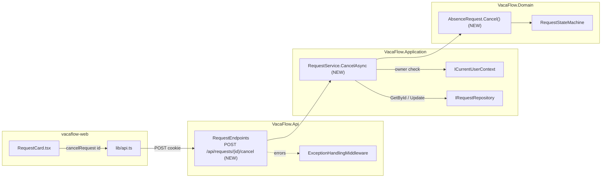

# Implementation Plan — US-007 Cancel Request

## 1. Metadata

| Field | Value |
|---|---|
| **Plan ID** | IP-2026-07-22-us-007-cancel-request |
| **Date** | 2026-07-22 |
| **Source analysis** | [`../../documentation/05-planning/backlog.md`](../../documentation/05-planning/backlog.md) §US-007 |
| **Author** | Bsa (AI Assisted) |
| **Status** | Draft |
| **Version** | 1.0 |
| **Impacted stacks** | Backend (Domain, Application, API), Frontend (Next.js) |
| **Linked ticket** | US-007 |
| **Depends on** | US-004 (Create Draft Request), US-005 (Edit Draft — shared ownership/exception primitives), US-006 (Submit — enables the Submitted → Cancelled path) |

---

## 2. Executive Summary

- **Change:** Add the ability for an authenticated Employee to cancel their own request via a new `AbsenceRequest.Cancel()` domain method, a `RequestService.CancelAsync` orchestration, the `POST /api/requests/{id}/cancel` endpoint, and a state-driven **Cancel** button in `RequestCard.tsx` plus a `cancelRequest` helper in `api.ts`.
- **Motivation:** Employees must be able to withdraw a request while it is still actionable (Draft or Submitted), marking it Cancelled so managers take no further action (FR-ARM-008, FR-LSE-002).
- **Backend impact:** One new domain method, one new service method + interface signature, one new endpoint. No new repository method, no new DB object — reuses `IRequestRepository.GetByIdAsync`/`UpdateAsync` and the existing `AbsenceRequests` table (all five status values already permitted by the CHECK constraint from US-004).
- **Frontend impact:** One new API helper and a conditional, state-driven Cancel button with loading/error/success states and a confirmation dialog, shown only for Draft/Submitted requests.
- **Global risk:** **Low** — small, additive slice built on the US-004 aggregate; the only cross-story concern is the shared 403 forbidden primitive.
- **Total effort:** **~10.5 hours** (Backend 6.5h · Frontend 4h · DB 0h).

---

## 3. Scope

### In scope — Backend
- `AbsenceRequest.Cancel()` domain method enforcing **BR-LIFE-004** (cancellable only from Draft or Submitted) and **BR-LIFE-002** (final states Approved/Rejected/Cancelled are immutable) via the existing `RequestStateMachine`.
- `IRequestService.CancelAsync(Guid requestId)` + `RequestService.CancelAsync` implementation, enforcing **BR-ROLE-002** (owner-only) using `ICurrentUserContext`.
- `POST /api/requests/{id}/cancel` endpoint in `RequestEndpoints.cs`.

### In scope — Frontend
- `cancelRequest(requestId)` helper in `src/lib/api.ts` (`credentials: 'include'`, no request body).
- State-driven **Cancel** button in `src/components/RequestCard.tsx`: visible only when `status ∈ {Draft, Submitted}`; confirmation dialog; loading, error and success states; `onCancelled` callback so the parent list refreshes.
- Responsive/mobile rendering of the button and accessible error messaging.

### In scope — Contracts
- New endpoint `POST /api/requests/{id}/cancel` → `204 No Content` on success; error codes `401 UNAUTHORIZED`, `403 FORBIDDEN`, `404 NOT_FOUND`, `422 DOMAIN_RULE_VIOLATION`, all following the shared `{ "code", "message" }` shape.

### Out of scope
- Any change to the create (US-004), edit (US-005) or submit (US-006) flows.
- The employee request-list page and DTO shaping (US-011) — this plan only exposes an `onCancelled` callback the list will consume.
- The manager approval queue (US-008/009/010) and `GET /api/me`/`useCurrentUser` (US-013).
- Undo/restore of a cancelled request (not a supported transition — Cancelled is terminal).

### Assumptions
- **A1 (prerequisite, do NOT re-scaffold):** US-004 has created the `AbsenceRequest` aggregate (with `RequestStatus` enum, private `Status` setter, `RequestorId`, `UpdatedAt`), `RequestStateMachine` (with the full transition map including `Draft→Cancelled` and `Submitted→Cancelled`), `IRequestService`/`RequestService`, `IRequestRepository` (`GetByIdAsync`, `UpdateAsync`), the `AbsenceRequests` table with a `Status` CHECK constraint covering all five values, `RequestEndpoints.cs` (route group `/api/requests`), the `ExceptionHandlingMiddleware`, and `RequestCard.tsx`/`api.ts`. This plan references these as `[will exist after US-004]` and only **adds** to them.
- **A2:** `NotFoundException` lives in `VacaFlow.Domain.Exceptions` and maps to 404 (US-004 middleware). `InvalidStateTransitionException : DomainException` maps to 422.
- **A3 (shared primitive):** A `ForbiddenAccessException` (Application layer) mapped to `403 FORBIDDEN` by the middleware is the agreed representation of ownership/role violations, first introduced by US-005. US-007 reuses it and **creates it only if still absent** (small compilable class provided in Phase 2) — this is not aggregate/service re-scaffolding.
- **A4:** `RequestCard.tsx` is rendered only in the authenticated user's **own** request list (`GET /api/requests` returns `employee = own`). Because that list is server-scoped to the owner, a status-driven Cancel button is equivalent to owner-scoped; the server still enforces owner-only (403) defensively per BR-ROLE-002.
- **A5 (doc tension, informational):** Not applicable to cancel — the BR-APPR-003 manager-scope tension affects the approval queue (US-008/009/010), not this story.

---

## 4. Architecture Impact

### Before → After (request cancel path)



### API Contract Changes

| Method | Path | Auth | Body | Success | Errors |
|---|---|---|---|---|---|
| POST (NEW) | `/api/requests/{id}/cancel` | Cookie (any authenticated) | none | `204 No Content` | `401 UNAUTHORIZED` (no/invalid cookie) · `403 FORBIDDEN` (not owner, BR-ROLE-002) · `404 NOT_FOUND` (unknown id) · `422 DOMAIN_RULE_VIOLATION` (final-state, BR-LIFE-002/004) |

### Frontend State / Routing changes
- No new route. `RequestCard` gains local state `isCancelling: boolean` and `error: string | null`, a new optional prop `onCancelled?: (id: string) => void`, and a derived `canCancel` flag. No global-state or router changes.

### Backend interface changes
- `IRequestService`: **add** `Task CancelAsync(Guid requestId);`
- `IRequestRepository`: **no change** (reuses `GetByIdAsync`, `UpdateAsync`).
- `AbsenceRequest`: **add** `public void Cancel();`

---

## 5. Pre-flight Checklist

- [ ] **Branch:** work on `feature/yreyes/us007` cut from the integration branch that contains US-004/005/006.
- [ ] **Prerequisite US present (do NOT re-scaffold):** US-004 aggregate `AbsenceRequest`, `RequestStatus` enum, `RequestStateMachine` (transition map includes `Draft→Cancelled` and `Submitted→Cancelled`), `IRequestService`/`RequestService`, `IRequestRepository` (`GetByIdAsync`, `UpdateAsync`), `AbsenceRequests` table with `Status` CHECK constraint (Draft/Submitted/Approved/Rejected/Cancelled), `RequestEndpoints.cs` group `/api/requests`, `ExceptionHandlingMiddleware`. US-005 shared `ForbiddenAccessException` (verify present; create if absent — Phase 2). US-006 enables the Submitted state used by AC-002.
- [ ] **Build green:** `dotnet build VacaFlow.sln` and `npm --prefix vacaflow-web run build` both succeed before starting.
- [ ] **Dependencies:** no new NuGet or npm packages required.
- [ ] **Test suite baseline:** `dotnet test` and `npm --prefix vacaflow-web test` are green before changes.
- [ ] **Migrations:** none required (verify `AbsenceRequests.Status` CHECK constraint already lists `Cancelled`).
- [ ] **Middleware mapping:** confirm `ExceptionHandlingMiddleware` maps `ForbiddenAccessException → 403`, `NotFoundException → 404`, `InvalidStateTransitionException`/`DomainException → 422`.
- [ ] **Analysis reviewed:** backlog §US-007 AC-001…AC-004 and business rules BR-LIFE-002, BR-LIFE-004, BR-ROLE-002 read.

---

## 6. Implementation Phases

### Phase 1 — Domain: `AbsenceRequest.Cancel()` [Stack: Backend]

- **Goal:** Add a domain method that transitions a request to Cancelled only from Draft or Submitted, delegating the guard to `RequestStateMachine`.
- **Affected files:** [`AbsenceRequest.cs`](../../VacaFlow.Domain/Entities/AbsenceRequest.cs), [`RequestStateMachine.cs`](../../VacaFlow.Domain/StateMachine/RequestStateMachine.cs) `[will exist after US-004]`, [`AbsenceRequestCancelTests.cs`](../../VacaFlow.Tests/Domain/AbsenceRequestCancelTests.cs) (new).
- **Steps:**
  1. Add the `Cancel()` method to the existing `AbsenceRequest` class (do not modify other members):
     ```csharp
     // VacaFlow.Domain/Entities/AbsenceRequest.cs  — add to the existing AbsenceRequest class
     /// <summary>
     /// Transitions this request to Cancelled. Permitted only from Draft or Submitted
     /// (BR-LIFE-004). Cancelling a final-state request (Approved, Rejected, Cancelled)
     /// throws <see cref="InvalidStateTransitionException"/> → HTTP 422 (BR-LIFE-002).
     /// </summary>
     public void Cancel()
     {
         RequestStateMachine.EnsureCanTransition(Status, RequestStatus.Cancelled);
         Status = RequestStatus.Cancelled;
         UpdatedAt = DateTime.UtcNow;
     }
     ```
  2. Confirm (do **not** rewrite) that `RequestStateMachine.EnsureCanTransition(RequestStatus from, RequestStatus to)` throws `InvalidStateTransitionException` when the edge is absent and that its map contains `Draft→Cancelled` and `Submitted→Cancelled`. If a Cancelled edge is missing, add only those two entries.
  3. Add domain unit tests (AAA, no mocks — pure domain):
     ```csharp
     // VacaFlow.Tests/Domain/AbsenceRequestCancelTests.cs
     using VacaFlow.Domain.Entities;
     using VacaFlow.Domain.Exceptions;
     using Xunit;

     public class AbsenceRequestCancelTests
     {
         [Theory]
         [InlineData(RequestStatus.Draft)]
         [InlineData(RequestStatus.Submitted)]
         public void Cancel_SetsStatusToCancelled_WhenDraftOrSubmitted(RequestStatus initial)
         {
             var request = AbsenceRequestFake.InStatus(initial);   // test factory in Fakes/
             request.Cancel();
             Assert.Equal(RequestStatus.Cancelled, request.Status);
         }

         [Theory]
         [InlineData(RequestStatus.Approved)]
         [InlineData(RequestStatus.Rejected)]
         [InlineData(RequestStatus.Cancelled)]
         public void Cancel_Throws_WhenFinalState(RequestStatus initial)
         {
             var request = AbsenceRequestFake.InStatus(initial);
             Assert.Throws<InvalidStateTransitionException>(() => request.Cancel());
         }
     }
     ```
- **Validation:** `dotnet test --filter FullyQualifiedName~AbsenceRequestCancelTests` green; `dotnet build VacaFlow.sln` green.
- **Rollback:** `git checkout -- VacaFlow.Domain/Entities/AbsenceRequest.cs VacaFlow.Tests/Domain/AbsenceRequestCancelTests.cs` (and revert the two state-map entries if added).
- **Estimated effort:** 2h.
- **Dependencies:** none (Pre-flight only).

### Phase 2 — Application: `RequestService.CancelAsync` [Stack: Backend]

- **Goal:** Orchestrate cancel: load the request (404 if missing), enforce owner-only (403), invoke `Cancel()`, and persist.
- **Affected files:** [`IRequestService.cs`](../../VacaFlow.Application/Interfaces/IRequestService.cs), [`RequestService.cs`](../../VacaFlow.Application/Services/RequestService.cs), [`ForbiddenAccessException.cs`](../../VacaFlow.Application/Exceptions/ForbiddenAccessException.cs) (create only if absent), [`RequestServiceCancelTests.cs`](../../VacaFlow.Tests/Application/RequestServiceCancelTests.cs) (new).
- **Steps:**
  1. Add the interface signature:
     ```csharp
     // VacaFlow.Application/Interfaces/IRequestService.cs — add member
     Task CancelAsync(Guid requestId);
     ```
  2. Ensure the shared forbidden primitive exists (create **only if** US-005 has not already added it — no framework types, Application-pure):
     ```csharp
     // VacaFlow.Application/Exceptions/ForbiddenAccessException.cs
     namespace VacaFlow.Application.Exceptions;

     /// <summary>Ownership/role authorization failure. Mapped to HTTP 403 by the API middleware.</summary>
     public sealed class ForbiddenAccessException : Exception
     {
         public ForbiddenAccessException(string message) : base(message) { }
     }
     ```
  3. Implement `CancelAsync` in the existing `sealed RequestService` (reuse the injected `_requestRepository` and `_currentUser`):
     ```csharp
     // VacaFlow.Application/Services/RequestService.cs — add method
     public async Task CancelAsync(Guid requestId)
     {
         var request = await _requestRepository.GetByIdAsync(requestId)
             ?? throw new NotFoundException($"Request '{requestId}' was not found.");

         // BR-ROLE-002: only the owner may cancel; identity comes from the session, never the body.
         if (request.RequestorId != _currentUser.CurrentUserId)
             throw new ForbiddenAccessException("You may only cancel your own requests.");

         // BR-LIFE-004 / BR-LIFE-002 enforced inside the aggregate (→ 422 on final states).
         request.Cancel();

         await _requestRepository.UpdateAsync(request);
     }
     ```
     Add `using VacaFlow.Application.Exceptions;` and `using VacaFlow.Domain.Exceptions;` if not already present. A single-aggregate update is atomic under EF Core `SaveChanges`, so no `ITransactionService` wrapping is needed.
  4. Add Application unit tests using hand-written fakes (no Moq), covering all four ACs:
     ```csharp
     // VacaFlow.Tests/Application/RequestServiceCancelTests.cs
     using System;
     using System.Threading.Tasks;
     using VacaFlow.Application.Exceptions;
     using VacaFlow.Application.Services;
     using VacaFlow.Domain.Entities;
     using VacaFlow.Domain.Exceptions;
     using VacaFlow.Tests.Fakes;
     using Xunit;

     public class RequestServiceCancelTests
     {
         private static (RequestService svc, FakeRequestRepository repo) Build(Guid ownerId, Guid currentUserId)
         {
             var repo = new FakeRequestRepository();
             var currentUser = new FakeCurrentUserContext(currentUserId, UserRole.Employee);
             var svc = new RequestService(repo, currentUser /*, other deps from US-004 */);
             return (svc, repo);
         }

         [Fact]
         public async Task CancelAsync_CancelsOwnSubmittedRequest_WhenOwner()  // AC-002
         {
             var owner = Guid.NewGuid();
             var (svc, repo) = Build(owner, owner);
             var request = AbsenceRequestFake.InStatus(RequestStatus.Submitted, ownerId: owner);
             repo.Seed(request);

             await svc.CancelAsync(request.Id);

             Assert.Equal(RequestStatus.Cancelled, repo.GetSeeded(request.Id).Status);
         }

         [Fact]
         public async Task CancelAsync_ThrowsForbidden_WhenNotOwner()          // AC-004
         {
             var owner = Guid.NewGuid();
             var (svc, repo) = Build(owner, currentUserId: Guid.NewGuid());
             var request = AbsenceRequestFake.InStatus(RequestStatus.Draft, ownerId: owner);
             repo.Seed(request);

             await Assert.ThrowsAsync<ForbiddenAccessException>(() => svc.CancelAsync(request.Id));
         }

         [Fact]
         public async Task CancelAsync_ThrowsNotFound_WhenMissing()
         {
             var (svc, _) = Build(Guid.NewGuid(), Guid.NewGuid());
             await Assert.ThrowsAsync<NotFoundException>(() => svc.CancelAsync(Guid.NewGuid()));
         }

         [Fact]
         public async Task CancelAsync_ThrowsStateViolation_WhenFinalState()   // AC-003
         {
             var owner = Guid.NewGuid();
             var (svc, repo) = Build(owner, owner);
             var request = AbsenceRequestFake.InStatus(RequestStatus.Approved, ownerId: owner);
             repo.Seed(request);

             await Assert.ThrowsAsync<InvalidStateTransitionException>(() => svc.CancelAsync(request.Id));
         }
     }
     ```
- **Validation:** `dotnet test --filter FullyQualifiedName~RequestServiceCancel` green; boundary check `grep -r "using Microsoft" VacaFlow.Application/` returns zero.
- **Rollback:** revert the added method/signature and delete the new test file; remove `ForbiddenAccessException.cs` only if this phase created it.
- **Estimated effort:** 2.5h.
- **Dependencies:** Phase 1.

### Phase 3 — API: `POST /api/requests/{id}/cancel` [Stack: Backend]

- **Goal:** Expose the cancel action on the existing `/api/requests` route group, deriving identity from the session cookie only.
- **Affected files:** [`RequestEndpoints.cs`](../../VacaFlow.Api/Endpoints/RequestEndpoints.cs), [`RequestCancelEndpointTests.cs`](../../VacaFlow.Tests/Application/RequestCancelEndpointTests.cs) (new integration test).
- **Steps:**
  1. Register the route inside the existing request group mapping (base `/api/requests`):
     ```csharp
     // VacaFlow.Api/Endpoints/RequestEndpoints.cs — inside MapRequestEndpoints(group)
     group.MapPost("/{id:guid}/cancel", CancelRequestAsync)
          .WithName("CancelRequest")
          .RequireAuthorization();
     ```
  2. Add the handler (transport-only; no business logic — identity resolved server-side via `ICurrentUserContext` inside the service):
     ```csharp
     // VacaFlow.Api/Endpoints/RequestEndpoints.cs
     private static async Task<IResult> CancelRequestAsync(Guid id, IRequestService requestService)
     {
         await requestService.CancelAsync(id);
         return Results.NoContent();
     }
     ```
  3. Rely on the existing `ExceptionHandlingMiddleware` to translate `ForbiddenAccessException`→403, `NotFoundException`→404, `InvalidStateTransitionException`→422; `.RequireAuthorization()` yields 401 for a missing/invalid cookie. Do not catch exceptions in the handler.
  4. Add an integration test (`WebApplicationFactory` + SQLite, per US-004 harness) asserting 204 on own Draft/Submitted, 401 without cookie, 403 for a non-owner, 404 for unknown id, 422 for a final-state request; assert error bodies match `{ "code", "message" }`.
- **Validation:** `dotnet test --filter FullyQualifiedName~RequestCancelEndpoint` green; manual `curl -i -X POST --cookie <session> http://localhost:5000/api/requests/<id>/cancel` returns `204`; both builds green.
- **Rollback:** remove the `MapPost` line and `CancelRequestAsync`; delete the integration test file.
- **Estimated effort:** 2h.
- **Dependencies:** Phase 2.

### Phase 4 — Frontend: `cancelRequest` API helper [Stack: Frontend]

- **Goal:** Add a typed helper that POSTs the cancel action with the session cookie and surfaces `{code,message}` errors.
- **Affected files:** [`api.ts`](../../vacaflow-web/src/lib/api.ts), [`api.cancelRequest.test.ts`](../../vacaflow-web/src/lib/api.cancelRequest.test.ts) (new).
- **Steps:**
  1. Add the helper (reuses `API_BASE_URL` and `ApiError` already defined in `api.ts` from US-002/US-004):
     ```typescript
     // vacaflow-web/src/lib/api.ts — add export
     export async function cancelRequest(requestId: string): Promise<void> {
       const response = await fetch(
         `${API_BASE_URL}/api/requests/${encodeURIComponent(requestId)}/cancel`,
         { method: 'POST', credentials: 'include' },
       );

       if (!response.ok) {
         const problem = await response
           .json()
           .catch(() => ({ code: 'UNKNOWN', message: response.statusText }));
         throw new ApiError(response.status, problem.code, problem.message);
       }
     }
     ```
     `encodeURIComponent` prevents path injection (OWASP A03); `credentials: 'include'` sends the HttpOnly cookie; no identifier is placed in the body (BR-IDEN-001).
  2. Add a unit test mocking `fetch`: asserts the correct URL/method/credentials, that a 204 resolves, and that a non-ok response throws `ApiError` with the parsed code/message.
- **Validation:** `npm --prefix vacaflow-web test -- api.cancelRequest` green; `npm --prefix vacaflow-web run build` green (helper is unused until Phase 5 — build stays clean).
- **Rollback:** remove the `cancelRequest` export and delete the test file.
- **Estimated effort:** 1h.
- **Dependencies:** Phase 3 (endpoint must exist before the FE calls it).

### Phase 5 — Frontend: state-driven Cancel button in `RequestCard.tsx` [Stack: Frontend]

- **Goal:** Show a Cancel button only for Draft/Submitted requests with confirmation, loading, error and success handling, mirroring server authorization.
- **Affected files:** [`RequestCard.tsx`](../../vacaflow-web/src/components/RequestCard.tsx), [`RequestCard.test.tsx`](../../vacaflow-web/src/components/RequestCard.test.tsx) (new/extended), [`types/index.ts`](../../vacaflow-web/src/types/index.ts) `[will exist after US-004]`.
- **Steps:**
  1. Add the Cancel affordance to the existing `RequestCard` (keep existing card content; add the button, states and `onCancelled` prop):
     ```tsx
     // vacaflow-web/src/components/RequestCard.tsx
     'use client';

     import { useState } from 'react';
     import { cancelRequest } from '@/lib/api';
     import type { AbsenceRequest } from '@/types';

     interface RequestCardProps {
       request: AbsenceRequest;
       onCancelled?: (requestId: string) => void;
     }

     const CANCELLABLE: ReadonlyArray<AbsenceRequest['status']> = ['Draft', 'Submitted'];

     export function RequestCard({ request, onCancelled }: RequestCardProps) {
       const [isCancelling, setIsCancelling] = useState(false);
       const [error, setError] = useState<string | null>(null);

       const canCancel = CANCELLABLE.includes(request.status);

       async function handleCancel(): Promise<void> {
         if (!window.confirm('Cancel this request? This action cannot be undone.')) return;
         setIsCancelling(true);
         setError(null);
         try {
           await cancelRequest(request.id);
           onCancelled?.(request.id);
         } catch {
           setError('Could not cancel the request. Please try again.');
         } finally {
           setIsCancelling(false);
         }
       }

       return (
         <article className="request-card" aria-busy={isCancelling}>
           {/* existing card content: absence type, dates, status badge, reason */}
           {canCancel && (
             <button
               type="button"
               onClick={handleCancel}
               disabled={isCancelling}
               aria-label={`Cancel request from ${request.startDate} to ${request.endDate}`}
             >
               {isCancelling ? 'Cancelling…' : 'Cancel'}
             </button>
           )}
           {error && (
             <p role="alert" className="request-card__error">
               {error}
             </p>
           )}
         </article>
       );
     }
     ```
  2. Ensure the parent list passes `onCancelled` (e.g. to remove/refresh the item); if the list is not yet built (US-011), the callback is optional and the button still functions.
  3. Add/extend tests (React Testing Library): button renders for Draft and Submitted; is absent for Approved/Rejected/Cancelled; clicking (with `window.confirm` stubbed true) calls `cancelRequest` and then `onCancelled`; the button is disabled and shows `Cancelling…` while pending; a rejected promise renders a `role="alert"` message; a stubbed `confirm=false` does not call the API.
  4. Run an accessibility assertion (jest-axe) on the card in each state — button has an accessible name, error uses `role="alert"`, focus remains on the trigger.
- **Validation:** `npm --prefix vacaflow-web test -- RequestCard` green; `npm --prefix vacaflow-web run build` green; manual check across desktop and 375px mobile widths.
- **Rollback:** `git checkout -- vacaflow-web/src/components/RequestCard.tsx vacaflow-web/src/components/RequestCard.test.tsx`.
- **Estimated effort:** 3h.
- **Dependencies:** Phase 4.

---

## 7. Database Changes

**No database changes required.** The `AbsenceRequests` table and its `Status` CHECK constraint (covering `Draft, Submitted, Approved, Rejected, Cancelled`) are created by US-004. Cancel reuses `IRequestRepository.GetByIdAsync`/`UpdateAsync`; `UpdatedAt` is updated in-place. No new column, index, or migration.

> Pre-flight verification (read-only): confirm the CHECK constraint on `AbsenceRequests.Status` already lists `'Cancelled'`. If it does not (US-004 defect), that fix belongs to US-004, not this plan.

---

## 8. Testing Strategy

### Backend
- **Unit — Domain** (`AbsenceRequestCancelTests`): Cancel from Draft/Submitted → Cancelled (AC-001/AC-002); Cancel from Approved/Rejected/Cancelled → `InvalidStateTransitionException` (AC-003). Pure domain, no fakes.
- **Unit — Application** (`RequestServiceCancelTests`): owner cancels (AC-001/002); non-owner → `ForbiddenAccessException` (AC-004); unknown id → `NotFoundException`; final state → `InvalidStateTransitionException` (AC-003). In-memory `FakeRequestRepository` + `FakeCurrentUserContext`; no `DbContext`/`HttpContext`.
- **Integration — API** (`RequestCancelEndpointTests`): 204 own Draft/Submitted; 401 no cookie; 403 non-owner; 404 unknown; 422 final state; assert `{code,message}` bodies and that no stack trace leaks.
- **Coverage:** ≥80% on changed backend lines (Domain method, service method, endpoint handler).

### Frontend
- **Unit** (`api.cancelRequest.test.ts`): correct URL/method, `credentials:'include'`, resolves on 204, throws `ApiError` on non-ok.
- **Unit/Integration** (`RequestCard.test.tsx`): conditional rendering by status; confirm gate; success → `onCancelled`; loading disables + label change; error → `role="alert"`; API not called when confirm is declined.
- **Accessibility (a11y):** jest-axe on the card in default/loading/error states; button has an accessible name; error announced via `role="alert"`; keyboard-operable; ≥80% coverage on changed FE lines.

### Cross-cutting
- **Contract:** the integration test doubles as a contract check that error codes/shape match §4.
- **Regression:** confirm create (US-004), edit (US-005) and submit (US-006) flows are unchanged (shared `RequestService`/`RequestEndpoints`/`RequestCard`).

### UX/UI Validation
- **Loading:** button disabled with `Cancelling…` label and `aria-busy` while the request is in flight (prevents double-submit).
- **Error:** inline, non-blocking `role="alert"` message; the card remains in its prior state so the user can retry.
- **Empty:** not applicable at the card level; the empty request list is owned by US-011.
- **Success:** `onCancelled` fires so the parent list reflects the Cancelled state (or removes the actionable button); the card no longer offers Cancel because `status` is now terminal.
- **Confirmation:** destructive-action confirmation dialog before the API call.
- **Responsive/WCAG 2.1 AA:** button and status badge meet contrast; usable at 375px; focus is visible and retained on the trigger after completion.

---

## 9. Configuration & Deployment

- **Backend env config:** no new keys. Reuses `ConnectionStrings:VacaFlow`, `CookieAuth:*` (HttpOnly, SameSite=Strict, sliding 120 min), `Cors:AllowedOrigin`.
- **Frontend env files:** no new keys. Reuses `NEXT_PUBLIC_API_BASE_URL` in `vacaflow-web/.env.local`.
- **Local run order:** start `VacaFlow.Api` first (`dotnet run --project VacaFlow.Api`), then `npm --prefix vacaflow-web run dev`.
- **Feature flags:** none.
- **Performance notes:** the Cancel button is a lightweight, below-the-fold control; it introduces no layout shift and no additional network on page load — maintain LCP ≤2.5s and CLS ≤0.1 for the requests list.

---

## 10. Risks & Mitigations

| # | Risk | Prob | Impact | Mitigation | Owner | Stack |
|---|---|---|---|---|---|---|
| R1 | Shared `ForbiddenAccessException` + its `403` middleware arm named/mapped inconsistently across US-005/006/007 (parallel authoring) | M | M | Treat as a shared primitive; verify the middleware arm in Pre-flight; create the class only if absent; align naming with US-005 during review | BE | Backend/Cross |
| R2 | US-004 `RequestStateMachine` map omits `Draft→Cancelled` / `Submitted→Cancelled`, so `Cancel()` throws unexpectedly | M | M | Pre-flight verification; Phase 1 step 2 adds only the missing Cancelled edges without rewriting the map | BE | Backend |
| R3 | Returning `403` (not `404`) for another owner's existing request discloses resource existence (OWASP A01) | L | L | AC-004 mandates 403; keep the message generic ("You may only cancel your own requests."); no request details in the body | BE | Backend |
| R4 | `RequestCard` reused outside the owner-scoped list would show Cancel for non-owned items | L | L | Documented A4; server enforces owner-only (403); optionally pass current user id when the card is reused in a mixed list | FE | Frontend |
| R5 | Cancel succeeds but the list does not refresh, leaving a stale actionable card | L | M | `onCancelled` callback contract in Phase 5; parent removes/refreshes; button hidden once status is terminal | FE | Frontend |

---

## 11. Definition of Done

- [ ] **Backend code:** `AbsenceRequest.Cancel()`, `IRequestService.CancelAsync`, `RequestService.CancelAsync`, and `POST /api/requests/{id}/cancel` implemented; identity derived from the session only (BR-IDEN-001); no `Status` set directly.
- [ ] **Frontend code:** `cancelRequest` helper and state-driven Cancel button implemented; `credentials:'include'`; no identity from `localStorage`.
- [ ] **Tests:** domain, application, integration and frontend unit/a11y tests pass; ≥80% coverage on changed lines (higher than the MVP 50% floor — org bar applies).
- [ ] **Business rules verified:** BR-LIFE-004 (Draft/Submitted cancellable), BR-LIFE-002 (final states → 422), BR-ROLE-002 (owner-only → 403) tested with valid and invalid inputs.
- [ ] **Acceptance criteria satisfied:** AC-001 (cancel Draft), AC-002 (cancel Submitted), AC-003 (final-state cancel rejected, 422), AC-004 (non-owner rejected, 403).
- [ ] **API docs/contract:** §4 table reflected in the endpoint; error bodies use `{code,message}`; no stack-trace leakage.
- [ ] **Shared TS types:** `AbsenceRequest['status']` union reused; no new/duplicated types introduced.
- [ ] **Migrations:** none (verified `Status` CHECK already includes `Cancelled`).
- [ ] **Boundary check:** `grep -r "using Microsoft" VacaFlow.Application/` returns zero.
- [ ] **All UI states implemented:** loading, error, (n/a empty), success; confirmation dialog present.
- [ ] **UX/a11y:** UX score ≥7; WCAG 2.1 AA verified (accessible button name, `role="alert"` error, keyboard/focus); mobile breakpoint (375px) tested; LCP ≤2.5s, CLS ≤0.1 maintained.
- [ ] **Docs:** CHANGELOG updated via Update_Docs; this plan linked from the story.
- [ ] **PR approved:** peer review complete; both builds green.

---

## 12. References

- **Source analysis:** [`../../documentation/05-planning/backlog.md`](../../documentation/05-planning/backlog.md) §US-007 (AC-001…AC-004; FR-ARM-008, FR-ARM-009, FR-LSE-002, FR-LSE-003, FR-LSE-006).
- **Business rules (shared tech brief §5):** BR-LIFE-004 (only Draft/Submitted cancellable), BR-LIFE-002 (final states immutable), BR-ROLE-002 (owner-only edit/submit/cancel), BR-IDEN-001 (identity from session). Backlog equivalents: BR-004 (owner), BR-010 (final states).
- **Architecture:** Reduced Onion (Alternative C), 5 layers; error-mapping middleware and REST surface per the shared technical brief (§2, §4).
- **Related user stories:** US-004 (Create Draft — aggregate/service/repo/table prerequisite), US-005 (Edit — shared ownership/exception primitive), US-006 (Submit — enables Submitted→Cancelled), US-011 (Employee request list — consumes `onCancelled`).
- **Code standards / conventions:** shared technical brief §6 (C#/TS conventions, prohibited patterns, boundary grep, coverage bar).
