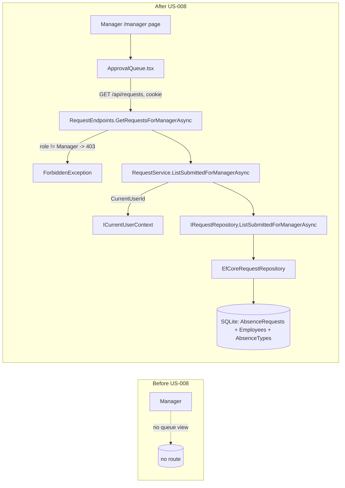

# Implementation Plan — US-008: Manager Views Submitted Requests

## 1. Metadata

| Field | Value |
|---|---|
| **Plan ID** | IP-2026-07-22-us-008-manager-views-submitted-requests |
| **Date** | 2026-07-22 |
| **Source analysis** | [`../../documentation/05-planning/backlog.md`](../../documentation/05-planning/backlog.md) §US-008 |
| **Author** | Bsa (AI Assisted) |
| **Status** | Draft |
| **Version** | 1.0 |
| **Impacted stacks** | Backend (VacaFlow.Application, VacaFlow.Infrastructure, VacaFlow.Api), Frontend (vacaflow-web) |
| **Linked ticket** | US-008 |
| **Governing spec** | VacaFlow_03 Shared Technical Brief (§2 architecture, §4 API surface, §5 business rules, §6 conventions, §7 output contract) |

---

## 2. Executive Summary

- **Change:** Add a Manager-only review queue that returns **only** the `Submitted` absence requests belonging to employees assigned to the authenticated manager, exposed via the role-shaped `GET /api/requests` endpoint and surfaced in a new `/manager` page with an `ApprovalQueue` component.
- **Motivation:** A manager must see their pending queue before they can approve (US-009) or reject (US-010); this story is the read-side gate for the entire approval workflow (Sprint 3).
- **Backend impact:** One new repository method `IRequestRepository.ListSubmittedForManagerAsync(managerId)` (AsNoTracking, server-side filter), one new service method `IRequestService.ListSubmittedForManagerAsync()`, one new read DTO, and one new `GET /api/requests` handler with Manager-only authorization (Employee → 403).
- **Frontend impact:** New route `app/manager/page.tsx`, new `components/ApprovalQueue.tsx` with explicit loading / empty / error / success states, plus a typed API client function and a shared TS type.
- **Global risk:** **Medium** — driven by a known documentation tension (assigned-employee scoping vs. "all pending") and by the fact that `GET /api/requests` is a route shared with US-011.
- **Total effort:** **~20.5 hours** (Backend ~10h, Frontend ~10h, DB ~0.5h optional).

---

## 3. Scope

### In scope — Backend
- `ManagerRequestQueueItemDto` read DTO in `VacaFlow.Application`.
- `IRequestRepository.ListSubmittedForManagerAsync(Guid managerId, CancellationToken ct)` interface method + `EfCoreRequestRepository` implementation (AsNoTracking, server-side `WHERE`, ordered).
- `IRequestService.ListSubmittedForManagerAsync(CancellationToken ct)` interface method + implementation on the existing `RequestService` (derives `managerId` from `ICurrentUserContext.CurrentUserId`).
- `GET /api/requests` endpoint handler in `RequestEndpoints.cs`: authenticated (401 if no cookie), **Manager-only** (Employee → 403 via `ForbiddenException`, BR-ROLE-001), returns `200` with the queue (empty list when none).

### In scope — Frontend
- `app/manager/page.tsx` route (server component shell).
- `components/ApprovalQueue.tsx` client component with loading, empty, error, and success states; WCAG 2.1 AA semantics; responsive layout down to a 360 px mobile breakpoint.
- `lib/api.ts` → `getManagerQueue()` (`credentials: 'include'`, typed, error-shape aware).
- `types/index.ts` → `ManagerRequestQueueItem` interface mirroring the DTO.

### In scope — Contracts
- `GET /api/requests` (role-shaped per Shared Brief §4). In US-008 this endpoint serves the **Manager review queue**; the Employee-own-list branch of the same route is US-011 and is **out of scope here** (see Assumptions).

### Out of scope
- Approve / Reject actions and Approval Records (US-009 / US-010).
- Employee own-request list branch of `GET /api/requests` and request detail `GET /api/requests/{id}` (US-011).
- `GET /api/me` profile endpoint (US-013); pagination, filtering, sorting UI; realtime updates.
- Any change to the `Employees`, `AbsenceRequests`, `AbsenceTypes`, or `ApprovalRecords` schema.

### Assumptions
- **A-1 (BR-APPR-003 scoping — documented tension):** The Shared Brief §5 flags that `tech-doc` says managers see "all pending requests," while **BR-APPR-003** + backlog US-008 AC-001 require a manager to see only *their assigned* employees' requests. **This plan follows the business rule + backlog:** the queue is filtered by `Employee.AssignedManagerId == currentManagerId`. This is the binding interpretation for US-008.
- **A-2 (shared route, forward-compat):** Per Shared Brief §4 the physical route is the single role-shaped `GET /api/requests`. In the US-008 delivery window (Sprint 3, before US-011 in Sprint 4) it is **Manager-only** and returns `403 FORBIDDEN` to Employees (satisfies AC-003 literally, BR-ROLE-001). US-011 will later extend the **same** route with an Employee-own-list branch; at that point an Employee receives their own list (never the manager queue), so AC-003's intent — an Employee never sees the manager queue — remains permanently satisfied. This cross-US evolution must be coordinated with US-011 (see §10 R-2).
- **A-3 (nav properties):** `AbsenceRequest` exposes `Requestor` (→ `Employee`) and `AbsenceType` (→ `AbsenceType`) navigation properties configured in `VacaFlowDbContext`, and `Employee` exposes `AssignedManagerId` (`Guid?`) — all created by US-001 scaffolding / US-004. Verified in Pre-flight.
- **A-4 (`ForbiddenException`):** An Application-layer `ForbiddenException` mapped to `403 FORBIDDEN` by `ExceptionHandlingMiddleware` already exists from the Sprint 2 ownership stories (US-005/006/007) and Shared Brief §4 error table. US-008 reuses it; it is not re-created.
- **A-5 (status representation):** `AbsenceRequest.Status` is a string whose canonical `Submitted` value is `"Submitted"` (Shared Brief §3). The queue filter is a read comparison only; no status mutation occurs here.
- **A-6 (JSON casing):** The API serializes with the ASP.NET Core default camelCase policy, so DTO `RequestId` → JSON `requestId`, matching the TS interface.

---

## 4. Architecture Impact

### Before → After



### API Contract Changes

| Method | Path | Auth | Role | Request | Success | Errors | US |
|---|---|---|---|---|---|---|---|
| GET | `/api/requests` | Yes (cookie) | **Manager** (this US) | none | `200` `ManagerRequestQueueItem[]` (may be `[]`) | `401 UNAUTHORIZED` (no/invalid cookie); `403 FORBIDDEN` (Employee, BR-ROLE-001) | US-008 (Manager branch); Employee branch = US-011 |

**Response body item shape (`200`):**

```json
[
  {
    "requestId": "7b1f...",
    "requestorName": "Ana Pérez",
    "requestorEmail": "ana.perez@igs.example",
    "absenceType": "Vacation",
    "startDate": "2026-08-03",
    "endDate": "2026-08-07",
    "status": "Submitted",
    "reason": "Family trip",
    "createdAt": "2026-07-22T14:11:05Z"
  }
]
```

**Error body shape (single `ExceptionHandlingMiddleware`):** `{ "code": "FORBIDDEN", "message": "..." }` / `{ "code": "UNAUTHORIZED", "message": "..." }` — no stack traces.

### Frontend state / routing changes
- New route segment `/manager` (`app/manager/page.tsx`).
- New client component `ApprovalQueue` owning a discriminated-union state (`loading | error | ready`), auto-fetch on mount, `AbortController` cleanup, `401 → router.replace('/login')`.
- New API client function `getManagerQueue(signal?)` and shared type `ManagerRequestQueueItem`.

### Backend interface changes
- `IRequestRepository`: **+** `Task<IReadOnlyList<AbsenceRequest>> ListSubmittedForManagerAsync(Guid managerId, CancellationToken ct = default)`.
- `IRequestService`: **+** `Task<IReadOnlyList<ManagerRequestQueueItemDto>> ListSubmittedForManagerAsync(CancellationToken ct = default)`.
- No new constructor parameters: `RequestService` already depends on `IRequestRepository` and `ICurrentUserContext` (from US-004).

---

## 5. Pre-flight Checklist

- [ ] **Branch:** work on `feature/yreyes/us008` off the integration branch (do **not** commit as part of this plan).
- [ ] **Prerequisite US complete** (do **NOT** re-scaffold — Shared Brief §0):
  - [ ] US-001 — solution, 5 projects, `VacaFlowDbContext`, cookie auth in `Program.cs`, `AddInfrastructure()`, `Employee` entity + `UserRole`, `ExceptionHandlingMiddleware`, seeders exist.
  - [ ] US-002 — login + role claims established; `HttpContextCurrentUserContext` populates `ICurrentUserContext.CurrentUserRole`.
  - [ ] US-006 — `Submit()` transition exists, so `Submitted` requests can be produced for the queue.
  - [ ] `AbsenceRequests`, `Employees`, `AbsenceTypes` tables exist; `Employee.AssignedManagerId` (`Guid?`) column present.
  - [ ] `EfCoreRequestRepository` and `RequestEndpoints.cs` exist (US-004) to extend.
  - [ ] `ForbiddenException` (→ 403) + its middleware branch exist (US-005/006/007).
- [ ] **Verify navigation properties** (A-3): confirm `AbsenceRequest.Requestor` and `AbsenceRequest.AbsenceType` are configured in `VacaFlowDbContext.OnModelCreating`. If absent, add configuration in Phase 2 (still within US-008 read scope) — mark `[TBD — verify]` before coding.
- [ ] **Build green (baseline):** `dotnet build VacaFlow.sln` and `npm --prefix vacaflow-web run build` both succeed before changes.
- [ ] **Test suite green (baseline):** `dotnet test VacaFlow.sln` and `npm --prefix vacaflow-web test` pass.
- [ ] **Dependencies:** no new NuGet or npm packages required.
- [ ] **Migrations:** none required (read-only query); optional performance index deferred to §7.
- [ ] **Boundary check baseline:** `grep -r "using Microsoft" VacaFlow.Application/` returns zero.
- [ ] **Analysis reviewed:** backlog §US-008 (AC-001…AC-004) and Shared Brief §4/§5/§6 read.

---

## 6. Implementation Phases

### Phase 1 — Application contract: DTO + service method [Stack: Backend]

- **Goal:** Expose a manager-queue read operation in the Application layer that maps domain requests to a lean DTO using the session-derived manager id.
- **Affected files:**
  - [`VacaFlow.Application/Dtos/ManagerRequestQueueItemDto.cs`](../../VacaFlow.Application/Dtos/ManagerRequestQueueItemDto.cs) (new)
  - [`VacaFlow.Application/Interfaces/IRequestRepository.cs`](../../VacaFlow.Application/Interfaces/IRequestRepository.cs) (add method)
  - [`VacaFlow.Application/Interfaces/IRequestService.cs`](../../VacaFlow.Application/Interfaces/IRequestService.cs) (add method)
  - [`VacaFlow.Application/Services/RequestService.cs`](../../VacaFlow.Application/Services/RequestService.cs) (add method)
- **Steps:**
  1. Create the DTO record:
     ```csharp
     namespace VacaFlow.Application.Dtos;

     public sealed record ManagerRequestQueueItemDto(
         Guid RequestId,
         string RequestorName,
         string RequestorEmail,
         string AbsenceType,
         DateOnly StartDate,
         DateOnly EndDate,
         string Status,
         string? Reason,
         DateTime CreatedAt);
     ```
  2. Add to `IRequestRepository`:
     ```csharp
     Task<IReadOnlyList<AbsenceRequest>> ListSubmittedForManagerAsync(
         Guid managerId, CancellationToken ct = default);
     ```
  3. Add to `IRequestService`:
     ```csharp
     Task<IReadOnlyList<ManagerRequestQueueItemDto>> ListSubmittedForManagerAsync(
         CancellationToken ct = default);
     ```
  4. Implement on the existing `RequestService` (reuses injected `_requestRepository` and `_currentUser`):
     ```csharp
     public async Task<IReadOnlyList<ManagerRequestQueueItemDto>> ListSubmittedForManagerAsync(
         CancellationToken ct = default)
     {
         var managerId = _currentUser.CurrentUserId;

         var requests = await _requestRepository
             .ListSubmittedForManagerAsync(managerId, ct);

         return requests
             .Select(r => new ManagerRequestQueueItemDto(
                 r.Id,
                 r.Requestor.FullName,
                 r.Requestor.Email,
                 r.AbsenceType.Name,
                 r.StartDate,
                 r.EndDate,
                 r.Status,
                 r.Reason,
                 r.CreatedAt))
             .ToList();
     }
     ```
  5. Add unit tests (see §8) covering mapping and that the session `CurrentUserId` is the value passed to the repository (AC-001).
- **Validation:** `dotnet build VacaFlow.sln` green; `grep -r "using Microsoft" VacaFlow.Application/` returns zero; new service unit tests pass.
- **Rollback:** `git checkout -- VacaFlow.Application/` (or delete the new DTO file and revert the two interfaces + `RequestService.cs`).
- **Estimated effort:** 4h.
- **Dependencies:** none (Pre-flight only).

---

### Phase 2 — Infrastructure: EF Core repository query [Stack: Backend (+DB read)]

- **Goal:** Implement the server-side, AsNoTracking query returning only `Submitted` requests of employees assigned to the given manager.
- **Affected files:**
  - [`VacaFlow.Infrastructure/Persistence/Repositories/EfCoreRequestRepository.cs`](../../VacaFlow.Infrastructure/Persistence/Repositories/EfCoreRequestRepository.cs) (add method)
  - [`VacaFlow.Infrastructure/Persistence/VacaFlowDbContext.cs`](../../VacaFlow.Infrastructure/Persistence/VacaFlowDbContext.cs) (verify nav config only; edit only if A-3 gap found)
- **Steps:**
  1. Confirm `AbsenceRequest.Requestor` / `AbsenceRequest.AbsenceType` navigations are mapped (A-3). If missing, add the `HasOne(...).WithMany().HasForeignKey(...)` configuration — no data change.
  2. Implement the method:
     ```csharp
     public async Task<IReadOnlyList<AbsenceRequest>> ListSubmittedForManagerAsync(
         Guid managerId, CancellationToken ct = default)
     {
         return await _db.AbsenceRequests
             .AsNoTracking()
             .Include(r => r.Requestor)
             .Include(r => r.AbsenceType)
             .Where(r => r.Status == "Submitted"
                      && r.Requestor.AssignedManagerId == managerId)
             .OrderBy(r => r.CreatedAt)
             .ToListAsync(ct);
     }
     ```
     - `AsNoTracking` (read-only), `Include` avoids N+1, the entire predicate translates to a single parameterized SQL `WHERE` (OWASP A03 — no string interpolation).
  3. Add an integration test against a SQLite file/connection with seeded data (see §8) covering AC-001 (assigned only), AC-002 (non-Submitted excluded), AC-004 (empty → empty list).
- **Validation:** `dotnet build VacaFlow.sln` green; integration test proves cross-manager isolation and status filtering; captured SQL shows a single parameterized query with a `WHERE` (no client-side evaluation warning).
- **Rollback:** revert `EfCoreRequestRepository.cs` (and `VacaFlowDbContext.cs` if edited) via `git checkout --`.
- **Estimated effort:** 3h (+0.5h DB if optional index from §7 is applied).
- **Dependencies:** Phase 1.

---

### Phase 3 — API endpoint: GET /api/requests (Manager-only) [Stack: Backend]

- **Goal:** Wire the role-shaped `GET /api/requests` handler that serves the manager queue and returns 403 to Employees / 401 to anonymous callers.
- **Affected files:**
  - [`VacaFlow.Api/Endpoints/RequestEndpoints.cs`](../../VacaFlow.Api/Endpoints/RequestEndpoints.cs) (add GET mapping + handler)
- **Steps:**
  1. Register the endpoint on the existing authenticated group (created in US-004):
     ```csharp
     // inside MapRequestEndpoints, on the existing group:
     // var group = app.MapGroup("/api/requests").RequireAuthorization();
     group.MapGet("/", GetRequestsForManagerAsync)
          .WithName("GetManagerRequestQueue");
     ```
  2. Add the handler (Manager-only; identity from session — BR-IDEN-001/002, BR-ROLE-001):
     ```csharp
     private static async Task<IResult> GetRequestsForManagerAsync(
         ICurrentUserContext currentUser,
         IRequestService requestService,
         CancellationToken ct)
     {
         if (currentUser.CurrentUserRole != UserRole.Manager)
         {
             // Mapped to 403 FORBIDDEN by ExceptionHandlingMiddleware (A-4).
             throw new ForbiddenException(
                 "Only managers may access the review queue.");
         }

         var queue = await requestService.ListSubmittedForManagerAsync(ct);
         return Results.Ok(queue);
     }
     ```
     - `.RequireAuthorization()` on the group yields `401 UNAUTHORIZED` for a missing/invalid cookie (BR-IDEN-001).
     - No identity is read from the body — `managerId` comes only from `ICurrentUserContext`.
  3. Add endpoint/integration tests (see §8) for AC-001 (Manager → 200 list), AC-003 (Employee → 403), AC-004 (empty → 200 `[]`), and 401 (anonymous).
- **Validation:** `dotnet build VacaFlow.sln` green; endpoint tests pass; manual `curl` with a manager cookie returns `200` JSON, with an employee cookie returns `403 {"code":"FORBIDDEN",...}`, with no cookie returns `401`.
- **Rollback:** revert `RequestEndpoints.cs` via `git checkout --`.
- **Estimated effort:** 3h.
- **Dependencies:** Phase 1, Phase 2.

---

### Phase 4 — Frontend contract: shared type + API client [Stack: Frontend]

- **Goal:** Provide a typed client function and shared type; no UI yet, so the frontend build stays green and nothing calls the endpoint at runtime.
- **Affected files:**
  - [`vacaflow-web/src/types/index.ts`](../../vacaflow-web/src/types/index.ts) (add interface)
  - [`vacaflow-web/src/lib/api.ts`](../../vacaflow-web/src/lib/api.ts) (add function; reuse existing `ApiError` if present)
- **Steps:**
  1. Add the shared type:
     ```typescript
     export interface ManagerRequestQueueItem {
       requestId: string;
       requestorName: string;
       requestorEmail: string;
       absenceType: string;
       startDate: string; // ISO date yyyy-MM-dd
       endDate: string;   // ISO date yyyy-MM-dd
       status: string;
       reason: string | null;
       createdAt: string; // ISO datetime
     }
     ```
  2. Add the client function (if `ApiError` already exists in `api.ts`, import/reuse it and add only `getManagerQueue`):
     ```typescript
     import type { ManagerRequestQueueItem } from '@/types';

     const API_BASE =
       process.env.NEXT_PUBLIC_API_BASE_URL ?? 'http://localhost:5000';

     export class ApiError extends Error {
       constructor(public readonly status: number, message: string) {
         super(message);
         this.name = 'ApiError';
       }
     }

     export async function getManagerQueue(
       signal?: AbortSignal,
     ): Promise<ManagerRequestQueueItem[]> {
       const res = await fetch(`${API_BASE}/api/requests`, {
         method: 'GET',
         credentials: 'include',
         headers: { Accept: 'application/json' },
         signal,
       });

       if (!res.ok) {
         let message = 'Failed to load the review queue.';
         try {
           const body = (await res.json()) as { message?: string };
           if (body?.message) message = body.message;
         } catch {
           /* non-JSON error body — keep default message */
         }
         throw new ApiError(res.status, message);
       }

       return (await res.json()) as ManagerRequestQueueItem[];
     }
     ```
     - `credentials: 'include'` sends the session cookie (Shared Brief §6). No identity is stored in `localStorage` (OWASP A01/A07).
- **Validation:** `npm --prefix vacaflow-web run build` green; `tsc --noEmit` shows no `any`; unit test for `getManagerQueue` (mocked `fetch`) passes for 200 / 401 / 403 branches.
- **Rollback:** revert `types/index.ts` and `lib/api.ts` via `git checkout --`.
- **Estimated effort:** 1.5h.
- **Dependencies:** Phase 3 (endpoint must exist before the client that targets it is merged).

---

### Phase 5 — Frontend UI: ApprovalQueue component + manager route [Stack: Frontend]

- **Goal:** Render the manager review queue with explicit loading, empty, error, and success states and accessible semantics.
- **Affected files:**
  - [`vacaflow-web/src/components/ApprovalQueue.tsx`](../../vacaflow-web/src/components/ApprovalQueue.tsx) (new)
  - [`vacaflow-web/src/app/manager/page.tsx`](../../vacaflow-web/src/app/manager/page.tsx) (new)
- **Steps:**
  1. Create the client component:
     ```tsx
     'use client';

     import { useEffect, useState } from 'react';
     import { useRouter } from 'next/navigation';
     import { getManagerQueue, ApiError } from '@/lib/api';
     import type { ManagerRequestQueueItem } from '@/types';

     type QueueState =
       | { status: 'loading' }
       | { status: 'error'; message: string }
       | { status: 'ready'; items: ManagerRequestQueueItem[] };

     export function ApprovalQueue() {
       const router = useRouter();
       const [state, setState] = useState<QueueState>({ status: 'loading' });

       useEffect(() => {
         const controller = new AbortController();

         getManagerQueue(controller.signal)
           .then((items) => setState({ status: 'ready', items }))
           .catch((err: unknown) => {
             if (controller.signal.aborted) return;
             if (err instanceof ApiError && err.status === 401) {
               router.replace('/login');
               return;
             }
             const message =
               err instanceof ApiError
                 ? err.message
                 : 'Something went wrong loading the review queue.';
             setState({ status: 'error', message });
           });

         return () => controller.abort();
       }, [router]);

       if (state.status === 'loading') {
         return (
           <div role="status" aria-live="polite" aria-busy="true">
             Loading review queue…
           </div>
         );
       }

       if (state.status === 'error') {
         return (
           <div role="alert">
             <p>{state.message}</p>
           </div>
         );
       }

       if (state.items.length === 0) {
         return (
           <div role="status">
             <p>No submitted requests are waiting for your review.</p>
           </div>
         );
       }

       return (
         <ul aria-label="Submitted requests awaiting review">
           {state.items.map((item) => (
             <li key={item.requestId}>
               <article>
                 <h3>{item.requestorName}</h3>
                 <p>{item.absenceType}</p>
                 <p>
                   <time dateTime={item.startDate}>{item.startDate}</time>
                   {' – '}
                   <time dateTime={item.endDate}>{item.endDate}</time>
                 </p>
                 {item.reason ? <p>{item.reason}</p> : null}
               </article>
             </li>
           ))}
         </ul>
       );
     }
     ```
  2. Create the route shell:
     ```tsx
     import { ApprovalQueue } from '@/components/ApprovalQueue';

     export const metadata = {
       title: 'Manager Review Queue — VacaFlow',
     };

     export default function ManagerPage() {
       return (
         <main>
           <h1>Review Queue</h1>
           <p>Submitted absence requests assigned to you.</p>
           <ApprovalQueue />
         </main>
       );
     }
     ```
  3. Ensure output is escaped by React defaults (OWASP A03 — no `dangerouslySetInnerHTML`). Values come only from the typed API response.
- **Validation:** `npm --prefix vacaflow-web run build` green; manual walkthrough of the four states (throttle network for loading, seed 0 rows for empty, stop the API for error, seed rows for success); layout holds at 360 px width.
- **Rollback:** delete `components/ApprovalQueue.tsx` and `app/manager/page.tsx`.
- **Estimated effort:** 5h.
- **Dependencies:** Phase 4.

---

### Phase 6 — Frontend tests + a11y + UX validation [Stack: Frontend]

- **Goal:** Cover every UI state and accessibility contract for the queue.
- **Affected files:**
  - [`vacaflow-web/src/components/ApprovalQueue.test.tsx`](../../vacaflow-web/src/components/ApprovalQueue.test.tsx) (new)
  - [`vacaflow-web/src/lib/api.test.ts`](../../vacaflow-web/src/lib/api.test.ts) (new or extend)
- **Steps:**
  1. Component tests (React Testing Library) mocking `getManagerQueue`: renders loading first, then success list (AC-001 rows visible), empty state (AC-004), and error state; asserts `401` triggers `router.replace('/login')`.
  2. Client tests for `getManagerQueue` (mocked `fetch`): 200 returns array; 403/401 throw `ApiError` with the parsed `message`.
  3. Accessibility assertions: `role="status"`/`aria-live` on loading, `role="alert"` on error, list `aria-label` present; run `jest-axe` (or the project's a11y helper) with zero violations.
- **Validation:** `npm --prefix vacaflow-web test` green; coverage ≥80% on changed files; a11y check passes.
- **Rollback:** delete the added test files.
- **Estimated effort:** 3.5h.
- **Dependencies:** Phase 5.

---

## 7. Database Changes

**No schema changes are required for US-008.** The story is a read-only query over existing tables (`AbsenceRequests`, `Employees`, `AbsenceTypes`) created by US-001/US-004.

**Optional performance index (not required for MVP correctness; SQLite, low volume):**

| Object | Type | Idempotent DDL | Migration | Perf impact | Rollback |
|---|---|---|---|---|---|
| `IX_AbsenceRequests_Status` | Index | `CREATE INDEX IF NOT EXISTS IX_AbsenceRequests_Status ON AbsenceRequests (Status);` | EF migration `AddManagerQueueIndexes` (`migrationBuilder.CreateIndex`) | Speeds status filter as data grows; negligible write cost at MVP scale | `DROP INDEX IF EXISTS IX_AbsenceRequests_Status;` |
| `IX_Employees_AssignedManagerId` | Index | `CREATE INDEX IF NOT EXISTS IX_Employees_AssignedManagerId ON Employees (AssignedManagerId);` | same migration | Speeds the manager join/filter | `DROP INDEX IF EXISTS IX_Employees_AssignedManagerId;` |

> Apply the optional index only if queue latency is observed; for the MVP local dataset the default query is sufficient. If applied, run via the standard migration command; rollback with the `DROP INDEX IF EXISTS` statements above.

---

## 8. Testing Strategy

### Backend
- **Unit (Application, in-memory fakes — no DbContext/HttpContext):**
  - `RequestService.ListSubmittedForManagerAsync` maps each entity field to the DTO (AC-001).
  - Service passes `ICurrentUserContext.CurrentUserId` verbatim to the repository (session-derived manager id, BR-IDEN-001).
  - Empty repository result → empty DTO list (AC-004).
  - Fakes (`VacaFlow.Tests/Fakes/`, hand-written, no Moq):
    ```csharp
    public sealed class FakeCurrentUserContext : ICurrentUserContext
    {
        public FakeCurrentUserContext(Guid userId, UserRole role)
        {
            CurrentUserId = userId;
            CurrentUserRole = role;
        }
        public Guid CurrentUserId { get; }
        public UserRole CurrentUserRole { get; }
    }

    public sealed class FakeRequestRepository : IRequestRepository
    {
        private readonly IReadOnlyList<AbsenceRequest> _submittedForManager;
        public Guid? LastManagerIdQueried { get; private set; }

        public FakeRequestRepository(
            IReadOnlyList<AbsenceRequest>? submittedForManager = null)
            => _submittedForManager =
                 submittedForManager ?? Array.Empty<AbsenceRequest>();

        public Task<IReadOnlyList<AbsenceRequest>> ListSubmittedForManagerAsync(
            Guid managerId, CancellationToken ct = default)
        {
            LastManagerIdQueried = managerId;
            return Task.FromResult(_submittedForManager);
        }

        // Implement remaining IRequestRepository members as in the existing
        // US-004 fake (GetByIdAsync, CreateAsync, UpdateAsync, ListByEmployeeAsync…) — elided.
    }
    ```
    ```csharp
    [Fact]
    public async Task ListSubmittedForManagerAsync_QueriesRepositoryWithSessionManagerId_AndMapsDtos()
    {
        // Arrange
        var managerId = Guid.NewGuid();
        var request = RequestTestData.SubmittedForManager(managerId); // [TBD — verify: use US-004 AbsenceRequest factory/builder]
        var repo = new FakeRequestRepository(new[] { request });
        var currentUser = new FakeCurrentUserContext(managerId, UserRole.Manager);
        var sut = new RequestService(repo, currentUser); // match US-004 ctor order

        // Act
        var result = await sut.ListSubmittedForManagerAsync();

        // Assert
        Assert.Equal(managerId, repo.LastManagerIdQueried);
        Assert.Single(result);
        Assert.Equal(request.Id, result[0].RequestId);
    }
    ```
- **Integration (Infrastructure, SQLite):** seed two managers, employees assigned to each, and requests in every status; assert the query returns only `Submitted` requests of the target manager's employees (AC-001, AC-002), returns empty for a manager with none (AC-004), and never returns another manager's rows.
- **Endpoint/integration (Api):** Manager cookie → `200` + list (AC-001); Employee cookie → `403 FORBIDDEN` (AC-003); no cookie → `401`; manager with empty queue → `200 []` (AC-004).
- **Coverage target:** ≥80% on changed backend surface (higher than the MVP 50% floor — Shared Brief §6).

### Frontend
- **Unit/integration (RTL):** loading → success → empty → error transitions; `401` redirects to `/login`; success renders one list item per API row.
- **Client tests:** `getManagerQueue` returns typed array on 200; throws `ApiError` with parsed message on 401/403.
- **a11y:** `jest-axe` zero violations; verify `role="status"`/`aria-live` (loading), `role="alert"` (error), list `aria-label` (success).
- **Coverage target:** ≥80% on changed frontend files.

### Cross-cutting
- **Contract test:** DTO field names (camelCased) equal the `ManagerRequestQueueItem` keys (A-6) — guard against serialization drift.
- **Security regression:** confirm no request-body identity is honored (manager id is session-only); confirm error bodies never contain stack traces.
- **Regression areas:** existing `POST /api/requests` (US-004) and submit flow (US-006) remain green after the endpoint group gains the GET mapping.

### UX/UI Validation
- **Loading state:** visible non-blocking indicator with `aria-busy`/`aria-live="polite"` while the fetch is in flight.
- **Empty state:** explicit "No submitted requests are waiting for your review." message (not a blank page) — AC-004.
- **Error state:** `role="alert"` message on network/500/403; never a silent failure or raw stack trace.
- **Success state:** each queue item shows requestor, absence type, and the date range via semantic `<time>` elements.
- **Responsive:** layout usable at 360 px width; no horizontal overflow.
- **Performance target:** initial queue render LCP ≤ 2.5 s, CLS ≤ 0.1 on the local dataset.

---

## 9. Configuration & Deployment

### Backend env config (existing keys — no new keys)
- `ConnectionStrings:VacaFlow` — SQLite path (US-001).
- `CookieAuth:*` — HttpOnly, `SameSite=Strict`, sliding 120 min (US-001/US-002).
- `Cors:AllowedOrigin` — must include the web origin (e.g. `http://localhost:3000`) with credentials allowed so the session cookie is sent on `GET /api/requests`.

### Frontend env (`vacaflow-web/.env.local`)
- `NEXT_PUBLIC_API_BASE_URL=http://localhost:5000` (consumed by `getManagerQueue`).

### Local run order
1. Start API: `dotnet run --project VacaFlow.Api` (listens on `http://localhost:5000`).
2. Start web: `npm --prefix vacaflow-web run dev` (Next.js on `http://localhost:3000`).
3. Log in as a seeded Manager, navigate to `/manager`.

### Pipelines / feature flags
- No CI/CD (local MVP, Shared Brief §1). **No feature flags.**
- Performance note: keep the `/manager` initial render within LCP ≤ 2.5 s / CLS ≤ 0.1 (§8 UX/UI Validation).

---

## 10. Risks & Mitigations

| # | Risk | Probability | Impact | Mitigation | Owner | Stack |
|---|---|---|---|---|---|---|
| R-1 | **Scoping tension:** `tech-doc` says managers see "all pending" while BR-APPR-003 + AC-001 require assigned-only; wrong choice leaks other managers' data. | M | H | Follow BR-APPR-003 + backlog (A-1): filter `Requestor.AssignedManagerId == managerId`; integration test proves cross-manager isolation. | BSA / Coder | BE |
| R-2 | **Shared route (`GET /api/requests`) cross-US conflict:** US-011 later adds the Employee branch to the same route; uncoordinated changes could break AC-003 or duplicate handlers. | M | M | Document A-2 forward-compat; single handler dispatches by role; flag US-011 to extend (not replace) this handler; regression endpoint tests. | BSA / Coder | BE |
| R-3 | **Query correctness/perf:** missing `Requestor`/`AbsenceType` nav config (A-3) causes runtime failure; unindexed filter slows as data grows. | L | M | Verify nav config in Pre-flight/Phase 2; `Include` + `AsNoTracking`; optional index in §7 if latency observed. | Coder | BE/DB |
| R-4 | Employee reaching `/manager` sees a bare error rather than a clear "not authorized" message. | L | L | ApprovalQueue surfaces the API `403` message in the error state; page normally unreachable by employees via navigation. | Coder | FE |

> No Critical/Major UX gaps were identified for this queue view; all four UI states are specified in §8 and enforced in §11.

---

## 11. Definition of Done

- [ ] **Backend code:** `ManagerRequestQueueItemDto`, both interface methods, `RequestService` method, `EfCoreRequestRepository` query, and `GET /api/requests` handler implemented per §6.
- [ ] **Frontend code:** `ManagerRequestQueueItem` type, `getManagerQueue`, `ApprovalQueue`, and `/manager` route implemented per §6.
- [ ] **Tests:** backend unit + integration + endpoint tests and frontend unit + a11y tests pass; coverage ≥80% on changed code (BE and FE).
- [ ] **All UI states implemented:** loading, empty, error, success — each covered by a test.
- [ ] **Accessibility:** WCAG 2.1 AA verified (`jest-axe` zero violations; correct `role`/`aria` on each state).
- [ ] **Mobile:** layout verified at the 360 px breakpoint with no horizontal overflow.
- [ ] **Performance:** `/manager` initial render LCP ≤ 2.5 s, CLS ≤ 0.1 on the local dataset.
- [ ] **Shared TS types:** `ManagerRequestQueueItem` matches the DTO (camelCase contract test green).
- [ ] **Migrations:** none required; optional index applied only if needed (§7) with rollback verified.
- [ ] **Boundary check:** `grep -r "using Microsoft" VacaFlow.Application/` returns zero.
- [ ] **Security:** identity is session-only (no body id honored); error bodies use `{code,message}` with no stack traces (OWASP A01/A03/A07).
- [ ] **API docs:** `GET /api/requests` (Manager branch) documented (contract table §4).
- [ ] **PR approved** by at least one reviewer; both builds green.
- [ ] **Acceptance criteria satisfied:** AC-001 (assigned Submitted only), AC-002 (non-Submitted excluded), AC-003 (Employee → 403), AC-004 (empty → empty list).

---

## 12. References

- **Source analysis:** [`../../documentation/05-planning/backlog.md`](../../documentation/05-planning/backlog.md) §US-008 (AC-001…AC-004), traceability FR-MRA-001, FR-LSE-007.
- **Business rules (Shared Technical Brief §5):** BR-ROLE-001 (approve/reject require Manager → 403), BR-APPR-003 (manager acts only on assigned employees' requests → 403), BR-IDEN-001/002 (identity from session cookie only).
- **API surface & error shape:** Shared Technical Brief §4 (`GET /api/requests`; 401/403 mapping).
- **Architecture:** Shared Technical Brief §2 (Reduced Onion, 5 layers; Application carries no Microsoft.* deps).
- **Conventions & standards:** Shared Technical Brief §6 (C#/TS naming, prohibited patterns, `credentials:'include'`, testing).
- **Related User Stories:** US-002 (login/roles — prerequisite), US-006 (Submit — produces Submitted requests, prerequisite), US-009 / US-010 (Approve/Reject — consume this queue), US-011 (Employee own-list branch of the same route).
