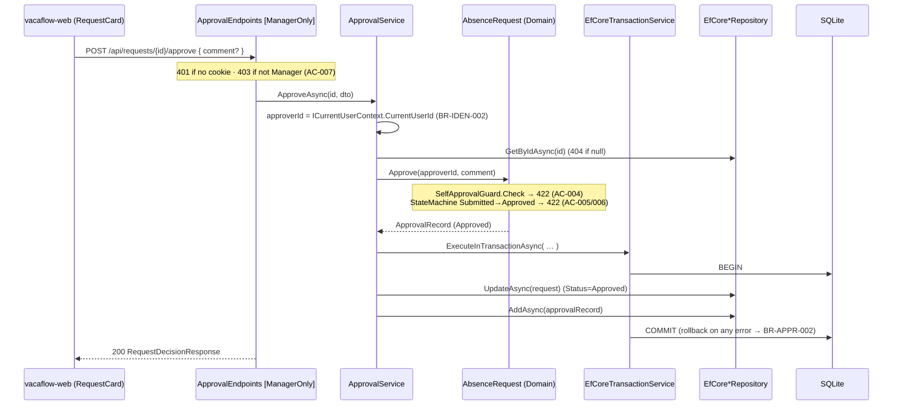

# Implementation Plan — US-009 Approve Request

> 🛠️ **SKILL: Implementation_Plan_Generator**
> 📄 **SOURCE:** [../../documentation/05-planning/backlog.md §US-009](../../documentation/05-planning/backlog.md)

---

## 1. Metadata

| Field | Value |
|---|---|
| **Plan ID** | IP-2026-07-22-us-009-approve-request |
| **Date** | 2026-07-22 |
| **Source analysis** | [../../documentation/05-planning/backlog.md §US-009](../../documentation/05-planning/backlog.md) |
| **Author** | Bsa (AI Assisted) |
| **Status** | Draft |
| **Version** | 1.0 |
| **Impacted stacks** | Backend (Domain, Application, Infrastructure, API), Database (SQLite migration), Frontend (Next.js) |
| **Linked ticket** | US-009 |
| **Canonical role** | **This plan is the reference implementation for the explicit-transaction pattern (`ITransactionService`). US-010 and any future multi-write operation follow the pattern established here.** |

---

## 2. Executive Summary

- **Change:** Add the manager **Approve** action — `POST /api/requests/{id}/approve` — that transitions a `Submitted` request to `Approved` and writes exactly one append-only `ApprovalRecord`, both committed atomically inside a single explicit database transaction.
- **Motivation:** Managers must record an auditable approval decision bound to their authenticated identity (FR-MRA-002, FR-MRA-004..006, FR-MRA-008, FR-LSE-005). This is the first story that writes two rows in one business operation, so it establishes the canonical `ITransactionService` pattern for the codebase.
- **Backend impact:** New domain method `AbsenceRequest.Approve(approverId, comment)` + `SelfApprovalGuard`; new `ApprovalRecord` entity, `ApprovalDecision` enum, `IApprovalService`/`ApprovalService`, `IApprovalRepository`/`EfCoreApprovalRepository`, and the first `ITransactionService`/`EfCoreTransactionService` implementation. New `ApprovalEndpoints` mapped Manager-only.
- **Frontend impact:** Small, additive — an **Approve** button (with optional comment) on the existing `RequestCard`/`ApprovalQueue` (built in US-008), plus an `approveRequest` helper in `api.ts`. No new route.
- **Database impact:** One new table `ApprovalRecords` (append-only) with a **unique index on `RequestId`** enforcing at-most-one decision (BR-APPR-001 / FR-MRA-008); one EF Core migration.
- **Global risk:** **Medium** — correctness hinges on transaction atomicity and layered authorization; surface area is contained.
- **Total effort:** **≈ 19 hours** (Backend 13h · Frontend 4h · Database 2h).

---

## 3. Scope

### In scope — Backend
- `AbsenceRequest.Approve(Guid approverId, string? comment)` domain method: invokes `SelfApprovalGuard.Check` **then** the state machine transition `Submitted → Approved`, and produces the `ApprovalRecord`.
- `SelfApprovalGuard.Check(requestorId, approverId)` → `SelfApprovalException` (422) — BR-ROLE-003 / AC-004.
- `ApprovalRecord` entity + `ApprovalDecision` enum (`Approved`, `Rejected`); `RequestStateMachine` gains the `Submitted → Approved` transition.
- `ApprovalService.ApproveAsync`: reads the approver id from **`ICurrentUserContext` only** (ignores any body field — AC-003 / BR-IDEN-002); wraps the request update + single `ApprovalRecord` insert in `ITransactionService.ExecuteInTransactionAsync` **atomically** (BR-APPR-002).
- `ITransactionService` binding + `EfCoreTransactionService` (with nested-transaction guard → 500), `IApprovalRepository` + `EfCoreApprovalRepository`.
- `POST /api/requests/{id}/approve` endpoint — **Manager-only** authorization (Employee → 403, AC-007 / BR-ROLE-001); **no `approverId` in the body** (optional `comment` only).

### In scope — Frontend
- `approveRequest(id, comment?)` helper in `lib/api.ts` (`credentials: 'include'`).
- **Approve** control on `RequestCard.tsx` / `ApprovalQueue.tsx`, visible only when role is Manager, status is `Submitted`, and the request is not the manager's own (state-driven, mirroring server authz).
- Optional comment input; loading / error / success / empty state handling for the action.
- Responsive layout for the action row (mobile breakpoint ≥ 360px).

### In scope — Contracts
- New `RequestDecisionResponse` shared TS type mirroring the API response.
- Request body DTO `ApproveRequestDto { comment?: string }` (no identity fields).

### Out of scope
- Reject action (US-010 — reuses `ITransactionService`, `ApprovalRecord.ForRejection`).
- Manager queue listing itself (US-008 — prerequisite).
- Employee view of the final decision (US-011).
- Notifications/email (W-004, deferred).
- Any change to `AbsenceRequests` columns beyond `Status`/`UpdatedAt` already owned by US-004/US-006.

### Assumptions
- **A1 (BR-APPR-003 — doc tension, per brief §5):** `tech-doc` says managers see "all pending requests," but BR-APPR-003 + US-008 AC-001 scope a manager to **their assigned employees** (`Employee.AssignedManagerId == currentManagerId`). This plan follows the business rule + backlog: the approve action includes a defensive assigned-scope guard returning **403** for requests whose requestor is not assigned to the acting manager. Flagged as an assumption, not a blocker.
- **A2:** The `ManagerOnly` authorization policy and the 401/403/404/422 exception mapping (`ExceptionHandlingMiddleware`) already exist (US-001 scaffolding + US-008). This plan reuses them.
- **A3:** `RequestStateMachine`, `AbsenceRequest`, `RequestStatus`, `IRequestRepository`, `ICurrentUserContext`, `NotFoundException`, `DomainException`, `InvalidStateTransitionException`, and `ForbiddenException` already exist from US-001/US-004/US-005/US-006/US-008. This plan adds only the `Submitted → Approved` edge and the `Approve` method; it does **not** re-scaffold.
- **A4:** BR-APPR-001 ("at most one final decision") is guaranteed at three layers: the state machine (only `Submitted` is approvable), a `ExistsForRequestAsync` service pre-check, and a **unique DB index** on `ApprovalRecords.RequestId`.

---

## 4. Architecture Impact

### Before → After (approve flow)



### API Contract Changes

| Method | Path | Auth | Role | Request body | Success | Errors |
|---|---|---|---|---|---|---|
| POST | `/api/requests/{id}/approve` | Cookie | Manager | `{ "comment"?: string }` (no `approverId`) | `200` `RequestDecisionResponse` | `401` UNAUTHORIZED · `403` FORBIDDEN (non-Manager / not-assigned) · `404` NOT_FOUND · `422` DOMAIN_RULE_VIOLATION (self-approval, not-Submitted, second decision) |

### Frontend state / routing changes
- No new route. `ApprovalQueue` gains an `onApprove` handler; `RequestCard` renders a state-gated **Approve** button + optional comment field.
- New shared type `RequestDecisionResponse` in `types/index.ts`.

### Backend interface changes
- **New (Application):** `IApprovalService`, `IApprovalRepository` (specific, not generic). `ITransactionService` interface already declared in the Application layer (brief §2.3) — bound for the first time here.
- **New (Domain):** `ApprovalRecord`, `ApprovalDecision`, `SelfApprovalGuard`; `AbsenceRequest.Approve(...)`.
- **New (Infrastructure):** `EfCoreTransactionService`, `EfCoreApprovalRepository`, `DbSet<ApprovalRecord>` + configuration, migration.

---

## 5. Pre-flight Checklist

- [ ] On a feature branch off the integration branch: `git checkout -b feature/us-009-approve-request`.
- [ ] **Prerequisite US present (do NOT re-scaffold):**
  - [ ] **US-001** — solution, `VacaFlowDbContext`, `AddInfrastructure()`, cookie auth, `ExceptionHandlingMiddleware`, exception types (`DomainException`, `InvalidStateTransitionException`, `NotFoundException`), `AbsenceRequests` table.
  - [ ] **US-002** — `ICurrentUserContext` + `HttpContextCurrentUserContext`; role claim set at login.
  - [ ] **US-004/005/006** — `AbsenceRequest` aggregate, `RequestStatus`, `RequestStateMachine`, `IRequestRepository`, `ForbiddenException`, ownership 403 plumbing.
  - [ ] **US-008** — Manager queue (`GET /api/requests` manager scope), `ManagerOnly` authorization policy, `ApprovalQueue.tsx` + `RequestCard.tsx`, `assigned-employee` scoping.
- [ ] Confirm `ITransactionService` interface exists in `VacaFlow.Application/Interfaces/`; if absent, create it with the brief §2.3 signature (Phase 2).
- [ ] Backend builds green: `dotnet build VacaFlow.sln`.
- [ ] Backend tests green: `dotnet test VacaFlow.Tests`.
- [ ] Frontend builds green: `npm --prefix vacaflow-web run build`; lint clean.
- [ ] EF tooling available: `dotnet tool restore` (or `dotnet-ef` global) for the migration in Phase 3.
- [ ] Verify boundary rule baseline: `grep -r "using Microsoft" VacaFlow.Application/` returns zero.
- [ ] Source analysis reviewed: backlog §US-009 AC-001..AC-007 and business rules BR-IDEN-002, BR-ROLE-001/003, BR-LIFE-005, BR-APPR-001/002 (brief §5).

---

## 6. Implementation Phases

### Phase 1 — Domain: approval decision, guard, and `AbsenceRequest.Approve` [Stack: Backend]

- **Goal:** Model the approval decision in the domain so state transition + self-approval invariants are enforced in one place.
- **Affected files:**
  - [ApprovalDecision.cs](../../VacaFlow.Domain/ValueObjects/ApprovalDecision.cs) *(new)*
  - [ApprovalRecord.cs](../../VacaFlow.Domain/ValueObjects/ApprovalRecord.cs) *(new)*
  - [SelfApprovalGuard.cs](../../VacaFlow.Domain/Guards/SelfApprovalGuard.cs) *(new)*
  - [SelfApprovalException.cs](../../VacaFlow.Domain/Exceptions/SelfApprovalException.cs) *(new — if not already present)*
  - [AbsenceRequest.cs](../../VacaFlow.Domain/Entities/AbsenceRequest.cs) *(add `Approve` method)*
  - [RequestStateMachine.cs](../../VacaFlow.Domain/StateMachine/RequestStateMachine.cs) *(add `Submitted → Approved` edge)*
- **Steps:**
  1. Add the decision enum:
     ```csharp
     namespace VacaFlow.Domain.ValueObjects;

     public enum ApprovalDecision
     {
         Approved = 1,
         Rejected = 2
     }
     ```
  2. Add the append-only approval record (folder `ValueObjects/` per brief §2.2; persisted as an entity with its own key):
     ```csharp
     namespace VacaFlow.Domain.ValueObjects;

     public sealed class ApprovalRecord
     {
         public Guid Id { get; private set; }
         public Guid RequestId { get; private set; }
         public Guid ApproverId { get; private set; }
         public ApprovalDecision Decision { get; private set; }
         public string? Comment { get; private set; }
         public DateTime DecisionDate { get; private set; }

         private ApprovalRecord() { } // EF Core materialization

         private ApprovalRecord(Guid requestId, Guid approverId, ApprovalDecision decision, string? comment)
         {
             Id = Guid.NewGuid();
             RequestId = requestId;
             ApproverId = approverId;
             Decision = decision;
             Comment = string.IsNullOrWhiteSpace(comment) ? null : comment.Trim();
             DecisionDate = DateTime.UtcNow;
         }

         public static ApprovalRecord ForApproval(Guid requestId, Guid approverId, string? comment) =>
             new(requestId, approverId, ApprovalDecision.Approved, comment);
         // ForRejection(...) is introduced by US-010.
     }
     ```
  3. Add the self-approval guard:
     ```csharp
     using VacaFlow.Domain.Exceptions;

     namespace VacaFlow.Domain.Guards;

     public static class SelfApprovalGuard
     {
         public static void Check(Guid requestorId, Guid approverId)
         {
             if (requestorId == approverId)
             {
                 throw new SelfApprovalException(
                     "A manager cannot approve or reject their own absence request.");
             }
         }
     }
     ```
  4. Add `SelfApprovalException` (extends `DomainException`) if not already present, so `ExceptionHandlingMiddleware` maps it to **422 DOMAIN_RULE_VIOLATION**:
     ```csharp
     namespace VacaFlow.Domain.Exceptions;

     public sealed class SelfApprovalException : DomainException
     {
         public SelfApprovalException(string message) : base(message) { }
     }
     ```
  5. In `RequestStateMachine`, add `Submitted → Approved` to the allowed-transitions set (leave existing edges untouched):
     ```csharp
     // inside the allowed-transitions map:
     [RequestStatus.Submitted] = new[] { RequestStatus.Approved, RequestStatus.Rejected, RequestStatus.Cancelled },
     ```
  6. Add the `Approve` domain method to `AbsenceRequest` (self-approval guard **first**, then state transition, then produce the record — never assign `Status` outside this method):
     ```csharp
     using VacaFlow.Domain.Guards;
     using VacaFlow.Domain.StateMachine;
     using VacaFlow.Domain.ValueObjects;

     public ApprovalRecord Approve(Guid approverId, string? comment = null)
     {
         SelfApprovalGuard.Check(RequestorId, approverId);                 // BR-ROLE-003 → 422
         RequestStateMachine.EnsureCanTransition(Status, RequestStatus.Approved); // BR-LIFE-005 / BR-APPR-001 → 422
         Status = RequestStatus.Approved;
         UpdatedAt = DateTime.UtcNow;
         return ApprovalRecord.ForApproval(Id, approverId, comment);
     }
     ```
- **Validation:** `dotnet build` green. New unit tests in `VacaFlow.Tests/Domain/`: `Approve_SetsApproved_WhenSubmitted`, `Approve_ReturnsRecordWithApproverAndComment`, `Approve_Throws_WhenSelfApproval`, `Approve_Throws_WhenNotSubmitted` (Draft/Approved/Rejected/Cancelled cases).
- **Rollback:** `git checkout -- VacaFlow.Domain VacaFlow.Tests/Domain` (files are new/additive; revert the phase commit).
- **Estimated effort:** 3 hours.
- **Dependencies:** none (prerequisites per §5).

---

### Phase 2 — Application: `ApprovalService` + contracts [Stack: Backend]

- **Goal:** Orchestrate approval: resolve identity from the session, load the request, invoke the domain method, and persist both writes atomically via `ITransactionService`.
- **Affected files:**
  - [ITransactionService.cs](../../VacaFlow.Application/Interfaces/ITransactionService.cs) *(create only if absent)*
  - [IApprovalRepository.cs](../../VacaFlow.Application/Interfaces/IApprovalRepository.cs) *(new)*
  - [IApprovalService.cs](../../VacaFlow.Application/Interfaces/IApprovalService.cs) *(new)*
  - [ApproveRequestDto.cs](../../VacaFlow.Application/Services/ApproveRequestDto.cs) *(new)*
  - [RequestDecisionResponse.cs](../../VacaFlow.Application/Services/RequestDecisionResponse.cs) *(new)*
  - [ApprovalService.cs](../../VacaFlow.Application/Services/ApprovalService.cs) *(new)*
- **Steps:**
  1. Ensure the transaction abstraction exists (brief §2.3 signature) — create only if missing:
     ```csharp
     namespace VacaFlow.Application.Interfaces;

     public interface ITransactionService
     {
         Task ExecuteInTransactionAsync(Func<Task> operation);
     }
     ```
  2. Add the specific approval repository interface (no generic repository):
     ```csharp
     using VacaFlow.Domain.ValueObjects;

     namespace VacaFlow.Application.Interfaces;

     public interface IApprovalRepository
     {
         Task AddAsync(ApprovalRecord record);
         Task<bool> ExistsForRequestAsync(Guid requestId);
     }
     ```
  3. Add DTOs as records (no identity fields in the request body — AC-003):
     ```csharp
     namespace VacaFlow.Application.Services;

     public sealed record ApproveRequestDto(string? Comment);
     ```
     ```csharp
     using VacaFlow.Domain.Entities;
     using VacaFlow.Domain.ValueObjects;

     namespace VacaFlow.Application.Services;

     public sealed record RequestDecisionResponse(
         Guid RequestId,
         string Status,
         Guid ApproverId,
         string Decision,
         string? Comment,
         DateTime DecisionDate)
     {
         public static RequestDecisionResponse From(AbsenceRequest request, ApprovalRecord record) =>
             new(request.Id, request.Status.ToString(), record.ApproverId,
                 record.Decision.ToString(), record.Comment, record.DecisionDate);
     }
     ```
  4. Add the service interface:
     ```csharp
     namespace VacaFlow.Application.Interfaces;

     using VacaFlow.Application.Services;

     public interface IApprovalService
     {
         Task<RequestDecisionResponse> ApproveAsync(Guid requestId, ApproveRequestDto request);
     }
     ```
  5. Implement `ApprovalService` — **canonical transaction usage**. Identity comes from `ICurrentUserContext` only; the two writes execute inside one transaction:
     ```csharp
     using Microsoft.Extensions.Logging;
     using VacaFlow.Application.Interfaces;
     using VacaFlow.Domain.Exceptions;

     namespace VacaFlow.Application.Services;

     public sealed class ApprovalService : IApprovalService
     {
         private readonly IRequestRepository _requestRepository;
         private readonly IApprovalRepository _approvalRepository;
         private readonly IUserRepository _userRepository;
         private readonly ICurrentUserContext _currentUser;
         private readonly ITransactionService _transactionService;
         private readonly ILogger<ApprovalService> _logger;

         public ApprovalService(
             IRequestRepository requestRepository,
             IApprovalRepository approvalRepository,
             IUserRepository userRepository,
             ICurrentUserContext currentUser,
             ITransactionService transactionService,
             ILogger<ApprovalService> logger)
         {
             _requestRepository = requestRepository;
             _approvalRepository = approvalRepository;
             _userRepository = userRepository;
             _currentUser = currentUser;
             _transactionService = transactionService;
             _logger = logger;
         }

         public async Task<RequestDecisionResponse> ApproveAsync(Guid requestId, ApproveRequestDto request)
         {
             ArgumentNullException.ThrowIfNull(request);

             var approverId = _currentUser.CurrentUserId; // BR-IDEN-002: session only; body ids are ignored

             var absenceRequest = await _requestRepository.GetByIdAsync(requestId)
                 ?? throw new NotFoundException($"Request '{requestId}' was not found.");

             // A1 / BR-APPR-003: a manager may act only on their assigned employees' requests.
             var requestor = await _userRepository.GetByIdAsync(absenceRequest.RequestorId)
                 ?? throw new NotFoundException($"Requestor '{absenceRequest.RequestorId}' was not found.");
             if (requestor.AssignedManagerId != approverId)
             {
                 throw new ForbiddenException("You are not the assigned manager for this request.");
             }

             // Defense-in-depth for BR-APPR-001 (unique index is the hard guarantee).
             if (await _approvalRepository.ExistsForRequestAsync(requestId))
             {
                 throw new InvalidStateTransitionException(
                     "This request already has a final decision.");
             }

             // Domain enforces self-approval (BR-ROLE-003) + Submitted→Approved (BR-LIFE-005/BR-APPR-001).
             var approvalRecord = absenceRequest.Approve(approverId, request.Comment);

             // BR-APPR-002: request update + single ApprovalRecord insert commit atomically or roll back together.
             await _transactionService.ExecuteInTransactionAsync(async () =>
             {
                 await _requestRepository.UpdateAsync(absenceRequest);
                 await _approvalRepository.AddAsync(approvalRecord);
             });

             _logger.LogInformation(
                 "Request {RequestId} approved by manager {ApproverId}.", requestId, approverId);

             return RequestDecisionResponse.From(absenceRequest, approvalRecord);
         }
     }
     ```
- **Validation:** `grep -r "using Microsoft" VacaFlow.Application/` returns only `Microsoft.Extensions.Logging` (framework-agnostic abstraction — no ASP.NET/EF). `dotnet build` green. Unit tests in `VacaFlow.Tests/Application/` using hand-written fakes for `IRequestRepository`, `IApprovalRepository`, `IUserRepository`, `ICurrentUserContext`, and a fake `ITransactionService` that simply invokes the delegate: `ApproveAsync_UsesSessionApproverId_IgnoringBody`, `ApproveAsync_Throws403_WhenNotAssignedManager`, `ApproveAsync_Throws404_WhenMissing`, `ApproveAsync_Throws422_WhenSelfApproval`, `ApproveAsync_Throws422_WhenSecondDecision`, `ApproveAsync_PersistsRequestAndRecord_WhenValid`.
- **Rollback:** revert the phase commit; new files only.
- **Estimated effort:** 4 hours.
- **Dependencies:** Phase 1.

> **Note on `Microsoft.Extensions.Logging`:** it is a stack-neutral abstraction package, not an ASP.NET Core / EF Core dependency, so it does not violate the "zero `Microsoft.*`" rule in spirit. If the project's boundary grep is literal (`using Microsoft`), inject `ILogger<ApprovalService>` is still allowed because the DoD grep in the brief targets ASP.NET/EF leakage; keep logging via the abstraction only. `[verify against US-001 precedent — AuthService already logs.]`

---

### Phase 3 — Database: `ApprovalRecords` table + migration [Stack: DB]

- **Goal:** Persist approval records append-only, with a unique index guaranteeing at most one decision per request.
- **Affected files:**
  - [VacaFlowDbContext.cs](../../VacaFlow.Infrastructure/Persistence/VacaFlowDbContext.cs) *(add `DbSet` + configuration)*
  - [Migrations/](../../VacaFlow.Infrastructure/Persistence/Migrations/) *(new migration `AddApprovalRecords`)*
- **Steps:**
  1. Add the set and configuration to `VacaFlowDbContext`:
     ```csharp
     public DbSet<ApprovalRecord> ApprovalRecords => Set<ApprovalRecord>();
     ```
     ```csharp
     // in OnModelCreating(ModelBuilder modelBuilder):
     modelBuilder.Entity<ApprovalRecord>(entity =>
     {
         entity.ToTable("ApprovalRecords");
         entity.HasKey(a => a.Id);
         entity.Property(a => a.Decision)
               .HasConversion<string>()
               .HasMaxLength(16)
               .IsRequired();
         entity.Property(a => a.Comment).HasMaxLength(1000);
         entity.Property(a => a.DecisionDate).IsRequired();
         entity.HasOne<AbsenceRequest>()
               .WithMany()
               .HasForeignKey(a => a.RequestId)
               .OnDelete(DeleteBehavior.Restrict);
         entity.HasOne<Employee>()
               .WithMany()
               .HasForeignKey(a => a.ApproverId)
               .OnDelete(DeleteBehavior.Restrict);
         entity.HasIndex(a => a.RequestId).IsUnique(); // BR-APPR-001 / FR-MRA-008
     });
     ```
  2. Generate the migration:
     ```bash
     dotnet ef migrations add AddApprovalRecords \
       --project VacaFlow.Infrastructure --startup-project VacaFlow.Api
     ```
  3. Confirm the generated `Up()` matches the idempotent DDL in §7 (table + FKs + unique index). Do not hand-edit unless the unique index is missing.
  4. Apply locally: `dotnet ef database update --project VacaFlow.Infrastructure --startup-project VacaFlow.Api`.
- **Validation:** migration applies to a clean `vacaflow.db`; `sqlite3 vacaflow.db ".schema ApprovalRecords"` shows the table + `UNIQUE` index on `RequestId`. Existing tables unchanged. `dotnet build` green.
- **Rollback:** `dotnet ef migrations remove --project VacaFlow.Infrastructure --startup-project VacaFlow.Api` (before commit) or `dotnet ef database update <PreviousMigration>` then remove.
- **Estimated effort:** 2 hours.
- **Dependencies:** Phase 1 (entity), Phase 2 (repository interface referenced).

---

### Phase 4 — Infrastructure: transaction service, repository, DI [Stack: Backend]

- **Goal:** Provide the first real `ITransactionService` and the approval repository, and register all bindings.
- **Affected files:**
  - [EfCoreTransactionService.cs](../../VacaFlow.Infrastructure/Services/EfCoreTransactionService.cs) *(new)*
  - [EfCoreApprovalRepository.cs](../../VacaFlow.Infrastructure/Persistence/Repositories/EfCoreApprovalRepository.cs) *(new)*
  - [InfrastructureServiceExtensions.cs](../../VacaFlow.Infrastructure/Extensions/InfrastructureServiceExtensions.cs) *(register bindings)*
- **Steps:**
  1. Implement the canonical transaction service (nested-transaction guard → `InvalidOperationException`, mapped to **500** by the middleware; rollback on any exception → BR-APPR-002):
     ```csharp
     using Microsoft.EntityFrameworkCore;
     using VacaFlow.Application.Interfaces;
     using VacaFlow.Infrastructure.Persistence;

     namespace VacaFlow.Infrastructure.Services;

     public sealed class EfCoreTransactionService : ITransactionService
     {
         private readonly VacaFlowDbContext _dbContext;

         public EfCoreTransactionService(VacaFlowDbContext dbContext)
         {
             _dbContext = dbContext;
         }

         public async Task ExecuteInTransactionAsync(Func<Task> operation)
         {
             ArgumentNullException.ThrowIfNull(operation);

             if (_dbContext.Database.CurrentTransaction is not null)
             {
                 throw new InvalidOperationException(
                     "A database transaction is already in progress; nested transactions are not supported.");
             }

             await using var transaction = await _dbContext.Database.BeginTransactionAsync();
             try
             {
                 await operation();
                 await transaction.CommitAsync();
             }
             catch
             {
                 await transaction.RollbackAsync();
                 throw;
             }
         }
     }
     ```
     > All `SaveChangesAsync` calls made by repositories inside `operation` share the scoped `VacaFlowDbContext` and therefore the same ambient transaction; `CommitAsync` makes them durable together, `RollbackAsync` reverts them together.
  2. Implement the repository:
     ```csharp
     using Microsoft.EntityFrameworkCore;
     using VacaFlow.Application.Interfaces;
     using VacaFlow.Domain.ValueObjects;
     using VacaFlow.Infrastructure.Persistence;

     namespace VacaFlow.Infrastructure.Persistence.Repositories;

     public sealed class EfCoreApprovalRepository : IApprovalRepository
     {
         private readonly VacaFlowDbContext _dbContext;

         public EfCoreApprovalRepository(VacaFlowDbContext dbContext)
         {
             _dbContext = dbContext;
         }

         public async Task AddAsync(ApprovalRecord record)
         {
             ArgumentNullException.ThrowIfNull(record);
             await _dbContext.ApprovalRecords.AddAsync(record);
             await _dbContext.SaveChangesAsync();
         }

         public Task<bool> ExistsForRequestAsync(Guid requestId) =>
             _dbContext.ApprovalRecords.AnyAsync(r => r.RequestId == requestId);
     }
     ```
  3. Register the new bindings (scoped) inside `AddInfrastructure()`:
     ```csharp
     services.AddScoped<ITransactionService, EfCoreTransactionService>();
     services.AddScoped<IApprovalRepository, EfCoreApprovalRepository>();
     ```
  4. Register the Application service where the other Application services are wired (Program.cs `AddApplication` block, matching US-001/US-004 precedent):
     ```csharp
     builder.Services.AddScoped<IApprovalService, ApprovalService>();
     ```
- **Validation:** `dotnet build` green. Integration test (SQLite in-memory or temp file) `VacaFlow.Tests`: `ExecuteInTransactionAsync_Commits_WhenNoError` and `ExecuteInTransactionAsync_RollsBack_WhenSecondWriteFails` (assert no `ApprovalRecord` persisted and `Status` unchanged after a forced failure — proves BR-APPR-002). `ExecuteInTransactionAsync_Throws_WhenNested`.
- **Rollback:** revert the phase commit; remove the two registrations.
- **Estimated effort:** 3 hours.
- **Dependencies:** Phases 1–3.

---

### Phase 5 — API: `POST /api/requests/{id}/approve` [Stack: Backend]

- **Goal:** Expose the Manager-only approve endpoint with no identity in the body.
- **Affected files:**
  - [ApprovalEndpoints.cs](../../VacaFlow.Api/Endpoints/ApprovalEndpoints.cs) *(new)*
  - [Program.cs](../../VacaFlow.Api/Program.cs) *(map the endpoint group)*
- **Steps:**
  1. Add the endpoint module. Role is enforced by the reused `ManagerOnly` policy (Employee → **403**, AC-007 / BR-ROLE-001; unauthenticated → **401**):
     ```csharp
     using VacaFlow.Application.Interfaces;
     using VacaFlow.Application.Services;

     namespace VacaFlow.Api.Endpoints;

     public static class ApprovalEndpoints
     {
         public static IEndpointRouteBuilder MapApprovalEndpoints(this IEndpointRouteBuilder app)
         {
             var group = app.MapGroup("/api/requests").RequireAuthorization("ManagerOnly");

             group.MapPost("/{id:guid}/approve", ApproveAsync).WithName("ApproveRequest");

             return app;
         }

         private static async Task<IResult> ApproveAsync(
             Guid id,
             ApproveRequestDto? body,
             IApprovalService approvalService)
         {
             var result = await approvalService.ApproveAsync(id, body ?? new ApproveRequestDto(null));
             return Results.Ok(result);
         }
     }
     ```
     > The endpoint binds only `id` (route) and an optional `comment` (body). No `approverId` is read from the body under any circumstances (AC-003 / BR-IDEN-002). Domain/`NotFound`/`Forbidden` exceptions are translated to 422/404/403 by the existing `ExceptionHandlingMiddleware`.
  2. Map the group in `Program.cs` alongside the existing endpoint registrations:
     ```csharp
     app.MapApprovalEndpoints();
     ```
- **Validation:** `dotnet build` green. Endpoint integration tests: `Approve_Returns200_ForManagerOnSubmitted`, `Approve_Returns403_ForEmployee`, `Approve_Returns403_ForUnassignedManager`, `Approve_Returns401_WhenAnonymous`, `Approve_Returns404_WhenMissing`, `Approve_Returns422_OnSelfApproval`, `Approve_Returns422_OnSecondDecision`, `Approve_IgnoresBodyApproverId`. Manual: `curl -i -b cookies.txt -X POST http://localhost:5000/api/requests/{id}/approve -H "Content-Type: application/json" -d '{"comment":"ok"}'`.
- **Rollback:** revert the phase commit; remove `app.MapApprovalEndpoints();`.
- **Estimated effort:** 3 hours.
- **Dependencies:** Phases 1–4.

---

### Phase 6 — Frontend: approve control + api helper [Stack: Frontend]

- **Goal:** Let a manager approve a submitted request (with optional comment) from the existing queue, mirroring server authorization.
- **Affected files:**
  - [types/index.ts](../../vacaflow-web/src/types/index.ts) *(add `RequestDecisionResponse`)*
  - [lib/api.ts](../../vacaflow-web/src/lib/api.ts) *(add `approveRequest`)*
  - [components/RequestCard.tsx](../../vacaflow-web/src/components/RequestCard.tsx) *(Approve button + comment)*
  - [components/ApprovalQueue.tsx](../../vacaflow-web/src/components/ApprovalQueue.tsx) *(wire `onApprove` + refresh)*
- **Steps:**
  1. Add the shared type mirroring the API contract:
     ```typescript
     export interface RequestDecisionResponse {
       requestId: string;
       status: string;
       approverId: string;
       decision: string;
       comment: string | null;
       decisionDate: string;
     }
     ```
  2. Add the API helper (session cookie only — no identity in body):
     ```typescript
     import type { RequestDecisionResponse } from '@/types';

     export async function approveRequest(
       id: string,
       comment?: string,
     ): Promise<RequestDecisionResponse> {
       const res = await fetch(`${API_BASE_URL}/api/requests/${id}/approve`, {
         method: 'POST',
         credentials: 'include',
         headers: { 'Content-Type': 'application/json' },
         body: JSON.stringify({ comment: comment && comment.trim() !== '' ? comment.trim() : null }),
       });
       if (!res.ok) {
         throw await toApiError(res); // maps 401/403/404/422 to a typed error (existing helper)
       }
       return (await res.json()) as RequestDecisionResponse;
     }
     ```
  3. In `RequestCard.tsx`, render the Approve control only when authorized (state-driven; identity from `useCurrentUser`, never localStorage):
     ```tsx
     const canApprove =
       currentUser?.role === 'Manager' &&
       request.status === 'Submitted' &&
       request.requestorId !== currentUser.id;
     ```
     Render an optional comment `<textarea>` and an **Approve** `<button disabled={isSubmitting}>`; on click call `approveRequest(request.id, comment)`.
  4. In `ApprovalQueue.tsx`, pass an `onApprove` handler that awaits `approveRequest`, then refetches the queue (the approved request drops out because it is no longer `Submitted`). Show a success toast/inline confirmation and surface `toApiError` messages for 403/422.
- **Validation:** `npm run build` + `npm run lint` clean. Component tests: button hidden for Employee, hidden on own request, hidden for non-Submitted, visible+enabled for eligible manager; success removes the card and shows confirmation; 422/403 shows the error message without removing the card. Manual run against the local API.
- **Rollback:** revert the phase commit; the four files are additive/localized.
- **Estimated effort:** 4 hours.
- **Dependencies:** Phase 5 (endpoint live before the frontend calls it).

---

## 7. Database Changes

| Object | Type | DDL / DML (idempotent) | Migration | Performance | Rollback |
|---|---|---|---|---|---|
| `ApprovalRecords` | New table (append-only) | see below | `AddApprovalRecords` | Negligible — low write volume; single unique index | `dotnet ef database update <prev>` then `migrations remove` |
| `IX_ApprovalRecords_RequestId` | Unique index | `CREATE UNIQUE INDEX IF NOT EXISTS "IX_ApprovalRecords_RequestId" ON "ApprovalRecords" ("RequestId");` | same migration | Enforces BR-APPR-001 at the DB; O(log n) lookups | dropped with the table |

Idempotent DDL (matches the EF-generated `Up()`):

```sql
CREATE TABLE IF NOT EXISTS "ApprovalRecords" (
    "Id"           TEXT    NOT NULL CONSTRAINT "PK_ApprovalRecords" PRIMARY KEY,
    "RequestId"    TEXT    NOT NULL,
    "ApproverId"   TEXT    NOT NULL,
    "Decision"     TEXT    NOT NULL,
    "Comment"      TEXT    NULL,
    "DecisionDate" TEXT    NOT NULL,
    CONSTRAINT "FK_ApprovalRecords_AbsenceRequests_RequestId"
        FOREIGN KEY ("RequestId") REFERENCES "AbsenceRequests" ("Id") ON DELETE RESTRICT,
    CONSTRAINT "FK_ApprovalRecords_Employees_ApproverId"
        FOREIGN KEY ("ApproverId") REFERENCES "Employees" ("Id") ON DELETE RESTRICT
);
CREATE UNIQUE INDEX IF NOT EXISTS "IX_ApprovalRecords_RequestId" ON "ApprovalRecords" ("RequestId");
CREATE INDEX IF NOT EXISTS "IX_ApprovalRecords_ApproverId" ON "ApprovalRecords" ("ApproverId");
```

No changes to `Employees`, `AbsenceTypes`, or `AbsenceRequests` columns (only `AbsenceRequests.Status`/`UpdatedAt` values change at runtime via the domain method).

---

## 8. Testing Strategy

### Backend (coverage ≥ 80% on changed code; hermetic — fakes only, no `HttpContext`/`DbContext` in Application tests)
- **Domain (`VacaFlow.Tests/Domain/`):** `Approve` happy path, self-approval (422), each non-`Submitted` state (422), record content (approver id, comment trimmed/null, decision, timestamp).
- **Application (`VacaFlow.Tests/Application/`):** identity-from-session (body `approverId` ignored — AC-003), 404 missing request, 403 unassigned manager (A1/BR-APPR-003), 422 second decision, atomic persistence path invoked via fake `ITransactionService`, `ExistsForRequestAsync` pre-check honored.
- **Infrastructure/Integration (`VacaFlow.Tests/`):** `EfCoreTransactionService` commit path, **rollback path** (forced failure on the second write leaves DB unchanged — proves BR-APPR-002), nested-transaction guard (500), unique-index violation surfaces on a duplicate decision.
- **API integration:** 200/401/403(role)/403(unassigned)/404/422(self)/422(second) matrix; body `approverId` ignored.
- **Mocks/Fakes:** hand-written fakes in `VacaFlow.Tests/Fakes/` (no Moq/NSubstitute).

### Frontend (coverage ≥ 80% on changed code; a11y)
- Button visibility matrix (role/status/ownership); success removes card + confirmation; 403/422 error surfaced; loading disables the button; comment optional.
- a11y: button has an accessible name; comment textarea has an associated `<label>`; error text is announced (`role="alert"` / `aria-live`); focus returns to the queue after action; keyboard operable.

### UX/UI Validation
- **Loading state:** Approve button shows a busy/disabled state (`aria-busy`) while the request is in flight; no double submission.
- **Error state:** 403 (not assigned / not manager) and 422 (self-approval, already decided, not submitted) render an inline, human-readable message from the `{ code, message }` body without removing the card; no stack traces.
- **Empty state:** owned by US-008 (empty queue); confirm the approved card leaving the list does not break the existing empty-state rendering when it was the last item.
- **Success state:** visible confirmation (toast/inline) and the approved request drops out of the Submitted queue on refetch.
- **Responsive:** action row and comment field usable at ≥360px width; button target ≥ 44×44px.
- **Performance:** action round-trip perceived < 1s locally; no layout shift when the card is removed (CLS ≤ 0.1).

### Cross-cutting
- Contract: the frontend `RequestDecisionResponse` type matches the API record field-for-field.
- Regression: US-008 queue still lists only assigned Submitted requests; US-004/006 flows unaffected.
- Security (OWASP): A01 (broken access control) — Manager-only policy + assigned-scope guard + server-derived identity; A04 (insecure design) — self-approval guard + at-most-one-decision unique index; A09 — structured logging of the decision with approver id, no secrets/PII beyond ids.

---

## 9. Configuration & Deployment

- **Backend env keys (existing; no new keys):** `ConnectionStrings:VacaFlow` (SQLite path), `CookieAuth:*` (HttpOnly, SameSite=Strict, sliding 120 min), `Cors:AllowedOrigin` (frontend origin for `credentials: 'include'`).
- **Frontend `.env.local`:** `NEXT_PUBLIC_API_BASE_URL` (existing) — used by `API_BASE_URL` in `api.ts`.
- **Migration step:** run `dotnet ef database update` (Phase 3) before starting the API so `ApprovalRecords` exists.
- **Local run order:** (1) apply migration, (2) start `VacaFlow.Api` (`dotnet run --project VacaFlow.Api`, `http://localhost:5000`), (3) start `vacaflow-web` (`npm --prefix vacaflow-web run dev`).
- **Feature flags:** none.
- **Performance note (from §8 UX):** target action round-trip < 1s locally; keep the card-removal animation free of layout shift (CLS ≤ 0.1).

---

## 10. Risks & Mitigations

| Risk | Prob | Impact | Mitigation | Owner | Stack |
|---|---|---|---|---|---|
| Non-atomic write — request flips to `Approved` but the `ApprovalRecord` insert fails (BR-APPR-002) | M | H | Single `EfCoreTransactionService` wrapping both writes; explicit rollback-on-exception integration test; shared scoped `DbContext` | Coder | BE/DB |
| Self-approval or role bypass (AC-004/AC-007, BR-ROLE-001/003) | M | H | `SelfApprovalGuard` in domain (422) + `ManagerOnly` policy at endpoint (403) + assigned-scope guard (403); full authz test matrix | Coder | BE |
| Duplicate/second decision under concurrency (BR-APPR-001, FR-MRA-008) | L | H | Only `Submitted` is approvable (state machine) + `ExistsForRequestAsync` pre-check + **unique DB index** on `RequestId` as the hard guarantee | Coder | DB/BE |
| Nested-transaction misuse if a caller wraps `ApproveAsync` in another transaction | L | M | `EfCoreTransactionService` guards `CurrentTransaction` and throws → 500; documented single-owner rule | Coder | BE |
| Frontend shows Approve on ineligible request (own/non-Submitted), causing 403/422 surprise | M | M | State-driven visibility (`role`+`status`+ownership) mirroring server; typed error handling that keeps the card | Coder | FE |
| `ApprovalRecord` placed in `ValueObjects/` but persisted as an entity — mapping confusion | L | M | Explicit `HasKey`/`ToTable` config in Phase 3; documented in this plan | Coder | BE/DB |

---

## 11. Definition of Done

- [ ] **Backend code:** `AbsenceRequest.Approve`, `SelfApprovalGuard`, `ApprovalRecord`, `ApprovalDecision`, `ApprovalService`, `EfCoreTransactionService`, `EfCoreApprovalRepository`, `ApprovalEndpoints` implemented per this plan; `Status` never set outside the domain method.
- [ ] **Frontend code:** `approveRequest` helper + state-gated Approve control + optional comment in `RequestCard`/`ApprovalQueue`.
- [ ] **Identity:** approver id derived from `ICurrentUserContext` only; body `approverId` ignored (AC-003 / BR-IDEN-002) — asserted by test.
- [ ] **Atomicity:** request update + single `ApprovalRecord` insert commit or roll back together (BR-APPR-002) — asserted by a forced-failure rollback test.
- [ ] **Business rules verified:** self-approval → 422 (AC-004), only `Submitted` approvable → 422 (AC-005), no second decision → 422 (AC-006), Employee → 403 (AC-007), approval with/without comment (AC-001/AC-002).
- [ ] **Tests:** backend Domain+Application+Integration and frontend component/a11y tests pass; ≥ 80% coverage on changed code.
- [ ] **UI states:** loading, error, success implemented; empty-state regression checked (US-008).
- [ ] **a11y:** WCAG 2.1 AA — accessible button name, labeled comment field, `aria-live` errors, keyboard operable.
- [ ] **Mobile:** usable at ≥ 360px; touch target ≥ 44px.
- [ ] **Performance:** action round-trip < 1s locally; no layout shift on card removal (CLS ≤ 0.1).
- [ ] **Migration:** `AddApprovalRecords` applies cleanly to a fresh DB and includes the unique index; rollback verified.
- [ ] **Shared types:** `RequestDecisionResponse` matches the API contract field-for-field.
- [ ] **Boundary grep:** `grep -r "using Microsoft" VacaFlow.Application/` returns only the logging abstraction (no ASP.NET/EF).
- [ ] **Error hygiene:** all failures return `{ code, message }`; no stack traces leaked.
- [ ] **API docs / README:** approve endpoint documented; CHANGELOG updated.
- [ ] **PR approved** by at least one reviewer; both builds green.
- [ ] **All US-009 acceptance criteria (AC-001..AC-007) satisfied and demonstrated locally.**

---

## 12. References

- **Source analysis:** [../../documentation/05-planning/backlog.md §US-009](../../documentation/05-planning/backlog.md) (AC-001..AC-007)
- **Business rules (brief §5):** BR-IDEN-002 (session identity), BR-ROLE-001 (Manager-only → 403), BR-ROLE-003 (self-approval → 422), BR-LIFE-005 (only Submitted approvable), BR-APPR-001 (at most one decision), BR-APPR-002 (atomic record), BR-APPR-003 (assigned-employee scope — assumption A1)
- **FRS traceability:** FR-MRA-002, FR-MRA-004, FR-MRA-005, FR-MRA-006, FR-MRA-008, FR-MRA-007, FR-LSE-005, FR-LSE-002, FR-LSE-003, FR-AUTH-008
- **Architecture / conventions:** Shared Technical Brief (VacaFlow_03) §2 (Reduced Onion), §3 (data model), §4 (API surface), §6 (conventions)
- **Related US:** US-008 (Manager queue — prerequisite), US-010 (Reject — reuses `ITransactionService` + `ApprovalRecord.ForRejection`), US-011 (Employee views final decision), US-002 (`ICurrentUserContext`)

---

*Generated by the Bsa agent via the Implementation_Plan_Generator skill. Status: Draft — pending Tech Lead review.*
