# Implementation Plan — US-010: Reject Request

## 1. Metadata

| Field | Value |
|---|---|
| **Plan ID** | IP-2026-07-22-us-010-reject-request |
| **Date** | 2026-07-22 |
| **Source analysis** | [backlog.md §US-010](../../documentation/05-planning/backlog.md) |
| **Author** | Bsa (AI Assisted) |
| **Status** | Draft |
| **Version** | 1.0 |
| **Impacted stacks** | Backend (Domain, Application, API), Frontend (Next.js) |
| **Linked ticket** | US-010 |
| **Sprint** | Sprint 3 |
| **Depends on** | US-008 (Manager queue), **US-009 (Approve — introduces the approval infrastructure this plan reuses)** |

---

## 2. Executive Summary

- **Change:** Add the *reject* half of the manager decision workflow — a `POST /api/requests/{id}/reject` endpoint, an `AbsenceRequest.Reject(approverId, reason)` domain method, an `ApprovalService.RejectAsync` orchestration, and a Reject button + optional reason input in the manager review UI.
- **Motivation:** FR-MRA-003 / FR-LSE-005 — a manager must be able to reject a Submitted request, producing exactly one append-only `ApprovalRecord` bound to their authenticated identity (audit trail), mirroring the approve path.
- **Backend impact:** One new domain method, one new service method, one new endpoint. **No new tables, repositories, services, or guards** — US-009 already introduced `ApprovalRecords`, `ITransactionService`, `IApprovalRepository`, `ApprovalService`, and `SelfApprovalGuard`. This story *extends* them.
- **Frontend impact:** Add a reject affordance (button + optional reason textarea) and an `api.ts` reject helper to the existing `ApprovalQueue.tsx` / `RequestCard.tsx` (built in US-008/US-009). State-driven: only shown for `Submitted` requests in the manager's queue.
- **Global risk:** **Low** — this is a symmetric mirror of a completed, tested pattern (US-009); the only decision surfaces (self-approval, terminal-state, identity-from-session, atomicity) are already solved and reused verbatim.
- **Total effort:** **15.5 hours** (Backend 9.5h · Frontend 6h · DB 0h).

---

## 3. Scope

### In scope — Backend
- `AbsenceRequest.Reject(Guid approverId, string? reason)` domain method: runs `SelfApprovalGuard` (AC-004 / BR-ROLE-003) + `RequestStateMachine` transition `Submitted → Rejected` (AC-005 / AC-006 / BR-LIFE-005 / BR-APPR-001), then yields the single `ApprovalRecord` (BR-APPR-002).
- `ApprovalRecord.ForRejection(...)` factory added next to US-009's `ForApproval` (same value object, `Decision = Rejected`).
- `IApprovalService.RejectAsync` + `ApprovalService.RejectAsync`: reads the approver **only** from `ICurrentUserContext` (AC-003 / BR-IDEN-002); commits the request update + record insert atomically via the existing `ITransactionService` (BR-APPR-002).
- `POST /api/requests/{id}/reject` endpoint added to the existing `ApprovalEndpoints` group; body `{ "reason": "..." }` (optional, **never** an approverId).

### In scope — Frontend
- `rejectRequest(id, reason)` helper in `lib/api.ts` (`credentials: 'include'`).
- Reject button + optional reason `<textarea>` in `RequestCard.tsx`, wired through `ApprovalQueue.tsx`; loading / error / success states; responsive layout down to 360 px.

### In scope — Contracts
- New endpoint `POST /api/requests/{id}/reject` → `200 OK` with the shared `ApprovalDecisionResponse` (introduced in US-009, reused).
- Shared TS type `ApprovalDecisionResponse` reused from US-009 (`types/index.ts`); no new type unless absent.

### Out of scope
- Any re-scaffolding of the solution, projects, `VacaFlowDbContext`, cookie auth, or the `ApprovalRecords` table/migration (US-001, US-009).
- The approve path (US-009), the manager queue list endpoint/UI (US-008), email/Teams notification of the rejected employee (Won't-v1 W-004).
- Editing/undoing a decision — Rejected is terminal (BR-LIFE-002).

### Assumptions
- **US-009 is merged first.** All of `ApprovalRecords` (table + EF migration), `ApprovalRecord` value object, `ApprovalDecision` enum, `SelfApprovalGuard`, `IApprovalRepository` + `EfCoreApprovalRepository`, `ITransactionService` + `EfCoreTransactionService`, `IApprovalService` + `ApprovalService`, `ApprovalEndpoints` (with the approve endpoint under a `ManagerOnly` authorization policy), and the `ApprovalDecisionResponse` DTO **already exist**. This plan reuses them and does not recreate them.
- **BR-APPR-003 (assigned-manager scoping):** the `tech-doc` says managers see "all pending requests," but **BR-APPR-003 + backlog US-008 AC-001** scope a manager to their *assigned* employees. US-009's `ApprovalService` already applies this scoping guard to `ApproveAsync`; `RejectAsync` reuses the same guard. No new mechanism is introduced here. (Flagged per shared brief §5.)
- The manager role gate for AC-007 (Employee → 403) is the endpoint-level `ManagerOnly` authorization policy established in US-008/US-009; the reject endpoint joins the same protected group.
- `RequestStateMachine` already declares `Submitted → Rejected` as a legal transition (data model §3); no state-machine change is required.

---

## 4. Architecture Impact

### Before → After (reject request flow)

```mermaid
flowchart LR
  subgraph FE[vacaflow-web]
    RC[RequestCard.tsx<br/>+ Reject button + reason]
    AQ[ApprovalQueue.tsx]
    API[lib/api.ts<br/>+ rejectRequest]
  end
  subgraph API_L[VacaFlow.Api]
    EP[ApprovalEndpoints<br/>+ POST /requests/&#123;id&#125;/reject]
    MW[ExceptionHandlingMiddleware]
  end
  subgraph APP[VacaFlow.Application]
    SVC[ApprovalService.RejectAsync<br/>NEW method]
    CU[ICurrentUserContext]
    TX[ITransactionService]
    RR[IRequestRepository]
    AR[IApprovalRepository]
  end
  subgraph DOM[VacaFlow.Domain]
    AGG[AbsenceRequest.Reject<br/>NEW method]
    SM[RequestStateMachine<br/>Submitted→Rejected]
    GUARD[SelfApprovalGuard]
    REC[ApprovalRecord.ForRejection<br/>NEW factory]
  end
  AQ --> RC --> API -->|POST reject, cookie| EP --> SVC
  SVC --> CU
  SVC --> AGG --> GUARD
  AGG --> SM
  AGG --> REC
  SVC --> TX --> RR
  TX --> AR
  EP -.errors.-> MW
```



Reused unchanged (US-009): `ApprovalRecords` table, `EfCoreApprovalRepository`, `EfCoreTransactionService`, `HttpContextCurrentUserContext`, `ManagerOnly` policy, `ApprovalDecisionResponse`.

### API Contract Changes

| Method | Path | Auth | Role | Request body | Success | Error codes |
|---|---|---|---|---|---|---|
| POST | `/api/requests/{id}/reject` | Cookie (required) | Manager (`ManagerOnly` policy) | `{ "reason": "string \| null" }` (optional; **no approverId**) | `200 OK` → `ApprovalDecisionResponse` | 401 UNAUTHORIZED · 403 FORBIDDEN (AC-007) · 404 NOT_FOUND · 422 DOMAIN_RULE_VIOLATION (AC-004/005/006) |

`ApprovalDecisionResponse` (reused from US-009): `{ requestId, status, approverId, decision, comment, decisionDate }`.

### Frontend State / Routing changes
- No new route. `RequestCard` gains local state `reason`, `busy`, `error`; renders the reject affordance **only** when `request.status === 'Submitted'` (state mirrors server authz).
- `ApprovalQueue` passes an `onDecision(requestId)` callback (already used by US-009 approve) so the queue refetches after a successful rejection.

### Backend interface changes
- `IApprovalService`: **add** `Task<ApprovalDecisionResponse> RejectAsync(Guid requestId, string? reason);`
- `AbsenceRequest`: **add** `ApprovalRecord Reject(Guid approverId, string? reason)`.
- `ApprovalRecord`: **add** static factory `ForRejection(...)`.
- No changes to `IApprovalRepository`, `IRequestRepository`, `ITransactionService`, `ICurrentUserContext`, or `RequestStateMachine`.

---

## 5. Pre-flight Checklist

- [ ] **Branch:** work on `feature/yreyes/us010-reject-request` (never `0-setup-inicial`/`main`).
- [ ] **Prerequisite US merged:** US-009 (Approve) is complete on the base branch. Verify these symbols exist before starting:
  - Domain: `SelfApprovalGuard.EnsureNotSelf(...)`, `ApprovalRecord` (+ `ApprovalDecision` enum, `ForApproval` factory), `RequestStateMachine.EnsureCanTransition(...)` with `Submitted → Rejected` allowed.
  - Application: `IApprovalService.ApproveAsync`, `ApprovalService` (with injected `IRequestRepository`, `IApprovalRepository`, `ITransactionService`, `ICurrentUserContext`), `ApprovalDecisionResponse`.
  - Infrastructure: `EfCoreApprovalRepository`, `EfCoreTransactionService`, `ApprovalRecords` table + EF migration applied; DI bindings in `AddInfrastructure()`.
  - API: `ApprovalEndpoints` group mapped under the `ManagerOnly` authorization policy (approve endpoint present).
  - Frontend: `ApprovalQueue.tsx`, `RequestCard.tsx`, `lib/api.ts` (with `API_BASE_URL`, `parseApiError`, `approveRequest`), `types/index.ts` (`ApprovalDecisionResponse`).
- [ ] **Build green (baseline):** `dotnet build VacaFlow.sln` and `npm --prefix vacaflow-web run build` both succeed before changes.
- [ ] **Test suite green (baseline):** `dotnet test VacaFlow.Tests` and `npm --prefix vacaflow-web test` pass.
- [ ] **Dependencies:** no new NuGet or npm packages required.
- [ ] **Migrations:** none — `ApprovalRecords` already migrated by US-009. If `dotnet ef migrations list` does not show the US-009 approval migration, **stop** — US-009 is not merged.
- [ ] **Analysis reviewed:** [backlog §US-010](../../documentation/05-planning/backlog.md) AC-001…AC-007 read; business rules BR-IDEN-002, BR-ROLE-001, BR-ROLE-003, BR-LIFE-005, BR-APPR-001, BR-APPR-002 confirmed.
- [ ] **Seed data available:** at least one Manager (seeded) and one Submitted request owned by a *different* employee assigned to that manager, for manual verification.

---

## 6. Implementation Phases

> Order: Domain → Application → API → Frontend helper → Frontend UI → Backend tests → Frontend tests. Every phase leaves **both** builds green. The frontend reject call (Phase 4) is written only after its backend endpoint (Phase 3) is complete.

### Phase 1 — Domain: `AbsenceRequest.Reject` + `ApprovalRecord.ForRejection` [Stack: Backend]

- **Goal:** Encapsulate the reject decision inside the aggregate so state transition, self-approval guard, and the single decision record are enforced in one place.
- **Affected files:**
  - [AbsenceRequest.cs](../../VacaFlow.Domain/Entities/AbsenceRequest.cs)
  - [ApprovalRecord.cs](../../VacaFlow.Domain/ValueObjects/ApprovalRecord.cs)
- **Steps:**
  1. In `ApprovalRecord.cs`, add a `ForRejection` factory beside the existing `ForApproval` (reuse the private constructor and `ApprovalDecision` enum from US-009):
     ```csharp
     // VacaFlow.Domain/ValueObjects/ApprovalRecord.cs
     public static ApprovalRecord ForRejection(Guid requestId, Guid approverId, string? comment) =>
         new(Guid.NewGuid(), requestId, approverId, ApprovalDecision.Rejected, comment, DateTime.UtcNow);
     ```
  2. In `AbsenceRequest.cs`, add the `Reject` method mirroring US-009's `Approve` (never assign `Status` outside a domain method):
     ```csharp
     // VacaFlow.Domain/Entities/AbsenceRequest.cs
     public ApprovalRecord Reject(Guid approverId, string? reason)
     {
         // AC-004 / BR-ROLE-003: a manager may not decide on their own request.
         SelfApprovalGuard.EnsureNotSelf(approverId, RequestorId);

         // AC-005 / AC-006 / BR-LIFE-005 / BR-APPR-001: only Submitted → Rejected is legal.
         // Any already-terminal state (including a prior Rejected) fails here → 422.
         RequestStateMachine.EnsureCanTransition(Status, RequestStatus.Rejected);

         Status = RequestStatus.Rejected;
         UpdatedAt = DateTime.UtcNow;

         // BR-APPR-002: exactly one append-only record carries the decision + optional comment.
         return ApprovalRecord.ForRejection(Id, approverId, reason);
     }
     ```
- **Validation:** `dotnet build VacaFlow.Domain` succeeds; unit tests added in Phase 6 cover the four domain outcomes.
- **Rollback:** `git checkout -- VacaFlow.Domain/Entities/AbsenceRequest.cs VacaFlow.Domain/ValueObjects/ApprovalRecord.cs` (both additions are isolated to these two files).
- **Estimated effort:** 2h.
- **Dependencies:** none beyond US-009 symbols.

### Phase 2 — Application: `IApprovalService.RejectAsync` + `ApprovalService.RejectAsync` [Stack: Backend]

- **Goal:** Orchestrate rejection: derive approver from session, invoke the aggregate, persist request + record atomically.
- **Affected files:**
  - [IApprovalService.cs](../../VacaFlow.Application/Interfaces/IApprovalService.cs)
  - [ApprovalService.cs](../../VacaFlow.Application/Services/ApprovalService.cs)
- **Steps:**
  1. Add to the interface:
     ```csharp
     // VacaFlow.Application/Interfaces/IApprovalService.cs
     Task<ApprovalDecisionResponse> RejectAsync(Guid requestId, string? reason);
     ```
  2. Implement in the sealed service (reusing the constructor-injected `_requestRepository`, `_approvalRepository`, `_transactionService`, `_currentUser` from US-009):
     ```csharp
     // VacaFlow.Application/Services/ApprovalService.cs
     public async Task<ApprovalDecisionResponse> RejectAsync(Guid requestId, string? reason)
     {
         var request = await _requestRepository.GetByIdAsync(requestId)
             ?? throw new NotFoundException($"Absence request '{requestId}' was not found.");

         // AC-003 / BR-IDEN-002: approver identity comes ONLY from the authenticated session,
         // never from the request body (OWASP A01 — broken access control).
         var approverId = _currentUser.CurrentUserId;

         // BR-APPR-003 (mirrors ApproveAsync): reuse the assigned-manager scoping guard.
         EnsureManagerOwnsRequest(request, approverId);

         // Domain enforces self-approval + legal transition and yields the single decision record.
         var record = request.Reject(approverId, reason);

         // BR-APPR-002: request update + record insert commit atomically or roll back together.
         await _transactionService.ExecuteInTransactionAsync(async () =>
         {
             await _requestRepository.UpdateAsync(request);
             await _approvalRepository.AddAsync(record);
         });

         return new ApprovalDecisionResponse(
             request.Id,
             request.Status.ToString(),
             approverId,
             record.Decision.ToString(),
             record.Comment,
             record.DecisionDate);
     }
     ```
     > `EnsureManagerOwnsRequest(...)` is the private guard already added by US-009 for `ApproveAsync`; reuse it as-is. If US-009 named it differently, call that method — do not duplicate the logic.
- **Validation:** `dotnet build VacaFlow.Application` succeeds; `grep -r "using Microsoft" VacaFlow.Application/` still returns zero (no framework leakage).
- **Rollback:** `git checkout -- VacaFlow.Application/Interfaces/IApprovalService.cs VacaFlow.Application/Services/ApprovalService.cs`.
- **Estimated effort:** 3h.
- **Dependencies:** Phase 1.

### Phase 3 — API: `POST /api/requests/{id}/reject` endpoint [Stack: Backend]

- **Goal:** Expose rejection over HTTP under the existing manager-only, cookie-authenticated group.
- **Affected files:**
  - [ApprovalEndpoints.cs](../../VacaFlow.Api/Endpoints/ApprovalEndpoints.cs)
- **Steps:**
  1. Add the route to the **existing** endpoint group (already carries `.RequireAuthorization(ManagerOnly)` from US-009 → AC-007 Employee → 403; and the `ExceptionHandlingMiddleware` maps domain exceptions to 404/422):
     ```csharp
     // VacaFlow.Api/Endpoints/ApprovalEndpoints.cs (inside MapApprovalEndpoints, same group as approve)
     group.MapPost("/{id:guid}/reject", RejectAsync)
          .WithName("RejectRequest")
          .WithSummary("Reject a submitted absence request (manager only).");
     ```
  2. Add the handler and request body record (body carries only an optional reason — **never** an approverId, per BR-IDEN-002):
     ```csharp
     private static async Task<IResult> RejectAsync(
         Guid id,
         RejectRequestBody body,
         IApprovalService approvalService)
     {
         var result = await approvalService.RejectAsync(id, body.Reason);
         return Results.Ok(result);
     }

     public sealed record RejectRequestBody(string? Reason);
     ```
- **Validation:** `dotnet build VacaFlow.Api` succeeds. Manual smoke with the seeded manager cookie:
  - Reject a Submitted request owned by another assigned employee → `200` + `decision: "Rejected"`, one `ApprovalRecord` row.
  - Reject a Draft/Approved/Rejected request → `422 DOMAIN_RULE_VIOLATION`.
  - Reject own request → `422`. Employee cookie → `403`. No cookie → `401`. Unknown id → `404`.
- **Rollback:** `git checkout -- VacaFlow.Api/Endpoints/ApprovalEndpoints.cs`.
- **Estimated effort:** 1.5h.
- **Dependencies:** Phase 2.

### Phase 4 — Frontend: `rejectRequest` API helper + shared type [Stack: Frontend]

- **Goal:** Provide a typed, cookie-bearing client call for rejection. (Backend Phase 3 is complete, so this call has a live endpoint.)
- **Affected files:**
  - [api.ts](../../vacaflow-web/src/lib/api.ts)
  - [index.ts](../../vacaflow-web/src/types/index.ts) (only if `ApprovalDecisionResponse` is not already present from US-009)
- **Steps:**
  1. Confirm `ApprovalDecisionResponse` exists in `types/index.ts` (added by US-009). If missing, add:
     ```ts
     // vacaflow-web/src/types/index.ts
     export interface ApprovalDecisionResponse {
       requestId: string;
       status: string;
       approverId: string;
       decision: string;
       comment: string | null;
       decisionDate: string;
     }
     ```
  2. Add the helper mirroring the US-009 `approveRequest` helper:
     ```ts
     // vacaflow-web/src/lib/api.ts
     export async function rejectRequest(
       id: string,
       reason: string | null,
     ): Promise<ApprovalDecisionResponse> {
       const res = await fetch(`${API_BASE_URL}/api/requests/${id}/reject`, {
         method: 'POST',
         credentials: 'include',
         headers: { 'Content-Type': 'application/json' },
         body: JSON.stringify({ reason: reason && reason.trim() ? reason.trim() : null }),
       });
       if (!res.ok) {
         throw await parseApiError(res);
       }
       return (await res.json()) as ApprovalDecisionResponse;
     }
     ```
- **Validation:** `npm --prefix vacaflow-web run build` and `tsc --noEmit` succeed (no `any`, strict mode).
- **Rollback:** `git checkout -- vacaflow-web/src/lib/api.ts vacaflow-web/src/types/index.ts`.
- **Estimated effort:** 1h.
- **Dependencies:** Phase 3.

### Phase 5 — Frontend: Reject button + reason input in review UI [Stack: Frontend]

- **Goal:** Let a manager reject a queued Submitted request with an optional reason, with explicit loading / error / success handling.
- **Affected files:**
  - [RequestCard.tsx](../../vacaflow-web/src/components/RequestCard.tsx)
  - [ApprovalQueue.tsx](../../vacaflow-web/src/components/ApprovalQueue.tsx)
- **Steps:**
  1. In `RequestCard.tsx`, add local state and the reject handler next to the US-009 approve handler:
     ```tsx
     // vacaflow-web/src/components/RequestCard.tsx
     const [reason, setReason] = useState('');
     const [busy, setBusy] = useState(false);
     const [error, setError] = useState<string | null>(null);

     async function handleReject() {
       setBusy(true);
       setError(null);
       try {
         await rejectRequest(request.id, reason);
         onDecision(request.id); // parent refetches the queue
       } catch (e) {
         setError(e instanceof ApiError ? e.message : 'Rejection failed. Please retry.');
       } finally {
         setBusy(false);
       }
     }
     ```
  2. Render the reject affordance **only** for `Submitted` requests (state-driven authz mirror). Reason is optional (AC-002); the textarea is labelled and the error region is `aria-live`:
     ```tsx
     {request.status === 'Submitted' && (
       <div className="decision-actions">
         <label htmlFor={`reject-reason-${request.id}`}>Reason (optional)</label>
         <textarea
           id={`reject-reason-${request.id}`}
           value={reason}
           onChange={(e) => setReason(e.target.value)}
           disabled={busy}
           maxLength={1000}
         />
         <button type="button" onClick={handleReject} disabled={busy}>
           {busy ? 'Rejecting…' : 'Reject'}
         </button>
         {error && <p role="alert" aria-live="assertive" className="error">{error}</p>}
       </div>
     )}
     ```
  3. In `ApprovalQueue.tsx`, ensure the `onDecision` callback (already used for approve) removes/refetches the decided request so a rejected item leaves the pending queue (AC — request no longer Submitted).
- **Validation:** `npm --prefix vacaflow-web run build` succeeds; manual check that after reject the card leaves the queue, a 403/422 surfaces a readable message, and keyboard-only operation works.
- **Rollback:** `git checkout -- vacaflow-web/src/components/RequestCard.tsx vacaflow-web/src/components/ApprovalQueue.tsx`.
- **Estimated effort:** 3h.
- **Dependencies:** Phase 4.

### Phase 6 — Backend tests (Domain + Application) [Stack: Backend]

- **Goal:** Prove every US-010 acceptance criterion and business rule at the unit level with hand-written fakes (no Moq, no DbContext/HttpContext).
- **Affected files:**
  - [AbsenceRequestRejectTests.cs](../../VacaFlow.Tests/Domain/AbsenceRequestRejectTests.cs) (new)
  - [ApprovalServiceRejectTests.cs](../../VacaFlow.Tests/Application/ApprovalServiceRejectTests.cs) (new)
  - Reuse existing `VacaFlow.Tests/Fakes/` (`FakeRequestRepository`, `FakeApprovalRepository`, `FakeTransactionService`, `FakeCurrentUserContext`) from US-009.
- **Steps:**
  1. Domain tests (AAA, `Method_ExpectedBehavior_WhenCondition`):
     - `Reject_TransitionsToRejectedAndReturnsRecord_WhenSubmittedAndDifferentApprover` (AC-001/002, BR-APPR-002).
     - `Reject_RecordCommentIsNull_WhenReasonNull` (AC-002).
     - `Reject_ThrowsSelfApprovalException_WhenApproverIsRequestor` (AC-004, BR-ROLE-003 → 422).
     - `Reject_ThrowsInvalidStateTransition_WhenNotSubmitted` (AC-005, BR-LIFE-005 → 422) — parametrized over Draft/Approved/Rejected/Cancelled (AC-006 second-reject covered by the Rejected case, BR-APPR-001).
  2. Application tests with fakes:
     - `RejectAsync_UsesSessionApproverId_WhenBodyHasNone` (AC-003, BR-IDEN-002) — assert the record's approverId equals `FakeCurrentUserContext.CurrentUserId`.
     - `RejectAsync_PersistsRequestAndRecordAtomically_WhenSubmitted` (BR-APPR-002) — assert both repositories saw the write inside the transaction fake.
     - `RejectAsync_RollsBackAndPersistsNothing_WhenRecordInsertFails` (BR-APPR-002) — inject a throwing `FakeApprovalRepository`, assert the request update did not commit.
     - `RejectAsync_ThrowsNotFound_WhenRequestMissing` (404).
- **Validation:** `dotnet test VacaFlow.Tests` passes; coverage on the changed Domain+Application surface ≥ 80%.
- **Rollback:** delete the two new test files.
- **Estimated effort:** 3h.
- **Dependencies:** Phases 1–2.

### Phase 7 — Frontend tests (component + a11y) [Stack: Frontend]

- **Goal:** Verify the reject affordance renders under the right state, calls the API, handles errors, and is accessible.
- **Affected files:**
  - [RequestCard.reject.test.tsx](../../vacaflow-web/src/components/RequestCard.reject.test.tsx) (new)
- **Steps:**
  1. Mock `rejectRequest`; assert:
     - Reject button + reason textarea render only when `status === 'Submitted'`.
     - Submitting calls `rejectRequest(id, reason)` and triggers `onDecision`.
     - Empty reason still submits (AC-002); button shows the loading label while pending.
     - A rejected promise renders the `role="alert"` message and re-enables the button.
  2. a11y: assert the textarea has an associated `<label>`, the error region is `aria-live`, and the control is keyboard-operable (axe check, zero violations).
- **Validation:** `npm --prefix vacaflow-web test` passes; component coverage ≥ 80%; axe reports 0 violations.
- **Rollback:** delete the new test file.
- **Estimated effort:** 2h.
- **Dependencies:** Phase 5.

---

## 7. Database Changes

**No database changes required.**

US-010 writes to the `ApprovalRecords` table (Id, RequestId→AbsenceRequests, ApproverId→Employees, Decision [Approved|Rejected], Comment?, DecisionDate) and updates `AbsenceRequests.Status`/`UpdatedAt`. Both objects, their columns, constraints, and the EF Core migration were created by **US-009** and are reused verbatim. The `Decision` column already accepts `Rejected`. No new migration, index, or DDL/DML is introduced by this story.

> Pre-flight guard: if `dotnet ef migrations list` does not include the US-009 approval migration, stop — the prerequisite is not merged.

---

## 8. Testing Strategy

### Backend
- **Unit (Domain):** `AbsenceRequest.Reject` — happy path, null-comment path, self-approval (422), and each illegal source state (422, covering AC-004/005/006 and BR-ROLE-003/BR-LIFE-005/BR-APPR-001).
- **Unit (Application):** `ApprovalService.RejectAsync` with hand-written fakes — session-derived approver (AC-003/BR-IDEN-002), atomic commit and rollback (BR-APPR-002), not-found (404). No `DbContext`/`HttpContext`.
- **Integration (light):** endpoint smoke via the seeded manager cookie confirming 200/401/403/404/422 mapping through `ExceptionHandlingMiddleware`.
- **Mocks:** reuse `VacaFlow.Tests/Fakes/` (no Moq/NSubstitute for MVP).
- **Coverage:** ≥ 80% on the changed Domain+Application code (org gate); MVP floor 70%.

### Frontend
- **Unit/component:** `RequestCard` reject flow (render-gating by state, API call, loading/error/success), with `rejectRequest` mocked.
- **Integration:** `ApprovalQueue` refetch/removal on `onDecision` after a rejection.
- **a11y:** axe on the reject affordance — labelled textarea, `aria-live` error region, keyboard operability; target WCAG 2.1 AA, 0 violations.
- **Coverage:** ≥ 80% on changed component code.

### Cross-cutting
- **Contract:** the FE `rejectRequest` payload shape (`{ reason }`, no approverId) and the `ApprovalDecisionResponse` shape match the BE endpoint (Phase 3 ↔ Phase 4).
- **Regression:** re-run US-009 approve tests to confirm the shared `ApprovalService`/`ApprovalEndpoints`/`RequestCard` changes did not break the approve path.
- **Security:** negative tests that a body-supplied `approverId`/`requestorId` is ignored (identity from session only).

### UX/UI Validation
- **Loading:** Reject button shows a "Rejecting…" label and disables (button + textarea) while the request is in flight; no double-submit.
- **Error:** API 403/422/network failures surface a human-readable message in a `role="alert"` `aria-live` region; the button re-enables so the manager can retry.
- **Empty:** reason is optional — an empty/whitespace reason submits and is normalized to `null` (AC-002).
- **Success:** the rejected card leaves the pending queue (or reflects `Rejected`), giving the manager immediate confirmation.
- **Responsive:** the button + textarea stack cleanly at 360 px; touch targets ≥ 44 px.
- **Accessibility:** textarea has a programmatic label; focus remains managed after submit; WCAG 2.1 AA.

---

## 9. Configuration & Deployment

- **Backend env keys (unchanged — reused from US-001/US-009):** `ConnectionStrings:VacaFlow` (SQLite), `CookieAuth:*` (HttpOnly; SameSite=Strict; sliding 120 min), `Cors:AllowedOrigin`. No new keys.
- **Frontend env (`vacaflow-web/.env.local`, unchanged):** `NEXT_PUBLIC_API_BASE_URL=http://localhost:5000`.
- **Local run order:** start `VacaFlow.Api` first (`dotnet run --project VacaFlow.Api`), then the web app (`npm --prefix vacaflow-web run dev`).
- **Feature flags:** none.
- **Performance notes:** the reject action is a single small POST; target FE interaction feedback < 200 ms to the loading state, LCP ≤ 2.5 s / CLS ≤ 0.1 on the manager queue view (no new heavy assets introduced).
- **CI/CD:** none for MVP (local execution only, per W-002/W-003).

---

## 10. Risks & Mitigations

| # | Risk | Prob | Impact | Mitigation | Owner | Stack |
|---|---|---|---|---|---|---|
| R-1 | Approver identity taken from the request body → impersonation / broken access control (OWASP A01) | L | H | `RejectAsync` reads `approverId` from `ICurrentUserContext` only; `RejectRequestBody` has no approverId field; negative unit test asserts a body id is ignored | BE | BE |
| R-2 | Non-atomic write leaves the request `Rejected` with no `ApprovalRecord` (or vice-versa), breaking the audit trail (BR-APPR-002) | L | H | Both writes run inside `ITransactionService.ExecuteInTransactionAsync`; rollback unit test (`...RollsBackAndPersistsNothing...`) proves all-or-nothing | BE | BE |
| R-3 | US-009 not actually merged → missing `SelfApprovalGuard`/`ApprovalRecord`/`ApprovalService`/policy causes hidden re-scaffolding or compile breaks | M | M | Pre-flight symbol + migration checks (§5) hard-block the story until US-009 is present; reuse existing types, never recreate | BE | Cross |
| R-4 | Second-decision race (two managers reject the same request concurrently) creates two records / double transition (BR-APPR-001) | L | M | Terminal-state check in `RequestStateMachine` rejects the second transition; SQLite single-writer + transactional update make the loser fail with 422 | BE | BE/DB |
| R-5 | Reject button shown for a state the server rejects → confusing 403/422 for the manager | L | M | State-driven rendering (`status === 'Submitted'`) mirrors server authz; `role="alert"` surfaces any server error and re-enables retry | FE | FE |

---

## 11. Definition of Done

- [ ] **Backend code:** `AbsenceRequest.Reject`, `ApprovalRecord.ForRejection`, `IApprovalService.RejectAsync` + `ApprovalService.RejectAsync`, and `POST /api/requests/{id}/reject` implemented; `Status` never set outside the domain method.
- [ ] **Frontend code:** `rejectRequest` helper + Reject button/reason textarea in `RequestCard.tsx`/`ApprovalQueue.tsx`; identity never read from `localStorage`; all fetches use `credentials: 'include'`.
- [ ] **Tests:** Domain + Application unit tests (Phase 6) and FE component/a11y tests (Phase 7) pass; ≥ 80% coverage on changed code (BE + FE).
- [ ] **Acceptance criteria satisfied:** AC-001 (reject with comment), AC-002 (reject without comment), AC-003 (identity from session), AC-004 (self-reject → 422), AC-005 (only Submitted → 422), AC-006 (no second decision → 422), AC-007 (Employee → 403).
- [ ] **Business rules verified:** BR-IDEN-002, BR-ROLE-001, BR-ROLE-003, BR-LIFE-005, BR-APPR-001, BR-APPR-002 (and BR-APPR-003 scoping reused from US-009).
- [ ] **A11y:** labelled reason input, `aria-live` error region, keyboard operable; axe 0 violations; WCAG 2.1 AA.
- [ ] **UI states:** loading, error, empty (no-reason), and success all implemented and demonstrated.
- [ ] **API docs:** `POST /api/requests/{id}/reject` present in the OpenAPI/Swagger surface with request/response shapes and error codes.
- [ ] **Shared types:** `ApprovalDecisionResponse` reused (or added) in `types/index.ts`; FE payload matches BE contract.
- [ ] **Migrations:** none added; US-009's `ApprovalRecords` migration confirmed applied.
- [ ] **Boundary check:** `grep -r "using Microsoft" VacaFlow.Application/` returns zero.
- [ ] **Builds green:** `dotnet build VacaFlow.sln` and `npm --prefix vacaflow-web run build` both succeed.
- [ ] **No secrets** in code; `vacaflow.db` remains gitignored; error responses never leak stack traces.
- [ ] **PR approved** by at least one reviewer; regression check confirms US-009 approve path still passes.

---

## 12. References

- **Source analysis:** [backlog §US-010 — Reject Request](../../documentation/05-planning/backlog.md)
- **Sibling plan (prerequisite):** [IP-2026-07-22-us-009-approve-request.md](./IP-2026-07-22-us-009-approve-request.md)
- **Business rules:** BR-IDEN-002 (identity from session), BR-ROLE-001 (Manager-only approve/reject → 403), BR-ROLE-003 (no self-decision → 422), BR-LIFE-005 (only Submitted approvable/rejectable → 422), BR-APPR-001 (at most one final decision → 422), BR-APPR-002 (exactly one ApprovalRecord, atomic), BR-APPR-003 (assigned-manager scoping)
- **Functional requirements:** FR-MRA-003, FR-MRA-004, FR-MRA-005, FR-MRA-006, FR-MRA-008, FR-LSE-005 (see [backlog §5 Traceability](../../documentation/05-planning/backlog.md))
- **Related user stories:** US-008 (Manager queue), US-009 (Approve), US-006 (Submit — produces Submitted requests)
- **Architecture:** `docs/architecture/` (Reduced Onion, 5 layers), `VacaFlow.sln` layer boundaries
- **API contract:** `POST http://localhost:5000/api/requests/{id}/reject`
