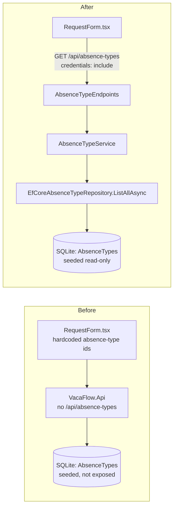

# Implementation Plan — List Absence Types (US-012)

> 🛠️ **SKILL: Implementation_Plan_Generator**
> 📄 **SOURCE: `../../documentation/05-planning/backlog.md` §US-012 (Should Have)**

---

## 1. Metadata

- **Plan ID:** IP-2026-07-22-us-012-list-absence-types
- **Created Date:** 2026-07-22
- **Source Analysis:** [`../../documentation/05-planning/backlog.md`](../../documentation/05-planning/backlog.md) §US-012 — List Absence Types
- **Author:** Bsa (AI Assisted)
- **Status:** Draft
- **Version:** 1.0
- **Impacted Stacks:** Backend (.NET 8 / ASP.NET Core Minimal API, EF Core 8), Frontend (Next.js 14 / React 18 / TS 5). **DB: no schema change** (`AbsenceTypes` table + seed already exist from US-001).
- **Linked Ticket:** US-012

---

## 2. Executive Summary

- **Change:** Expose the seeded absence-type catalog through a read-only, authenticated endpoint `GET /api/absence-types`, and hydrate the absence-type dropdown in the existing `RequestForm.tsx` from that endpoint (replacing hardcoded ids).
- **Motivation:** US-004 shipped the create-request form with hardcoded absence-type identifiers for MVP validation. US-012 makes the catalog system-controlled so the frontend selects from server-provided ids (FR-ATC-001/002/003).
- **Backend impact:** Low — add `IAbsenceTypeRepository.ListAllAsync`, a thin `IAbsenceTypeService`, an `AbsenceTypeResponse` DTO, and one `MapGet` endpoint. No create/edit/delete surface (BR-DATA-001).
- **Frontend impact:** Low — one API helper, one shared type, and a `useEffect` hydration in an existing form component with loading/error/empty states.
- **Global risk:** **L** (small, additive, read-only slice on an existing scaffold).
- **Total effort:** ~12 hours (BE ~8h / FE ~4h / DB 0h).

---

## 3. Scope

**In scope (Backend):**
- Add `Task<IReadOnlyList<AbsenceType>> ListAllAsync(...)` to `IAbsenceTypeRepository` and implement it in `EfCoreAbsenceTypeRepository` (read-only, `AsNoTracking`).
- Add `IAbsenceTypeService.ListAsync(...)` + `AbsenceTypeService` (Application layer, pure C#) returning `AbsenceTypeResponse` records.
- Add `AbsenceTypeEndpoints.MapAbsenceTypeEndpoints()` mapping only `GET /api/absence-types` with `.RequireAuthorization()`.
- Confirm the seeder is idempotent and that exactly three types (`Vacation`, `Personal Leave`, `Sick Leave`) exist after startup (AC-001) via test.
- Deliberately map **no** POST/PUT/DELETE for absence types so those verbs return 404/405 (AC-003, BR-DATA-001).

**In scope (Frontend):**
- `getAbsenceTypes()` in `lib/api.ts` (fetch with `credentials: 'include'`).
- `AbsenceType` shared type in `types/index.ts`.
- Hydrate the dropdown in `RequestForm.tsx` on mount; remove the hardcoded absence-type ids; render loading / error / empty / populated states. Responsive/mobile-safe (native `<select>`).

**In scope (Contracts):**
- New endpoint `GET /api/absence-types` → `200 [{ id, name }]`; `401` when unauthenticated.

**Out of scope:**
- Any absence-type create/edit/delete UI or endpoint (permanently excluded — FR-ATC-003 / BR-DATA-001).
- Changes to the seeder's seed values, the create-request endpoint (US-004), or the `AbsenceTypes` table schema.
- Caching/ETag optimization of the catalog (not required for a 3-row static list).

**Assumptions:**
- US-001 scaffolding is merged: `AbsenceType` entity, `VacaFlowDbContext` with the `AbsenceTypes` `DbSet`, `AbsenceTypeSeeder`, `IAbsenceTypeRepository` + `EfCoreAbsenceTypeRepository` (registered in `AddInfrastructure()`), cookie auth in `Program.cs`, and `ICurrentUserContext` all exist.
- US-002 login is merged: an authenticated session cookie is issued and validated, so `.RequireAuthorization()` behaves correctly.
- US-004 is merged: `vacaflow-web/src/components/RequestForm.tsx` exists and currently references hardcoded absence-type ids that this story replaces.
- `AbsenceType` primary keys are app-generated `Guid`s created at seed time; the frontend must never assume fixed ids — it uses whatever ids the endpoint returns.

---

## 4. Architecture Impact

**Before → After**



**API Contract Changes**

| Endpoint | Method | Auth | Request | Response (success) | Error |
| --- | --- | --- | --- | --- |
| `/api/absence-types` | GET | Yes (any role) | none | `200` `[{ "id": "<guid>", "name": "Vacation" }, …]` (3 items) | `401 UNAUTHORIZED` (no/invalid cookie) |
| `/api/absence-types` | POST / PUT / DELETE | — | — | — | `405 METHOD_NOT_ALLOWED` (route exists, verb unmapped) — no such capability (BR-DATA-001) |

**Frontend state / routing changes:** No new route. `RequestForm.tsx` gains `absenceTypes`, `typesLoading`, `typesError` state and a mount-time fetch. `lib/api.ts` gains `getAbsenceTypes()`. `types/index.ts` gains `AbsenceType`.

**Backend interface changes:**
- `IAbsenceTypeRepository` (Application) — add `ListAllAsync`.
- `IAbsenceTypeService` (Application) — **new**, `ListAsync`.
- `AbsenceTypeResponse` DTO (Application) — **new** record.

---

## 5. Pre-flight Checklist

- [ ] Working branch is off the correct base (not the default branch); e.g. `feature/yreyes/us012`.
- [ ] `dotnet build VacaFlow.sln` is green and `npm run build` in `vacaflow-web/` is green before starting.
- [ ] **Prerequisite US-001** merged: `AbsenceType` entity, `VacaFlowDbContext.AbsenceTypes`, `AbsenceTypeSeeder`, `IAbsenceTypeRepository` + `EfCoreAbsenceTypeRepository` registered in `AddInfrastructure()`. **Do NOT re-scaffold these.**
- [ ] **Prerequisite US-002** merged: cookie authentication working end-to-end (login issues a valid HttpOnly session cookie).
- [ ] **Prerequisite US-004** merged: `RequestForm.tsx`, `lib/api.ts`, and `types/index.ts` exist; note the current hardcoded absence-type ids to remove.
- [ ] Confirm no existing `AbsenceType` create/edit/delete endpoint is present (must stay absent — BR-DATA-001).
- [ ] `VacaFlow.Tests` project builds and the existing suite passes.
- [ ] No DB migration required (verify `AbsenceTypes` table already produced by US-001 auto-provisioning).
- [ ] Backlog §US-012 reviewed and its 3 acceptance criteria understood.

---

## 6. Implementation Phases

### Phase 1 — Confirm seed invariant: exactly three types [Stack: Backend]

- **Goal:** Guarantee that after startup the catalog contains exactly `Vacation`, `Personal Leave`, `Sick Leave` and that re-running the seeder does not duplicate them (AC-001).
- **Affected files:**
  - [`../../VacaFlow.Infrastructure/Seeders/AbsenceTypeSeeder.cs`](../../VacaFlow.Infrastructure/Seeders/AbsenceTypeSeeder.cs) (verify/harden only)
  - [`../../VacaFlow.Tests/Application/AbsenceTypeSeederTests.cs`](../../VacaFlow.Tests/Application/AbsenceTypeSeederTests.cs) (new)
- **Steps:**
  1. Verify `AbsenceTypeSeeder` is idempotent — it must seed only the missing types (guard on `Name`), never blindly insert. If it currently inserts unconditionally, harden it to skip names already present.
  2. Add a test asserting a single seed run yields exactly 3 rows with the exact names, and that a second seed run against the same store leaves the count at 3 (idempotency).
  3. Do **not** change the seed values or the seeder's registration.
- **Validation:** `dotnet test --filter FullyQualifiedName~AbsenceTypeSeeder` green; count == 3 after one and after two runs.
- **Rollback:** `git revert` this phase's commit (test-only + optional guard; no runtime behavior removed).
- **Estimated effort:** 2h.
- **Dependencies:** none (US-001 scaffolding assumed present).

### Phase 2 — Application read path: repository, service, DTO [Stack: Backend]

- **Goal:** Provide a pure-C# read path from the repository to a response DTO with no framework leakage into the Application layer.
- **Affected files:**
  - [`../../VacaFlow.Application/Interfaces/IAbsenceTypeRepository.cs`](../../VacaFlow.Application/Interfaces/IAbsenceTypeRepository.cs) (edit)
  - [`../../VacaFlow.Application/Interfaces/IAbsenceTypeService.cs`](../../VacaFlow.Application/Interfaces/IAbsenceTypeService.cs) (new)
  - [`../../VacaFlow.Application/Dtos/AbsenceTypeResponse.cs`](../../VacaFlow.Application/Dtos/AbsenceTypeResponse.cs) (new)
  - [`../../VacaFlow.Application/Services/AbsenceTypeService.cs`](../../VacaFlow.Application/Services/AbsenceTypeService.cs) (new)
  - [`../../VacaFlow.Infrastructure/Persistence/Repositories/EfCoreAbsenceTypeRepository.cs`](../../VacaFlow.Infrastructure/Persistence/Repositories/EfCoreAbsenceTypeRepository.cs) (edit)
- **Steps:**
  1. Add `ListAllAsync` to the repository interface (preserve any existing members such as `GetByIdAsync`/`ExistsAsync`):
     ```csharp
     using VacaFlow.Domain.Entities;

     namespace VacaFlow.Application.Interfaces;

     public interface IAbsenceTypeRepository
     {
         // ...existing members preserved...
         Task<IReadOnlyList<AbsenceType>> ListAllAsync(CancellationToken cancellationToken = default);
     }
     ```
  2. Define the response record (records for DTOs; `*Response` suffix):
     ```csharp
     namespace VacaFlow.Application.Dtos;

     public sealed record AbsenceTypeResponse(Guid Id, string Name);
     ```
  3. Define the service contract:
     ```csharp
     using VacaFlow.Application.Dtos;

     namespace VacaFlow.Application.Interfaces;

     public interface IAbsenceTypeService
     {
         Task<IReadOnlyList<AbsenceTypeResponse>> ListAsync(CancellationToken cancellationToken = default);
     }
     ```
  4. Implement the service (constructor injection; `sealed`; no `Microsoft.*`):
     ```csharp
     using VacaFlow.Application.Dtos;
     using VacaFlow.Application.Interfaces;

     namespace VacaFlow.Application.Services;

     public sealed class AbsenceTypeService : IAbsenceTypeService
     {
         private readonly IAbsenceTypeRepository _absenceTypeRepository;

         public AbsenceTypeService(IAbsenceTypeRepository absenceTypeRepository)
         {
             _absenceTypeRepository = absenceTypeRepository;
         }

         public async Task<IReadOnlyList<AbsenceTypeResponse>> ListAsync(CancellationToken cancellationToken = default)
         {
             var types = await _absenceTypeRepository.ListAllAsync(cancellationToken);
             return types
                 .Select(type => new AbsenceTypeResponse(type.Id, type.Name))
                 .ToList();
         }
     }
     ```
  5. Implement the repository method in Infrastructure (EF Core allowed here; read-only, no tracking, no raw SQL):
     ```csharp
     public async Task<IReadOnlyList<AbsenceType>> ListAllAsync(CancellationToken cancellationToken = default)
     {
         return await _dbContext.AbsenceTypes
             .AsNoTracking()
             .OrderBy(type => type.Name)
             .ToListAsync(cancellationToken);
     }
     ```
  6. Add Application-service unit test with a hand-written fake `IAbsenceTypeRepository` (no Moq) asserting `ListAsync` maps every entity to a `AbsenceTypeResponse` preserving `Id` and `Name`.
- **Validation:** `dotnet build VacaFlow.sln` green; `grep -r "using Microsoft" VacaFlow.Application/` returns zero; service unit test green.
- **Rollback:** `git revert` this phase's commit (all additions; the interface edit is additive).
- **Estimated effort:** 3h.
- **Dependencies:** Phase 1 (shares the seed fixture used by tests).

### Phase 3 — Endpoint + DI + integration tests [Stack: Backend]

- **Goal:** Expose `GET /api/absence-types` (authenticated, read-only) and prove no write verbs exist (AC-002, AC-003, BR-DATA-001).
- **Affected files:**
  - [`../../VacaFlow.Api/Endpoints/AbsenceTypeEndpoints.cs`](../../VacaFlow.Api/Endpoints/AbsenceTypeEndpoints.cs) (new)
  - [`../../VacaFlow.Api/Program.cs`](../../VacaFlow.Api/Program.cs) (edit — map endpoints + DI)
  - [`../../VacaFlow.Infrastructure/Extensions/InfrastructureServiceExtensions.cs`](../../VacaFlow.Infrastructure/Extensions/InfrastructureServiceExtensions.cs) (verify repo binding)
  - [`../../VacaFlow.Tests/Application/AbsenceTypeEndpointsTests.cs`](../../VacaFlow.Tests/Application/AbsenceTypeEndpointsTests.cs) (new — integration-style)
- **Steps:**
  1. Create the endpoint mapping — only `GET`, group-level `.RequireAuthorization()`:
     ```csharp
     using VacaFlow.Application.Interfaces;

     namespace VacaFlow.Api.Endpoints;

     public static class AbsenceTypeEndpoints
     {
         public static IEndpointRouteBuilder MapAbsenceTypeEndpoints(this IEndpointRouteBuilder app)
         {
             var group = app.MapGroup("/api/absence-types")
                 .RequireAuthorization()
                 .WithTags("AbsenceTypes");

             group.MapGet("/", async (IAbsenceTypeService absenceTypeService, CancellationToken cancellationToken) =>
             {
                 var types = await absenceTypeService.ListAsync(cancellationToken);
                 return Results.Ok(types);
             })
             .WithName("ListAbsenceTypes");

             // No MapPost/MapPut/MapDelete: write verbs on this route resolve to 405 (BR-DATA-001).
             return app;
         }
     }
     ```
  2. In `Program.cs`, register the Application service and map the endpoint group:
     ```csharp
     builder.Services.AddScoped<IAbsenceTypeService, AbsenceTypeService>();
     // ...after app is built and auth middleware is configured...
     app.MapAbsenceTypeEndpoints();
     ```
  3. Ensure `EfCoreAbsenceTypeRepository` is bound to `IAbsenceTypeRepository` (scoped) in `AddInfrastructure()`; add the binding only if US-001 did not already register it.
  4. Add integration-style tests: (a) authenticated `GET` returns `200` with exactly 3 items and the expected names (AC-002); (b) unauthenticated `GET` returns `401`; (c) `POST`/`PUT`/`DELETE` on `/api/absence-types` return `404`/`405` (AC-003).
- **Validation:** `dotnet test` green for all three cases; manual `curl` with a valid session cookie returns 3 items; without cookie returns 401.
- **Rollback:** `git revert` this phase's commit; remove `app.MapAbsenceTypeEndpoints()` and the service registration (frontend Phase 4 must not be merged before this is reverted).
- **Estimated effort:** 3h.
- **Dependencies:** Phase 2.

### Phase 4 — Frontend dropdown hydration [Stack: Frontend]

- **Goal:** Populate the absence-type `<select>` in `RequestForm.tsx` from `GET /api/absence-types`, removing hardcoded ids, with loading/error/empty/success states.
- **Affected files:**
  - [`../../vacaflow-web/src/types/index.ts`](../../vacaflow-web/src/types/index.ts) (edit — add type)
  - [`../../vacaflow-web/src/lib/api.ts`](../../vacaflow-web/src/lib/api.ts) (edit — add helper)
  - [`../../vacaflow-web/src/components/RequestForm.tsx`](../../vacaflow-web/src/components/RequestForm.tsx) (edit — hydrate dropdown, remove hardcoded ids)
- **Steps:**
  1. Add the shared type:
     ```typescript
     export interface AbsenceType {
       id: string;
       name: string;
     }
     ```
  2. Add the API helper (identity/session via cookie; never localStorage):
     ```typescript
     import type { AbsenceType } from "@/types";

     const API_BASE_URL = process.env.NEXT_PUBLIC_API_BASE_URL ?? "http://localhost:5000";

     export async function getAbsenceTypes(): Promise<AbsenceType[]> {
       const response = await fetch(`${API_BASE_URL}/api/absence-types`, {
         method: "GET",
         credentials: "include",
         headers: { Accept: "application/json" },
       });

       if (!response.ok) {
         throw new Error(`Failed to load absence types (status ${response.status})`);
       }

       return (await response.json()) as AbsenceType[];
     }
     ```
  3. In `RequestForm.tsx`, remove the hardcoded absence-type ids and hydrate on mount:
     ```tsx
     const [absenceTypes, setAbsenceTypes] = useState<AbsenceType[]>([]);
     const [typesLoading, setTypesLoading] = useState<boolean>(true);
     const [typesError, setTypesError] = useState<string | null>(null);

     useEffect(() => {
       let cancelled = false;
       getAbsenceTypes()
         .then((types) => {
           if (!cancelled) {
             setAbsenceTypes(types);
             setTypesError(null);
           }
         })
         .catch(() => {
           if (!cancelled) {
             setTypesError("Could not load absence types. Please retry.");
           }
         })
         .finally(() => {
           if (!cancelled) {
             setTypesLoading(false);
           }
         });
       return () => {
         cancelled = true;
       };
     }, []);
     ```
  4. Render the state-driven select (loading disables; error shows message + keeps submit disabled; empty shows guidance):
     ```tsx
     <label htmlFor="absenceTypeId">Absence type</label>
     <select
       id="absenceTypeId"
       value={absenceTypeId}
       onChange={(event) => setAbsenceTypeId(event.target.value)}
       disabled={typesLoading || absenceTypes.length === 0}
       required
       aria-busy={typesLoading}
     >
       <option value="" disabled>
         {typesLoading ? "Loading…" : "Select an absence type"}
       </option>
       {absenceTypes.map((type) => (
         <option key={type.id} value={type.id}>
           {type.name}
         </option>
       ))}
     </select>
     {typesError && (
       <p role="alert" className="field-error">
         {typesError}
       </p>
     )}
     ```
  5. Ensure the create-request submit uses the selected `absenceTypeId` from state (server-provided Guid), not any prior constant.
- **Validation:** `npm run build` green; with API running, dropdown lists the 3 seeded types; simulate network failure → error message shown and submit blocked; empty response → guidance shown; created request persists with a valid seeded `AbsenceTypeId`.
- **Rollback:** `git revert` this phase's commit; the backend endpoint remains functional and unused.
- **Estimated effort:** 4h.
- **Dependencies:** Phase 3 (endpoint must be live before the frontend calls it).

---

## 7. Database Changes

**No database changes required.** The `AbsenceTypes` table and its three seed rows (`Vacation`, `Personal Leave`, `Sick Leave`) are produced by US-001 auto-provisioning and `AbsenceTypeSeeder`. US-012 is a read-only consumer. Phase 1 verifies the seed invariant with a test; it introduces no DDL/DML and no migration.

---

## 8. Testing Strategy

**Backend (unit + integration; coverage ≥ 80% on changed code):**
- `AbsenceTypeSeederTests` — exactly 3 rows with correct names after one run; still 3 after a second run (idempotency) — AC-001.
- `AbsenceTypeServiceTests` — hand-written fake `IAbsenceTypeRepository` (no Moq); `ListAsync` maps every entity to `AbsenceTypeResponse` preserving `Id`/`Name`; empty repo → empty list.
- `AbsenceTypeEndpointsTests` — authenticated `GET` returns `200` + 3 items (AC-002); unauthenticated `GET` returns `401`; `POST`/`PUT`/`DELETE` return `404`/`405` (AC-003, BR-DATA-001).
- AAA pattern; naming `Method_ExpectedBehavior_WhenCondition`; no `HttpContext`/`DbContext` in Application unit tests.

**Frontend (unit + a11y; coverage ≥ 80% on changed code):**
- `getAbsenceTypes` — success maps JSON to `AbsenceType[]`; non-2xx throws.
- `RequestForm` — renders options after successful fetch; disabled `<select>` while loading; error `role="alert"` on failure; empty-list guidance; submit uses the selected server-provided id.

**Cross-cutting:**
- Contract check: response shape `{ id: string, name: string }[]` matches the `AbsenceType` TS interface (no field drift).
- Regression: confirm US-004 create-request still succeeds using an id sourced from this endpoint (FK integrity against seeded Guids).

### UX/UI Validation
- **Loading:** `<select>` disabled with a "Loading…" placeholder and `aria-busy="true"` while the fetch is in flight.
- **Error:** visible `role="alert"` message ("Could not load absence types. Please retry.") and submit remains blocked; no silent failure.
- **Empty:** if the API returns `[]`, show non-blocking guidance and keep the field disabled (should not occur given the seed, but handled defensively).
- **Success:** all three types listed in a stable order; keyboard-navigable native `<select>` (WCAG 2.1 AA); associated `<label htmlFor>`; usable at mobile breakpoints (≥320px) with no horizontal overflow.

---

## 9. Configuration & Deployment

**Backend env config (existing keys — no new keys):** `ConnectionStrings:VacaFlow`, `CookieAuth:*`, `Cors:AllowedOrigin`. The endpoint reuses the existing cookie-auth pipeline; no new configuration.

**Frontend env files:** `vacaflow-web/.env.local` → `NEXT_PUBLIC_API_BASE_URL` (already defined for US-002/US-004); reused by `getAbsenceTypes()`.

**Deployment order (local):** start `VacaFlow.Api` first, then `vacaflow-web`. The frontend must not be deployed ahead of Phase 3 (endpoint live) — see phase dependencies.

**Feature flags:** none.

**Performance note:** static 3-row catalog; the dropdown hydration is a single lightweight GET on form mount and must not regress form interactivity (target LCP ≤ 2.5s, CLS ≤ 0.1 for the request-new page).

---

## 10. Risks & Mitigations

| Risk | Probability | Impact | Mitigation | Owner | Stack |
| --- | --- | --- | --- | --- | --- |
| Seeded `AbsenceType` Guids are app-generated at seed time; any hardcoded ids left in `RequestForm.tsx` from US-004 will not match, breaking create-request FK | M | H | Phase 4 fully removes hardcoded ids and sources the id from the endpoint; cross-cutting regression test on create-request | BSA/Coder | Cross |
| Endpoint accidentally omits `.RequireAuthorization()`, exposing the catalog anonymously (violates AC-002) | L | M | Group-level `.RequireAuthorization()`; integration test asserts `401` when unauthenticated | Coder | BE |
| A write verb on `/api/absence-types` returns something other than 404/405 (violates AC-003 / BR-DATA-001) | L | M | Map only `GET`; integration test asserts `404`/`405` for POST/PUT/DELETE | Coder | BE |
| Non-idempotent seeder duplicates types on restart, breaking "exactly three" (AC-001) | L | M | Phase 1 hardens/guards the seeder by `Name` and tests a double-run count of 3 | Coder | BE |
| `RequestForm.tsx` not yet merged (US-004 slip) blocks the frontend phase | M | M | Pre-flight gate on US-004; if slipped, ship Phases 1–3 (backend) independently — both builds stay green | BSA | FE |

---

## 11. Definition of Done

- [ ] Backend: `IAbsenceTypeRepository.ListAllAsync`, `IAbsenceTypeService`/`AbsenceTypeService`, `AbsenceTypeResponse`, and `GET /api/absence-types` (authenticated) implemented.
- [ ] No create/edit/delete endpoint for absence types exists; write verbs return 404/405 (AC-003, BR-DATA-001).
- [ ] Frontend: `RequestForm.tsx` dropdown hydrated from the endpoint; all hardcoded absence-type ids removed; `getAbsenceTypes()` and `AbsenceType` type added.
- [ ] Tests: backend unit + integration and frontend unit + a11y green; coverage ≥ 80% on changed code (Domain+Application ≥ 70% overall floor maintained).
- [ ] All UI states implemented — loading, error, empty, success — and verified.
- [ ] WCAG 2.1 AA: labelled, keyboard-navigable `<select>`; error surfaced via `role="alert"`.
- [ ] Mobile breakpoints (≥320px) verified; no horizontal overflow; performance thresholds met (LCP ≤ 2.5s, CLS ≤ 0.1).
- [ ] Shared TS type matches the API response shape (no field drift).
- [ ] No DB migration introduced; `AbsenceTypes` schema/seed unchanged.
- [ ] Boundary check: `grep -r "using Microsoft" VacaFlow.Application/` returns zero.
- [ ] Both builds green (`dotnet build VacaFlow.sln`, `npm run build`).
- [ ] API docs/README updated to list the read-only `GET /api/absence-types`.
- [ ] Peer review approved (≥1 reviewer).
- [ ] US-012 acceptance criteria AC-001, AC-002, AC-003 satisfied and verified locally.

---

## 12. References

- **Backlog (source):** [`../../documentation/05-planning/backlog.md`](../../documentation/05-planning/backlog.md) §US-012 — List Absence Types (Should Have; Deferral Justification).
- **Business rules:** BR-DATA-001 (absence types seeded, read-only — no create/update/delete endpoint → 404/405); [`../../documentation/03-requirements/business-rules.md`](../../documentation/03-requirements/business-rules.md).
- **Functional requirements:** FR-ATC-001 (seed types), FR-ATC-002 (list endpoint), FR-ATC-003 (no management UI) — [`../../documentation/02-define/functional-spec.md`](../../documentation/02-define/functional-spec.md).
- **Architecture:** [`../../documentation/04-architecture/software-architecture-document.md`](../../documentation/04-architecture/software-architecture-document.md) (Reduced Onion, Application layer has zero Microsoft.* deps).
- **Tech / code standards:** [`../../documentation/07-development/tech-doc.md`](../../documentation/07-development/tech-doc.md), [`../../documentation/07-development/code-standards.md`](../../documentation/07-development/code-standards.md).
- **Related US:** US-001 (registration + scaffolding, seeder), US-002 (login/session cookie), US-004 (create draft request — owner of `RequestForm.tsx`).

---

*Plan generated for US-012 (Should Have). Backend-first, frontend-last; both builds remain green after every phase.*
