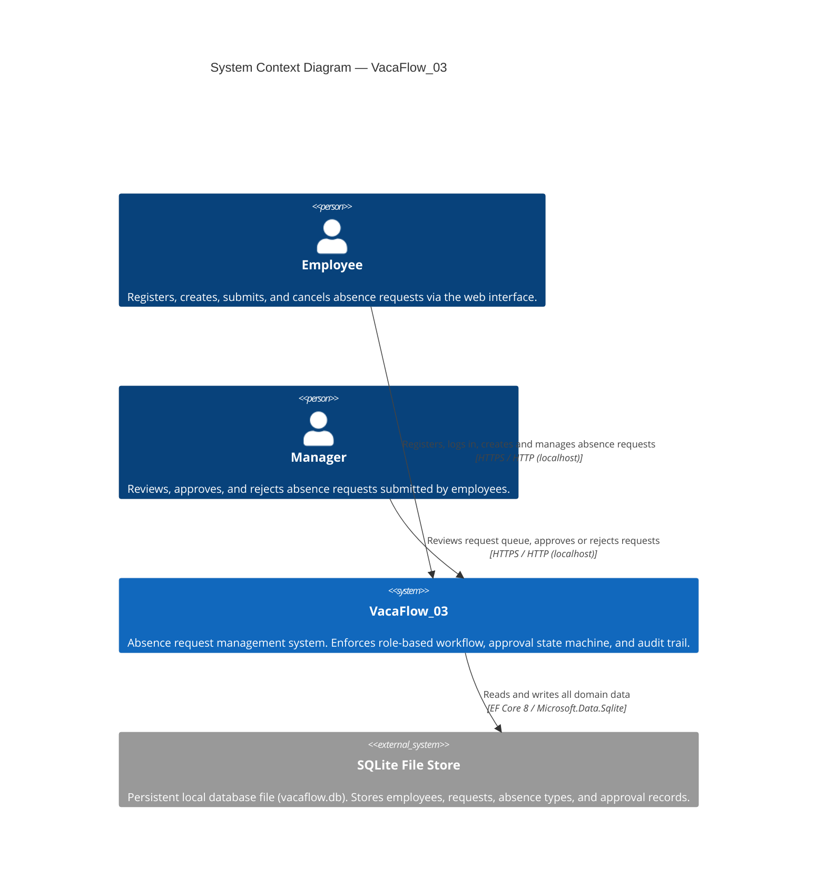
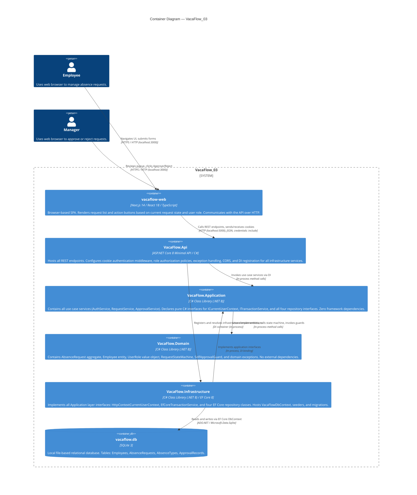
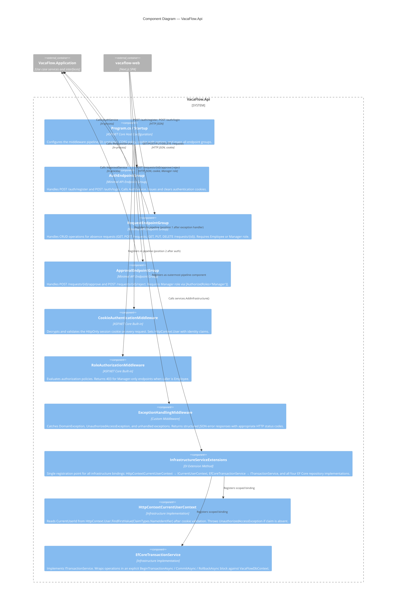
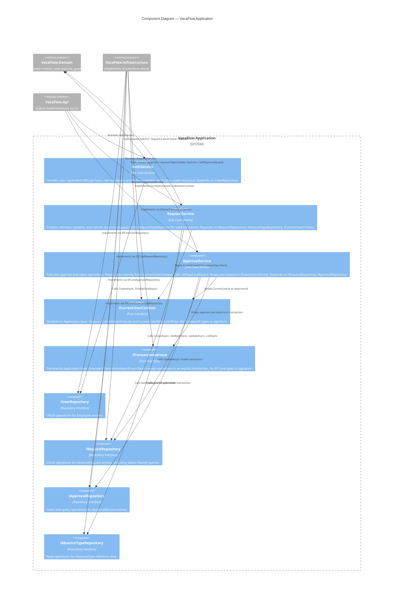

# Software Architecture Document
## VacaFlow_03

**Author:** Yeuri Jessel Reyes (AI Assisted)
**Date:** 2026-07-20
**Version:** 1.0
**Status:** Draft — Phase 1 Awaiting Approval
**Project:** VacaFlow_03 — IGS Solutions
**References:** AE-001 (Architecture Evaluation), AA-001 (Architecture Alternatives), AO-001 (Architecture Overview), UT-001 (Utility Tree), FS-001 (Functional Spec), NFR-001 (Non-Functional Requirements Specification), BR-001 (Business Rules)

---

## Table of Contents

- [Section 1: Recommended Architecture](#section-1-recommended-architecture)
- [Section 2: Architecture Diagrams (C4 Model)](#section-2-architecture-diagrams-c4-model)
- [Section 3: Component Architecture](#section-3-component-architecture)
- [Section 4: Architecture Decision Records](#section-4-architecture-decision-records)
- [Phase 1 Approval](#phase-1-approval)

---

## Section 1: Recommended Architecture

### 1.1 Primary Recommendation: Alternative C — Cookie-Based Authentication with Explicit Transaction Service and ICurrentUserContext

Alternative C is the optimal architecture for VacaFlow_03, achieving the maximum weighted score of **5.000** across all four quality attributes evaluated in the Architecture Evaluation (AE-001). It delivers the strictest compliance with the Reduced Onion Architecture mandate (NFR-MAINT-001) by ensuring that the Application layer assembly carries zero dependencies on ASP.NET Core or Entity Framework Core types — a property that is both architecturally correct and directly verifiable by the reviewer by inspecting the `using` directives of any Application layer class.

The recommended architecture is composed of five named layers organized as a Reduced Onion:

1. **VacaFlow.Domain** — Core business entities, value objects, domain rules, and the `RequestStateMachine`
2. **VacaFlow.Application** — Use case services, pure C# interfaces (`ICurrentUserContext`, `ITransactionService`, repository interfaces), no framework dependencies
3. **VacaFlow.Infrastructure** — EF Core context, concrete repository implementations, `EfCoreTransactionService`, `HttpContextCurrentUserContext`
4. **VacaFlow.Api** — ASP.NET Core Minimal API host, middleware pipeline, DI registration, cookie authentication configuration
5. **vacaflow-web** — Next.js 14 frontend, state-driven UI, REST client over HTTP

At the same time, the recommended architecture inherits the full Security profile of Alternative A (cookie `HttpOnly`, no token-theft surface) and the same frictionless local setup (two commands, no external secrets to configure). The explicit `ITransactionService` makes the atomic approval boundary visible in the `ApprovalService` code itself rather than relying on EF Core's implicit commit behavior, directly satisfying NFR-REL-002 in a way that is immediately understandable to any reviewer regardless of their EF Core experience.

---

### 1.2 Why Alternative C Wins

#### Security (Score: 5.00 / 5.00 — Weight: 40%)

Cookie `HttpOnly` with `SameSite=Strict` prevents token exfiltration via XSS across all four security scenarios. The `ICurrentUserContext` interface — read exclusively from the server-validated cookie claim — ensures that approver identity can never be injected from the request body (SC-SEC-04). Role enforcement via `RoleAuthorizationMiddleware` and domain-level `SelfApprovalGuard` provide defense in depth at two independent architectural layers. Alternative C matches Alternative A's perfect security score while improving the Application layer boundary.

#### Reliability (Score: 5.00 / 5.00 — Weight: 30%)

The explicit `ITransactionService.ExecuteInTransactionAsync` wrapping the approve/reject operation in a `BeginTransactionAsync` / commit / rollback block is the decisive differentiator over Alternative A. SC-REL-01 (atomic approval write) receives a score of 5 because the transactional guarantee is structurally enforced and visibly documented in the Application service code, not inferred from EF Core behavior. Auto-provisioning via EF Core seed data on first run (SC-REL-02) and the Domain `RequestStateMachine` pre-persistence guard (SC-REL-03) operate identically to Alternative A.

#### Usability & Compatibility (Score: 5.00 / 5.00 — Weight: 20%)

Identical to Alternative A — two-process startup with no external configuration, cross-platform runtime stack, and state-driven UI action visibility. Alternative C adds no setup steps over Alternative A. A reviewer with .NET 8 and Node.js installed can be running the full application in under five minutes from cloning the repository.

#### Maintainability (Score: 5.00 / 5.00 — Weight: 10%)

The Application layer's zero-dependency profile makes all five Onion layer boundaries immediately identifiable from `using` directives (SC-MAINT-01). Both `ICurrentUserContext` and `ITransactionService` are pure interfaces, enabling full Application layer unit test coverage with simple in-memory fakes and no `HttpContext` or `DbContext` involvement (SC-MAINT-02). Repository swaps, user context swaps, and transaction implementation swaps each require a single DI registration change in the API layer (SC-MAINT-03).

---

### 1.3 Why Not Alternative A: Cookie + SessionContext

Alternative A is a strong, production-grade implementation and a legitimate choice. Its principal weakness for VacaFlow_03 is the Maintainability dimension: `SessionContext` injects `IHttpContextAccessor` — an ASP.NET Core infrastructure type — into the Application layer. This violates the strict Onion dependency rule that the Application layer must have no outward dependency on framework types. For a project whose primary purpose is to demonstrate architectural fitness to a reviewer, this is a meaningful trade-off: a reviewer reading the Application layer will see `Microsoft.AspNetCore.Http` in the `using` directives and correctly note the boundary violation. Alternative A would be the right choice if the team prioritizes convention-first simplicity and expects no unit testing of Application services during the MVP review window.

### 1.4 Why Not Alternative B: JWT + ICurrentUserService

Alternative B introduces the cleanest Application layer separation among the three alternatives that use only a single new interface, and it is the best choice if the project were to evolve into a multi-host or stateless deployment post-MVP. However, for the constrained VacaFlow_03 context, it carries two meaningful costs: first, the JWT stored in `sessionStorage` is accessible to JavaScript, creating an XSS token-theft surface that `HttpOnly` cookies eliminate; second, the JWT signing key must be configured before the API will accept any login, adding a friction point to the reviewer setup flow that directly conflicts with SC-USE-01's 15-minute target. Alternative B would be the right choice if the post-MVP roadmap included horizontal scaling, multi-service token validation, or the team had a strong preference for stateless server design.

---

### 1.5 Strategic Path Forward

**Phase 1 — Local MVP Delivery**
Implement Alternative C as specified. Configure `EnsureCreated` or an initial EF Core migration for SQLite auto-provisioning, wire `EfCoreTransactionService` and `HttpContextCurrentUserContext` in the API layer DI, and verify all domain rules through Application layer unit tests using in-memory fakes. Deliver the working application for reviewer evaluation.

**Phase 2 — Architecture Hardening (Post-Review)**
Replace `EfCoreTransactionService` with a resilience-enhanced implementation using EF Core's `CreateExecutionStrategy` for retry-aware transaction semantics. Add integration tests that exercise the full request lifecycle (register → create → submit → approve) against an in-memory or file-based SQLite database to validate the transaction boundary under simulated fault conditions.

**Phase 3 — Production Migration (If Required)**
If VacaFlow_03 evolves beyond a single-machine MVP into a hosted service, replace `HttpContextCurrentUserContext` with an equivalent implementation backed by a distributed identity provider (e.g., Azure AD / Entra ID), replace `EfCoreTransactionService` with a PostgreSQL or SQL Server backed implementation, and replace the SQLite `VacaFlowDbContext` with a production-grade provider — all without changing a single line of Application layer code, validating the investment in Onion boundary purity made in Phase 1.

---

## Section 2: Architecture Diagrams (C4 Model)

The following diagrams follow the C4 Model, chosen for its ability to communicate architecture at multiple levels of abstraction to different audiences: business stakeholders (Level 1), technical architects (Level 2), and developers (Level 3).

---

### 2.1 Level 1 — System Context Diagram

The System Context diagram shows VacaFlow_03 in relation to its users and any external systems. At this level, the system is treated as a black box.

| Element | Type | Description |
|---------|------|-------------|
| Employee | Person | Any registered user with the `Employee` role. Can create, submit, and cancel their own absence requests. Cannot approve or reject requests. |
| Manager | Person | A seeded user with the `Manager` role. Reviews all pending requests and transitions them to Approved or Rejected. Cannot approve their own requests. |
| VacaFlow_03 | Software System | The full-stack application encompassing the Next.js frontend (vacaflow-web) and the ASP.NET Core API (VacaFlow.Api), connected over HTTP on localhost. |
| SQLite File Store | External System | A local `.db` file managed by EF Core 8. Provisioned automatically on first run. No separate database server required. |

---

### 2.2 Level 2 — Container Diagram

The Container diagram zooms into VacaFlow_03 to show its internal containers (separately deployable/runnable units) and how they communicate.

**Containers Table**

| Container | Technology | Description |
|-----------|------------|-------------|
| vacaflow-web | Next.js 14, React 18, TypeScript | Frontend SPA. Renders conditional UI based on request status and user role. Sends cookies automatically on all API requests. |
| VacaFlow.Api | ASP.NET Core 8 Minimal API, C# | API host. Configures middleware pipeline: exception handling → authentication → authorization → endpoints. Registers all DI bindings. |
| VacaFlow.Application | C# .NET 8 class library | Pure use case orchestration. No framework imports. Declares all interfaces consumed by the API and implemented by Infrastructure. |
| VacaFlow.Domain | C# .NET 8 class library | Business rules and domain logic. No external NuGet dependencies beyond `BCrypt.Net-Next` for password hashing. |
| VacaFlow.Infrastructure | C# .NET 8, EF Core 8 | All infrastructure concerns: persistence, transaction management, HTTP context access. Implements Application interfaces. |
| vacaflow.db | SQLite 3 | Local file database auto-provisioned by EF Core on first run. |

**Technology Choices Table**

| Layer | Technology | Version | Rationale |
|-------|------------|---------|-----------|
| Frontend | Next.js | 14.x | React-based SSR/SPA hybrid; state-driven rendering for action buttons |
| API Framework | ASP.NET Core Minimal API | .NET 8 | Lightweight, cross-platform, first-class cookie auth support |
| ORM | Entity Framework Core | 8.x | Code-First migrations, SQLite provider, implicit + explicit transactions |
| Database | SQLite | 3.x | Zero-configuration, file-based, cross-platform, no server process |
| Auth | ASP.NET Core Cookie Auth | Built-in | HttpOnly, SameSite=Strict, no external key management |
| Password Hashing | BCrypt.Net-Next | 4.x | Industry-standard adaptive hashing, cross-platform |

---

### 2.3 Level 3 — Component Diagram: VacaFlow.Api

The Component diagram zooms into the **VacaFlow.Api** container, showing its internal components and how they interact with the Application layer.

**Components Table**

| Component | Type | Description |
|-----------|------|-------------|
| Program.cs / Startup | Host Configuration | Bootstraps the application. Configures the complete middleware pipeline, maps endpoint groups, and invokes `AddInfrastructure()`. |
| AuthEndpointGroup | Endpoint Group | Handles registration and login. Calls `IAuthService`. Issues `Set-Cookie` response headers with `HttpOnly; SameSite=Strict`. |
| RequestEndpointGroup | Endpoint Group | Full CRUD for absence requests. Requires authenticated caller. Delegates to `IRequestService`. |
| ApprovalEndpointGroup | Endpoint Group | Approve and reject operations. `[Authorize(Roles = "Manager")]` enforced at this boundary. Delegates to `IApprovalService`. |
| CookieAuthenticationMiddleware | Built-in Middleware | Validates the encrypted session cookie. Populates `HttpContext.User`. Returns 401 if cookie absent or invalid. |
| RoleAuthorizationMiddleware | Built-in Middleware | Evaluates `[Authorize]` policies. Returns 403 for role mismatches before endpoint handler executes. |
| ExceptionHandlingMiddleware | Custom Middleware | Translates domain and authorization exceptions to structured HTTP error responses. Prevents stack trace leakage. |
| InfrastructureServiceExtensions | DI Extension | Single `AddInfrastructure()` call registers all infrastructure implementations. Single-line swap point for any binding. |
| HttpContextCurrentUserContext | Infrastructure Impl. | Reads caller identity from validated cookie claims. Throws on absent claim rather than returning `Guid.Empty`. |
| EfCoreTransactionService | Infrastructure Impl. | Provides explicit, visible transaction boundaries wrapping approval operations. Guards against nested transaction calls. |

---

### 2.4 Level 3 — Component Diagram: VacaFlow.Application

---

## Section 3: Component Architecture

### 3.1 Component Overview

| Component | Description | Technology | Owner |
|-----------|-------------|------------|-------|
| VacaFlow.Domain | Core business logic: entities, value objects, state machine, guards, domain exceptions. No external NuGet dependencies. | C# .NET 8 | Architecture Team |
| VacaFlow.Application | Use case orchestration services and all interface declarations. Zero framework dependencies. | C# .NET 8 | Architecture Team |
| VacaFlow.Infrastructure | Concrete implementations of all application interfaces: repositories, transaction service, user context. | C# .NET 8, EF Core 8, Microsoft.Data.Sqlite | Backend Team |
| VacaFlow.Api | ASP.NET Core Minimal API host: endpoint mapping, middleware pipeline, DI configuration, CORS, cookie auth. | C# .NET 8, ASP.NET Core 8 | Backend Team |
| vacaflow-web | Next.js 14 frontend SPA: request list, request form, approval queue, state-driven action rendering. | Next.js 14, React 18, TypeScript | Frontend Team |
| vacaflow.db | Auto-provisioned SQLite database file containing all persistent data. | SQLite 3 | DevOps / Backend Team |

---

### 3.2 Component Details

#### 3.2.1 VacaFlow.Domain

**Purpose:** Encapsulates all business rules, domain invariants, and state machine logic. Acts as the innermost Onion layer with zero outward dependencies.

**Responsibilities:**
- Define the `AbsenceRequest` aggregate root with all lifecycle state transitions
- Enforce the `RequestStateMachine` — valid transitions: Draft → Submitted → Approved / Rejected / Cancelled
- Execute `SelfApprovalGuard` — throws `DomainException` when `ApproverId == RequestorId`
- Define the `Employee` entity with `UserRole` value object (`Employee`, `Manager`)
- Define `AbsenceType` reference entity
- Define `ApprovalRecord` value object recording who approved/rejected and when
- Throw typed `DomainException` for all invariant violations before any persistence

**Interfaces:**

| Interface | Type | Description |
|-----------|------|-------------|
| N/A — Domain declares no interfaces | — | Domain is consumed by Application; it does not depend on abstractions |

**Dependencies:**
- `BCrypt.Net-Next` (password hashing within `Employee` entity factory method)
- No ASP.NET Core, EF Core, or infrastructure packages

**Technology Stack:** Language: C# 12, Framework: .NET 8 class library, Runtime: .NET 8

---

#### 3.2.2 VacaFlow.Application

**Purpose:** Orchestrates use cases by coordinating domain operations and infrastructure calls through pure interfaces. Contains no framework-specific code.

**Responsibilities:**
- `AuthService`: register new employees (validate role, hash password via domain), verify login credentials
- `RequestService`: create, list, retrieve, submit, and cancel absence requests with ownership and state validation
- `ApprovalService`: execute approve/reject operations by reading caller identity from `ICurrentUserContext`, invoking domain state machine, and persisting atomically via `ITransactionService`
- Declare all repository interfaces (`IUserRepository`, `IRequestRepository`, `IApprovalRepository`, `IAbsenceTypeRepository`)
- Declare `ICurrentUserContext` and `ITransactionService`

**Interfaces:**

| Interface | Type | Description |
|-----------|------|-------------|
| `IAuthService` | Use Case | Register and login operations |
| `IRequestService` | Use Case | Absence request lifecycle management |
| `IApprovalService` | Use Case | Approve and reject operations with self-approval guard |
| `ICurrentUserContext` | Infrastructure Contract | Provides `CurrentUserId` and `CurrentUserRole` from server-side session |
| `ITransactionService` | Infrastructure Contract | Wraps operations in explicit database transactions |
| `IUserRepository` | Repository Contract | Employee persistence operations |
| `IRequestRepository` | Repository Contract | AbsenceRequest persistence and query operations |
| `IApprovalRepository` | Repository Contract | ApprovalRecord persistence |
| `IAbsenceTypeRepository` | Repository Contract | AbsenceType reference data queries |

**Dependencies:**
- `VacaFlow.Domain` (project reference)
- No NuGet packages with ASP.NET Core or EF Core types

**Technology Stack:** Language: C# 12, Framework: .NET 8 class library, Runtime: .NET 8

---

#### 3.2.3 VacaFlow.Infrastructure

**Purpose:** Provides all concrete implementations of Application layer interfaces using EF Core 8 and ASP.NET Core's `IHttpContextAccessor`.

**Responsibilities:**
- `VacaFlowDbContext`: configures all entity mappings, Fluent API constraints, relationships, and indexes
- `EfCoreUserRepository`, `EfCoreRequestRepository`, `EfCoreApprovalRepository`, `EfCoreAbsenceTypeRepository`: implement repository interfaces using EF Core LINQ queries
- `EfCoreTransactionService`: opens, commits, and rolls back explicit SQLite transactions; guards against nested transaction calls
- `HttpContextCurrentUserContext`: reads `ClaimTypes.NameIdentifier` and role claim from validated `HttpContext.User`; throws `UnauthorizedAccessException` if claim is absent
- `AbsenceTypeSeeder` and `ManagerAccountSeeder`: provide seed data via EF Core `HasData` or startup hook
- EF Core migrations for schema creation and evolution

**Interfaces:**

| Interface | Type | Description |
|-----------|------|-------------|
| `IHttpContextAccessor` | ASP.NET Core | Injected to read `HttpContext.User` in `HttpContextCurrentUserContext` |

**Dependencies:**
- `VacaFlow.Application` (project reference)
- `VacaFlow.Domain` (project reference)
- `Microsoft.EntityFrameworkCore.Sqlite` (8.x)
- `Microsoft.AspNetCore.Http.Abstractions` (for `IHttpContextAccessor`)

**Technology Stack:** Language: C# 12, Framework: .NET 8, ORM: EF Core 8, Database Driver: Microsoft.Data.Sqlite 8.x

---

#### 3.2.4 VacaFlow.Api

**Purpose:** ASP.NET Core Minimal API host responsible for HTTP handling, authentication, authorization, and wiring all layers together via DI.

**Responsibilities:**
- Configure middleware pipeline: `ExceptionHandlingMiddleware` → `CookieAuthentication` → `Authorization` → endpoint routing
- Map endpoint groups: `/auth`, `/requests`, `/requests/{id}/approve`, `/requests/{id}/reject`, `/me`, `/health`
- Configure cookie authentication: `HttpOnly=true`, `SameSite=Strict`, sliding expiration 120 minutes, secure flag in production
- Configure CORS: explicit origin `http://localhost:3000`, `AllowCredentials()`, allowed methods and headers
- Register all DI bindings via `services.AddInfrastructure()`: six interface-to-implementation mappings as scoped lifetime

**Interfaces:**

| Interface | Type | Description |
|-----------|------|-------------|
| REST HTTP endpoints | External API | JSON over HTTP consumed by vacaflow-web |

**Dependencies:**
- `VacaFlow.Application` (project reference)
- `VacaFlow.Infrastructure` (project reference)
- `VacaFlow.Domain` (project reference)
- `Microsoft.AspNetCore.App` framework reference (.NET 8)

**Technology Stack:** Language: C# 12, Framework: ASP.NET Core 8 Minimal API, Runtime: .NET 8, Auth: ASP.NET Core Cookie Authentication (built-in)

---

#### 3.2.5 vacaflow-web

**Purpose:** Browser-based SPA providing the employee and manager user interfaces for the absence request workflow.

**Responsibilities:**
- Display request list for employees (own requests) and managers (all pending requests)
- Render state-driven action buttons: Submit (Draft), Cancel (Draft/Submitted), Approve/Reject (Submitted — Manager only)
- Hydrate current user role and identity via `GET /api/me` on app load
- Send all API requests with `credentials: 'include'` to include the session cookie automatically
- Handle 401 (redirect to login) and 403 (hide unauthorized actions) responses from the API

**Interfaces:**

| Interface | Type | Description |
|-----------|------|-------------|
| `GET /api/auth/login` | REST Client | Login form submission |
| `POST /api/auth/register` | REST Client | Registration form submission |
| `GET /api/requests` | REST Client | Fetch request list |
| `POST /api/requests` | REST Client | Create new request |
| `POST /api/requests/{id}/submit` | REST Client | Submit draft request |
| `POST /api/requests/{id}/approve` | REST Client | Manager approval |
| `POST /api/requests/{id}/reject` | REST Client | Manager rejection |
| `GET /api/me` | REST Client | Current user identity and role |

**Dependencies:**
- Next.js 14, React 18, TypeScript 5
- No backend package dependencies

**Technology Stack:** Language: TypeScript 5, Framework: Next.js 14 (App Router), UI Library: React 18, HTTP Client: Native `fetch` with `credentials: 'include'`, Runtime: Node.js 20.x (dev server)

---

## Section 4: Architecture Decision Records

### 4.1 ADR Index

| ADR | Title | Status | Date | Deciders |
|-----|-------|--------|------|----------|
| ADR-001 | Architecture Selection: Cookie-Based Auth with ICurrentUserContext and ITransactionService | Accepted | 2026-07-20 | Yeuri Jessel Reyes (Solution Architect), IGS Solutions Architecture Review Board |
| ADR-002 | Authentication Mechanism: HttpOnly Cookie over JWT | Accepted | 2026-07-20 | Yeuri Jessel Reyes (Solution Architect) |
| ADR-003 | Transaction Management: Explicit ITransactionService over Implicit EF Core SaveChanges | Accepted | 2026-07-20 | Yeuri Jessel Reyes (Solution Architect) |
| ADR-004 | Persistence: SQLite via EF Core over In-Memory or External Database | Accepted | 2026-07-20 | Yeuri Jessel Reyes (Solution Architect) |
| ADR-005 | Application Layer Purity: Zero Framework Dependencies in VacaFlow.Application | Accepted | 2026-07-20 | Yeuri Jessel Reyes (Solution Architect) |

---

### 4.2 Individual ADRs

---

#### ADR-001: Architecture Selection — Cookie-Based Auth with ICurrentUserContext and ITransactionService

**Date:** 2026-07-20
**Status:** Accepted
**Deciders:** Yeuri Jessel Reyes (Solution Architect), IGS Solutions Architecture Review Board
**References:** AE-001 §6, UT-001, NFR-001

---

**Context**

VacaFlow_03 is an absence request management system that must demonstrate compliance with a Reduced Onion Architecture mandate (NFR-MAINT-001) and deliver a fully functional MVP on a reviewer's local machine with minimal setup. The architecture evaluation (AE-001) assessed three alternatives against four weighted quality attributes: Security (40%), Reliability (30%), Usability & Compatibility (20%), and Maintainability (10%).

**Problem Statement**

Which overall architectural approach should be adopted for VacaFlow_03 to maximize compliance with the quality attribute utility tree (UT-001) while satisfying the local-MVP constraint and the Reduced Onion Architecture mandate?

**Constraints:**
- No Docker, no external services, no cloud accounts for MVP
- Exactly five named Onion layers (NFR-MAINT-001)
- No MediatR, CQRS, generic repositories, or unit-of-work
- Application layer must carry zero ASP.NET Core or EF Core dependencies

**Decision Drivers:**
- Security: eliminate XSS token-theft surface; enforce self-approval guard and role boundaries
- Reliability: atomic approval writes must be structurally guaranteed and readable
- Usability: reviewer setup in ≤ 15 minutes with no external configuration
- Maintainability: all five Onion layers identifiable from `using` directives; Application layer fully unit-testable with fakes

**Considered Options:**

| Option | Summary |
|--------|---------|
| Alternative A: Cookie + SessionContext | HttpOnly cookie auth; `SessionContext` wraps `IHttpContextAccessor` in Application layer (boundary violation); implicit EF Core transaction |
| Alternative B: JWT + ICurrentUserService | JWT in sessionStorage; `ICurrentUserService` pure interface; requires signing key configuration; XSS token-theft surface |
| Alternative C: Cookie + ICurrentUserContext + ITransactionService | HttpOnly cookie auth; two pure Application-layer interfaces; explicit transaction wrapping; zero framework dependency in Application |

**Decision Outcome:**

**Chosen option: Alternative C.** Final weighted score: 5.000 (vs. 4.740 for A, 4.215 for B). Alternative C is the only option that achieves a perfect score across all four quality attributes simultaneously. The two additional pure interfaces (`ICurrentUserContext`, `ITransactionService`) are the minimal investment required to eliminate the Application layer's remaining framework dependencies present in Alternative A, while retaining all the security and usability advantages of cookie-based authentication that differentiate it from Alternative B.

**Consequences:**

*Positive:*
- Application layer is verifiably framework-free — reviewable from `using` directives alone
- Explicit transaction boundary is self-documenting in `ApprovalService` code
- Cookie `HttpOnly` closes XSS token-theft attack surface entirely
- Full unit test coverage of Application services with simple in-memory fakes, no `HttpContext` or `DbContext` needed
- All six infrastructure bindings are swappable via single DI line changes in the API layer

*Negative:*
- Two additional interface declarations versus Alternative A (minor ceremony)
- `EfCoreTransactionService` must guard against nested transaction calls — documented with a descriptive guard exception

*Risks:*
- CORS `AllowCredentials` misconfiguration may cause silent 401 errors (mitigation: documented CORS snippet in README + health-check endpoint)
- Reviewers unfamiliar with the `ITransactionService` pattern may question the indirection (mitigation: inline comment in `ITransactionService.cs` citing NFR-REL-002 and NFR-MAINT-001)

---

#### ADR-002: Authentication Mechanism — HttpOnly Cookie over JWT

**Date:** 2026-07-20
**Status:** Accepted
**Deciders:** Yeuri Jessel Reyes (Solution Architect)
**References:** AE-001 §3 (Security scoring), UT-001 SC-SEC-01 through SC-SEC-04, NFR-SEC-002

---

**Context**

VacaFlow_03 requires server-side identity enforcement for all protected operations. The authentication mechanism determines the attack surface for token theft, the configuration overhead for reviewers, and the coupling between the Application layer and HTTP infrastructure types.

**Problem Statement**

Which authentication mechanism should be used to communicate authenticated identity from the browser to the API while satisfying the security and usability quality attribute scenarios?

**Constraints:**
- No external identity provider for MVP
- Reviewer setup must not require generating or configuring cryptographic keys
- Identity must be readable server-side only (cannot be accessible from JavaScript)

**Decision Drivers:**
- SC-SEC-02: unauthenticated requests must return 401 with no data leakage
- SC-SEC-04: approver identity must never be injectable from the request body
- SC-USE-01: 15-minute setup — no signing key configuration
- NFR-SEC-002: identity derived server-side from authenticated session

**Considered Options:**

| Option | Summary |
|--------|---------|
| HttpOnly Cookie (chosen) | ASP.NET Core cookie auth; HttpOnly=true; SameSite=Strict; no client-side token access |
| JWT in sessionStorage | JWT issued on login; stored in sessionStorage; accessible via JavaScript; requires signing key |
| JWT in HttpOnly Cookie | JWT issued on login; stored in HttpOnly cookie; requires signing key configuration |

**Decision Outcome:**

**Chosen option: HttpOnly Cookie using ASP.NET Core's built-in Cookie Authentication middleware.** This option requires zero cryptographic key configuration (the cookie encryption key is derived from ASP.NET Core's Data Protection API automatically), is immune to XSS token theft (JavaScript cannot read `HttpOnly` cookies), and returns 401 before any endpoint handler executes when the cookie is absent or invalid. The `SameSite=Strict` attribute provides CSRF protection without requiring a separate CSRF token mechanism.

**Consequences:**

*Positive:*
- Zero reviewer setup friction — no signing keys, no `appsettings` changes needed to start authenticating
- XSS attacks cannot exfiltrate the session credential
- CSRF protection via `SameSite=Strict` at no additional cost
- Cookie expiry is configurable via a single `appsettings.Development.json` value

*Negative:*
- Cookie-based auth is session-oriented; not suitable for stateless multi-instance deployment without distributed cache (acceptable for MVP scope)
- Requires CORS `AllowCredentials` with explicit origin — misconfiguration causes silent 401 (mitigated by README documentation)

*Risks:*
- Cookie sliding expiration interrupts a reviewer walkthrough if set too low — mitigated by setting 120-minute sliding expiration and logging the configured value at startup

---

#### ADR-003: Transaction Management — Explicit ITransactionService over Implicit EF Core SaveChanges

**Date:** 2026-07-20
**Status:** Accepted
**Deciders:** Yeuri Jessel Reyes (Solution Architect)
**References:** AE-001 §3 (Reliability scoring SC-REL-01), NFR-REL-002, NFR-MAINT-001

---

**Context**

The approval operation must atomically write a state change to `AbsenceRequest` and insert an `ApprovalRecord`. EF Core's `SaveChangesAsync` can batch multiple tracked changes in one implicit transaction, but this atomicity is invisible in the `ApprovalService` code and requires the reader to understand EF Core internals to verify the guarantee. Furthermore, placing EF Core types in the Application layer violates NFR-MAINT-001.

**Problem Statement**

How should the Application layer express and enforce the atomic boundary for the approve/reject operation without introducing EF Core or infrastructure types into the Application assembly?

**Constraints:**
- Application layer must carry zero EF Core or ASP.NET Core type references (NFR-MAINT-001)
- Atomic write must be immediately readable in `ApprovalService` without EF Core knowledge (NFR-REL-002)
- SQLite does not support nested transactions (implementation constraint for `EfCoreTransactionService`)

**Decision Drivers:**
- NFR-REL-002: approve/reject must write state change and `ApprovalRecord` atomically
- NFR-MAINT-001: Application layer must be framework-free
- SC-MAINT-02: Application services must be unit-testable without `DbContext`

**Considered Options:**

| Option | Summary |
|--------|---------|
| Implicit EF Core transaction via SaveChangesAsync (Alternative A approach) | Relies on EF Core batching; atomic but invisible; Application layer stays clean if `IRepository` interfaces are pure |
| Unit of Work pattern | Generic `IUnitOfWork` interface in Application; explicitly forbidden by NFR-MAINT-001 |
| Explicit ITransactionService (chosen) | Pure `ITransactionService` interface in Application; `ExecuteInTransactionAsync(Func<Task>)` wraps the operation; concrete `EfCoreTransactionService` in Infrastructure |

**Decision Outcome:**

**Chosen option: Explicit `ITransactionService` interface declared in `VacaFlow.Application`.** The interface signature uses only `System` types (`Func<Task>`) — no EF Core references. `ApprovalService.ApproveAsync` reads as a clear, self-documenting statement: "execute these persistence operations inside a transaction." The concrete `EfCoreTransactionService` implementation in the Infrastructure layer handles `BeginTransactionAsync`, `CommitAsync`, and `RollbackAsync` on the `VacaFlowDbContext`. A guard in `EfCoreTransactionService` throws a descriptive `InvalidOperationException` if a nested transaction is detected.

**Consequences:**

*Positive:*
- Atomic boundary is structurally enforced and visibly self-documenting in `ApprovalService`
- Application layer unit tests mock `ITransactionService` as a simple pass-through fake — no `DbContext` needed
- Future replacement with a Polly retry-aware or distributed transaction implementation requires only changing the DI registration

*Negative:*
- One additional interface and one additional implementation class versus the implicit approach
- Reviewers unfamiliar with the pattern may find it over-engineered for an MVP (mitigated by inline comment in `ITransactionService.cs`)

*Risks:*
- SQLite does not support nested transactions; if `ExecuteInTransactionAsync` is called within an existing EF Core transaction scope, `EfCoreTransactionService` must detect and throw a descriptive exception (documented guard behavior)

---

#### ADR-004: Persistence — SQLite via EF Core over In-Memory or External Database

**Date:** 2026-07-20
**Status:** Accepted
**Deciders:** Yeuri Jessel Reyes (Solution Architect)
**References:** NFR-REL-004, NFR-USE-001, NFR-COMP-001, AE-001 §6 Strategic Path Forward

---

**Context**

VacaFlow_03 must run on a reviewer's machine without any external database server. The persistence layer must auto-provision on first run and survive application restarts (ruling out EF Core in-memory provider for reviewer demos). Cross-platform support is mandatory.

**Problem Statement**

Which database technology and access strategy should be used to provide durable, auto-provisioned persistence with zero external dependencies?

**Constraints:**
- No Docker, no external database server, no cloud accounts for MVP
- Database must auto-create on first `dotnet run` (NFR-REL-004)
- Must run on Windows, macOS, and Linux (NFR-COMP-001)
- ORM must support Code-First migrations for future schema evolution

**Decision Drivers:**
- NFR-REL-004: auto-provisioning with no manual database setup
- NFR-USE-001: 15-minute setup
- NFR-COMP-001: cross-platform

**Considered Options:**

| Option | Summary |
|--------|---------|
| EF Core In-Memory Provider | No persistence across restarts; not suitable for reviewer demo |
| SQLite via EF Core (chosen) | File-based, zero configuration, cross-platform, persistent, EF Core Code-First support |
| PostgreSQL / SQL Server | Requires external server installation; violates setup time constraint |

**Decision Outcome:**

**Chosen option: SQLite 3 via EF Core 8 (`Microsoft.EntityFrameworkCore.Sqlite`).** The database file (`vacaflow.db`) is created automatically by `EnsureCreated()` (or pending migrations) at API startup. Seed data is applied via EF Core `HasData` configurations. The `Path.Combine` API is used for OS-neutral file path resolution. `Microsoft.Data.Sqlite` is fully cross-platform.

**Consequences:**

*Positive:*
- Zero external dependencies: no database server, no connection string configuration beyond a file path
- Auto-provisioned on every fresh clone: reviewer runs `dotnet run` and the database is ready
- Code-First migrations enable schema evolution in future phases
- Durable across restarts (unlike in-memory provider)

*Negative:*
- SQLite serializes writes: concurrent write load is unsuitable for multi-user production deployment (acceptable for MVP scope)
- No nested transaction support (handled by guard in `EfCoreTransactionService`)

*Risks:*
- `vacaflow.db` file accidentally committed to source control would expose BCrypt password hashes — mitigated by `.gitignore` entry and startup path-check warning (see AE-001 §7 Risk 5)

---

#### ADR-005: Application Layer Purity — Zero Framework Dependencies in VacaFlow.Application

**Date:** 2026-07-20
**Status:** Accepted
**Deciders:** Yeuri Jessel Reyes (Solution Architect)
**References:** NFR-MAINT-001, NFR-MAINT-002, NFR-REL-003, SC-MAINT-01, SC-MAINT-02

---

**Context**

The Reduced Onion Architecture mandate (NFR-MAINT-001) requires that the Application layer have no outward dependency on ASP.NET Core or EF Core types. This is the single most important architectural invariant for VacaFlow_03 because it makes the Onion boundary immediately verifiable from `using` directives and enables full unit testing of all Application services without any test infrastructure overhead.

**Problem Statement**

What constraints must be placed on `VacaFlow.Application.csproj` to enforce Application layer purity, and how should the two infrastructure concerns that naturally flow up to the Application layer (caller identity and transaction management) be handled without breaking the boundary?

**Constraints:**
- `VacaFlow.Application.csproj` must list no `PackageReference` to `Microsoft.AspNetCore.*` or `Microsoft.EntityFrameworkCore.*`
- All interfaces declared in the Application layer must use only `System.*` types in their signatures
- Application layer unit tests must require no `HttpContext` mocks, no `DbContext` subclasses, and no in-memory EF Core provider

**Decision Drivers:**
- NFR-MAINT-001: Reduced Onion — five named layers, no framework leakage into Application
- NFR-MAINT-002: dependencies flow inward only
- NFR-REL-003: Application services unit-testable without database or HTTP context
- SC-MAINT-01: all five layers identifiable in < 5 minutes by reading `using` directives

**Considered Options:**

| Option | Summary |
|--------|---------|
| Accept IHttpContextAccessor in Application (Alternative A approach) | Simpler; one fewer interface; violates Onion boundary — `Microsoft.AspNetCore.Http` appears in Application assembly |
| Pure interfaces with Infrastructure implementations (chosen) | `ICurrentUserContext` and `ITransactionService` declared as pure C# interfaces; implemented in Infrastructure; registered in API layer DI |

**Decision Outcome:**

**Chosen option: Pure interface declarations with Infrastructure implementations.** `ICurrentUserContext` and `ITransactionService` are declared in `VacaFlow.Application` using only `System.*` types. Their concrete implementations (`HttpContextCurrentUserContext` and `EfCoreTransactionService`) reside in `VacaFlow.Infrastructure` alongside the four repository implementations. `VacaFlow.Application.csproj` references only `VacaFlow.Domain` and standard .NET 8 framework libraries.

**Consequences:**

*Positive:*
- Application layer purity is machine-verifiable: `grep -r "using Microsoft" VacaFlow.Application/` returns zero results
- All six Application interfaces are mockable with five-line record fakes in unit tests
- Onion boundary violation is structurally impossible — build fails if any infrastructure `PackageReference` is added to `VacaFlow.Application.csproj`
- Each infrastructure implementation is independently replaceable via a single DI line in the API layer

*Negative:*
- Six interfaces to declare (vs. zero for direct infrastructure coupling) — acceptable for a system of this scope
- Developers new to Onion architecture may add framework references to the Application project by mistake — mitigated by a `<PackageReference>` guard comment in `VacaFlow.Application.csproj` documenting the restriction

*Risks:*
- None identified beyond the documentation concern above

---

## Phase 1 Approval

> Sections 1–4: Recommended Architecture, Diagrams (C4 Model), Component Architecture, and Architecture Decision Records.
> Review and approve to proceed to Phase 2 (Data Architecture, Data Model, Integration Architecture).

| Role | Name | Date | Status |
|------|------|------|--------|
| Solution Architect | | | ⏳ Pending |

---
## Document Control

| Field | Value |
|-------|-------|
| Author | Yeuri Jessel Reyes (AI Assisted) |
| Approval Authority | Solution Architect (PM_OVERRIDE — bypassed Solution Architect) |
| Status | Approved |
| Signature | ✅ SIGNED by Yeuri Jessel Reyes (yeuri.reyes@arroyoconsulting.net) on 2026-07-20 20:08:49 UTC |

*— End of document —*
